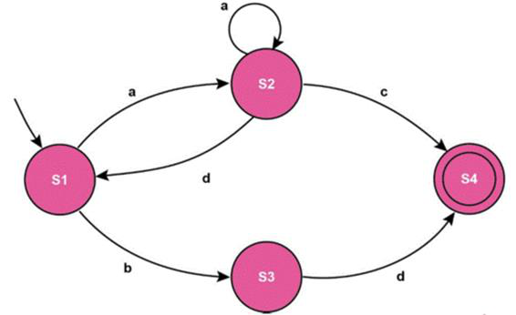
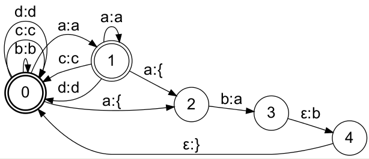

# 4PwfeI-Dogal Dil Isleme - Duzenli Ifadeler

**Toplam Sayfa:** 18
**Toplam Görsel:** 26

---

## Sayfa 1

### Görseller

*Görsel 1: 4PwfeI-Dogal Dil Isleme - Duzenli Ifadeler_sayfa1_gorsel1.png*

*Görsel 2: 4PwfeI-Dogal Dil Isleme - Duzenli Ifadeler_sayfa1_gorsel2.png*

*Görsel 3: 4PwfeI-Dogal Dil Isleme - Duzenli Ifadeler_sayfa1_gorsel3.png*

*Görsel 4: 4PwfeI-Dogal Dil Isleme - Duzenli Ifadeler_sayfa1_gorsel4.png*

### İçerik

Doğal Dil İşlemeye Giriş
Dr. Öğr. Üyesi Hayri Volkan Agun
Bilgisayar Mühendisliği

---

## Sayfa 2

### Görseller

*Görsel 1: 4PwfeI-Dogal Dil Isleme - Duzenli Ifadeler_sayfa2_gorsel1.png*

### İçerik

❑Düzenli ifadeler
❑Düzenli ifadelerde 
❑Düzenli ifade örnekleri
❑Chomsky hiyerarşisi
İçerik

---

## Sayfa 3

### Görseller

*Görsel 1: 4PwfeI-Dogal Dil Isleme - Duzenli Ifadeler_sayfa3_gorsel1.png*

### İçerik

❑Cümleler, kelimeler, kelimelere eklenen ekler ardışık olarak belirli karakter 
dizgelerinden oluşurlar.
❑Bu karakterler içerisinde geçen ardışık anlamlı öbeklerden oluşur. 
❑Örneğin: 
❑‘Takım kaptanı Gökhan 15 Haziran 2013 saat 08:05 de otobüse bindi.’ cümlesinde geçen 
farklı öbekler:
❑08:05 aslında bir öbektir. Benzer saat öbekleri 12:25, 24:00
❑15 Haziran 2013 aslında bir öbektir. Benzer tarih öbekleri 12 Temmuz 2020, 23 Nisan 
1919, 16 Mayıs 1233, …
❑Takım kaptanı aslında bir öbektir. Benzer isim öbekleri Gemi kaptanı, Uzakyol kaptanı, 
Yat kaptanı, Seyrüsefer Kaptanı.
❑Gökhan aslında bir öbektir. Benzer isim öbekleri Hunhan, Barkhan, Tunhan, …   
Düzenli İfadeler

---

## Sayfa 4

### Görseller

*Görsel 1: 4PwfeI-Dogal Dil Isleme - Duzenli Ifadeler_sayfa4_gorsel1.png*

### İçerik

❑Düzenli ifadeleri kullanarak benzer olan öbekleri metin içerisinde arayabiliriz.
❑Metin içerisinde arama için en basit yöntem karakterlere bakarak yapılan 
aramadır.
❑Belirli bir karakterden başlayarak metin içerisinde aranan öbeğin geçip 
geçmediğine bakılır.
❑Ancak bu yöntem her bir karakter ile aranan öbekteki her bir karakterin 
kıyaslamasını içerdiğinden dolayı O(n * m) zaman karmaşıklığına sahiptir. 
❑O(n * m) zaman karmaşıklığında n metin uzunluğu ve m ise aranan öbek 
uzunluğudur.
Düzenli İfadeler

---

## Sayfa 5

### Görseller

*Görsel 1: 4PwfeI-Dogal Dil Isleme - Duzenli Ifadeler_sayfa5_gorsel1.png*

*Görsel 2: 4PwfeI-Dogal Dil Isleme - Duzenli Ifadeler_sayfa5_gorsel2.png*

### İçerik

❑
Düzenli
ifadeler
aslında
deterministik
sonlu
durum
otomatlarıdır
(makineleridir).
❑
Sonraki sunumda gösterilen ifadede sonlu durum otomatları ile bir veri yapısı
gösterilmektedir.
❑
Bu veri yapısında kullanılan düğümlerden çift çizgili olanlar son durumu
göstermektedir.
Düzenli İfadeler

---

## Sayfa 6

### Görseller

*Görsel 1: 4PwfeI-Dogal Dil Isleme - Duzenli Ifadeler_sayfa6_gorsel1.png*

*Görsel 2: 4PwfeI-Dogal Dil Isleme - Duzenli Ifadeler_sayfa6_gorsel2.png*

### İçerik

❑Regex: (a+)(d(a+)c|bd)
❑Yukarıdaki düzenli ifade ile ifade edilen S1, S2, S3, ve S4 düğümleri ile ilgili olarak düğümler 
arasında geçiş için kullanılan a, b, c, ve d karakterlerini kullanarak tüm düzenli ifadenin 
tüketilmesi gerekir. 
❑Örneğin: aaaadaac, adac, adaabd, ve adbd ifadeleri yukarıdaki düzenli ifade tarafından 
üretilebilir yada tüketilebilir.
Düzenli İfadeler

---

## Sayfa 7

### Görseller

*Görsel 1: 4PwfeI-Dogal Dil Isleme - Duzenli Ifadeler_sayfa7_gorsel1.png*

### İçerik

❑
[A-Z]   :   A ve Z arasındaki bütün büyük harfleri yakalamak için kullanılır. Bu harfler 
sadece İngilizce alfabeden gelmektedir. 
❑
[A-ZÜŞİÇÖĞ] :  A ve Z arasındaki İngilizce alfabeye ek olarak Türkçe karakterleri 
yakalamak için kullanılır.
❑
[1-9]   : 1 ve 9 dahil tüm sayıları temsil eder.
❑
[1-9]+ : 1 ve 9 dahil tüm sayıların bir veya daha çok geçtiği durumlar örneğin: 2, 
123, 111, 122339 gibi sayı dizilerinin yakalanması için kullanılır.
❑
\p{Lu}{2, 5} : 2 veya en fazla 5 karakterden oluşan büyük harflerin yakalnmasında
kullanılır. Örneğin: ASV, AB, ABDFR gibi harf dizilerini yakalar.
❑
[^A-Z] : A ve Z karakterleri dışındaki harfler.
❑
[.] :  Herhangi bir sembol, karakter, yada sayı: &, A, 5, …
Düzenli İfadeler

---

## Sayfa 8

### Görseller

*Görsel 1: 4PwfeI-Dogal Dil Isleme - Duzenli Ifadeler_sayfa8_gorsel1.png*

### İçerik

Düzenli İfade örnekleri
İfade
Örnek
woodchucks?
woodchuck
colou?r
color or colour
^ 
Satır başı
\ $
Satır sonu
\b
Kelime sınırı
\B
Kelime sınırı olmayan
\d 
\D
\w
\W
\s 
\S
[0-9] : Rakam 
[^0-9] : Rakam olmayan
[a-zA-Z0-9] : Harf yada rakam
[^\w] : Harf yada rakam olmayan
[ \r\t\n\f] : Boşluk
[^\s] : Boşluk olmayan

---

## Sayfa 9

### Görseller

*Görsel 1: 4PwfeI-Dogal Dil Isleme - Duzenli Ifadeler_sayfa9_gorsel1.png*

*Görsel 2: 4PwfeI-Dogal Dil Isleme - Duzenli Ifadeler_sayfa9_gorsel2.png*

### İçerik

•
Yandaki doküman örneğinde bir 
kütüphaneye ait kitap borkodu 
verilmektedir. Bu kitap barkodunun 
içerisinde ayrıca kitabın basım yılı yer 
almaktadır. Buna göre kitabın basım 
yılını bulan düzenli ifade nedir?
Düzenli İfadeler Örnek
\d{4}
[1-9]+

---

## Sayfa 10

### Görseller

*Görsel 1: 4PwfeI-Dogal Dil Isleme - Duzenli Ifadeler_sayfa10_gorsel1.png*

### İçerik

package test;
public class RegexTestStrings {
public static final String EXAMPLE_TEST = "Bu kitabın basım yılı 1998 ve bu da barkod numarası 1999-
20Z1.12 "
public static void main(String[] args) {
System.out.println(EXAMPLE_TEST.matches("\\d{4}"));
String[] splitString = (EXAMPLE_TEST.split("\\s+"));
System.out.println(splitString.length);
for (String string : splitString) {
System.out.println(string);
}
}
}
Düzenli İfade - Java Örneği

---

## Sayfa 11

### Görseller

*Görsel 1: 4PwfeI-Dogal Dil Isleme - Duzenli Ifadeler_sayfa11_gorsel1.png*

### İçerik

• Aşağıdaki metin örnekleri içinde «büyük 
heykel» geçen örnekleri çıkaran düzenli 
ifadeyi yazınız. 
• Büyük yeşil boğa heykeli uzaktan çok 
minik göründü.
• büyük ve küçük heykeller sergilendi.
• Büyük güzel ağaç heykeli kapatıyor.
Büyük (.*) heykel
büyük (.*) heykel
???
Düzenli İfadeler - Problemleri

---

## Sayfa 12

### Görseller

*Görsel 1: 4PwfeI-Dogal Dil Isleme - Duzenli Ifadeler_sayfa12_gorsel1.png*

### İçerik

•
Bir dili başka bir dile çeviren diller bağımsız ya da yinelemeli sıralı (recursively enumarable)
dillerdir.
•
Karmaşıklık yukarıdaki örnek düşünüldüğünde anlaşılması zor bir hal almaktadır. 
•
Bir dilin parçalarından oluşturularak dilde geçen tüm ifadeleri üretebilen kuralların tümüne 
gramer denir.
•
Düzenli ifadeler en basit ifade ile düzenli gramerler olarak adlandırılabilir.
Öbek karmaşıklıkları

---

## Sayfa 13

### Görseller

*Görsel 1: 4PwfeI-Dogal Dil Isleme - Duzenli Ifadeler_sayfa13_gorsel1.png*

### İçerik

•
İki sevyeli morfolojik analiz : Sonlu durum çeviricileri
•
Düzenli ifadeler belirli bir öbeği yakalarken sonlu durum otomatlarını kullanırlar.
•
Ancak dildeki tüm yapılar sonlu durum otomatları ile modellenemez. Örneğin
•
Satılacaklar : kitap +laş +tır +ıl +an +lar
•
Yukarıdaki kelimenin eklerinin bulunması için ekler arasındaki bağıntılar dikkate alınır. Örneğin
+laş isimden fiil türeten ekten sonra +lar çoğul eki gelmez.
•
Bazı durumlarda örneğin pçtk sessiz benzeşmesi (kitapım => kitabım), yada hece düşmesi (alın
=> alnımda) durumlarında eklerin ayrıştırılması için sonlu durum çeviriciler kullanılır.
Düzenli ifade çeşitleri

---

## Sayfa 14

### Görseller

*Görsel 1: 4PwfeI-Dogal Dil Isleme - Duzenli Ifadeler_sayfa14_gorsel1.png*

*Görsel 2: 4PwfeI-Dogal Dil Isleme - Duzenli Ifadeler_sayfa14_gorsel2.png*

### İçerik

Yandaki düzenli ifade epsilon (ε) karakteri boş karakteri
ifade eder.
A: ε şeklinde yazıldığında tüketim için A karakteri ve
üretim için boş karakter kullanılır.
Buna göre kitabın kelimesini kitap ve ın şeklinde kitap+ın
şeklinde yazmak için ne kullanılır.
Boş karakter tüketim için kullanıldığında sonlu durumlar
deterministik olmayabilir.
Deterministik olma durumunda birden çok dallanma
ortaya çıkacaktır.
Düzenli ifade çeşitleri

---

## Sayfa 15

### Görseller

*Görsel 1: 4PwfeI-Dogal Dil Isleme - Duzenli Ifadeler_sayfa15_gorsel1.png*

### İçerik

Sonlu durum otomatları bir metin içerisinde geçen
düzenli öbekleri yakalamak için kullanılırlar.
Sonlu durum otomatları ile metin içerisinde geçen
örneğin tarih, saat, isimler, ekler yakalanabilir.
Sonlu durum otomatları yakalanan ifade üzerinde bir
değişiklik yapmazlar.
Türkçe
gibi
dillerde
otomatlar
eklerin
yakalanmasında kullanılabilir. Ancak bir kelimenin
kökünün sondan tüketim ile elde edilmesinde yeterli
değildir.
Ekler:
kitaplar => kitap + lar
kitabı => kitap + ı
alnından => alın + ın + dan
Yukarıdaki ek çözümlemelerinde bir otomat için bitiş
durumları ek sonlarını ifade etmektedir.
Yukarıdaki otomatın b=>p ve ε => ı dönüşümlerini
yapabilmesi için sonlu durum otomatının, sonlu
durum çeviricisi olması gerekmektedir.
Burada
ε
epsilon
yani
boş
karakteri
temsil
etmektedir.
Bu çevirici sadece yukarıdaki üç örnek için ne
olmalıdır.
Düzenli çeviriciler 

---

## Sayfa 16

### Görseller

*Görsel 1: 4PwfeI-Dogal Dil Isleme - Duzenli Ifadeler_sayfa16_gorsel1.png*

### İçerik

AAAAA BBBB – içerisinde 5 kez A ve sonrasında
da 4 kez B geçsin.
Bu ifade de A sayısı n, B sayısı da m olsun.
A{n}B{m} düzenli ifadesi
sadece n ve m sabit ise doğru çıkarım yapabilir.
N ve m sayısı önceden bilinmiyorsa örneğin n >
m koşulu için çıkarım yapamaz.
Yandaki ifadeleri çıkarım yapabilecek bir düzenli
ifade yok.
Yakalanacak öbekler:
AAAAA BBB
AAA B
AAB
Yakalanmayacak öbekler
ABB
AB
AABB
AAABB
Düzenli ifadeler

---

## Sayfa 17

### Görseller

*Görsel 1: 4PwfeI-Dogal Dil Isleme - Duzenli Ifadeler_sayfa17_gorsel1.png*

*Görsel 2: 4PwfeI-Dogal Dil Isleme - Duzenli Ifadeler_sayfa17_gorsel2.png*

### İçerik

Dilleri
ve
yakalamak
istediğimiz
metin
karmaşıklıklarını
ifade
ederken
daha
önce
tanımlanmış
olan
Chomsky
hiyerarşisiniz
kullanıyoruz.
Bu hiyerarşide öbek yada dil karmaşıklığı açılım
yöntemi ile gösteriliyor.
A -> c A
S -> g S c
Yukarıdaki örneklerde A yerine c A ve S yerine g S c
yazılarak açılım daha da türetilebilir.
Öbek karmaşıklıkları –
Chomsky Hiyerarşisi 

---

## Sayfa 18

### Görseller

*Görsel 1: 4PwfeI-Dogal Dil Isleme - Duzenli Ifadeler_sayfa18_gorsel1.png*

### İçerik

https://bilgisayarkavramlari.com/2009/06/27/chomsky-hiyerarsisi-chomsky-hierarchy/
https://bilgisayarkavramlari.com/2007/04/14/regular-expression-regexp-duzenli-deyimler-
ifadeler/
https://web.cs.hacettepe.edu.tr/~ilyas/Courses/BBM401/lec03-
RegularExpressionsRegularLanguages.pdf
https://tr.wikipedia.org/wiki/D%C3%BCzenli_ifade
Referanslar

---

