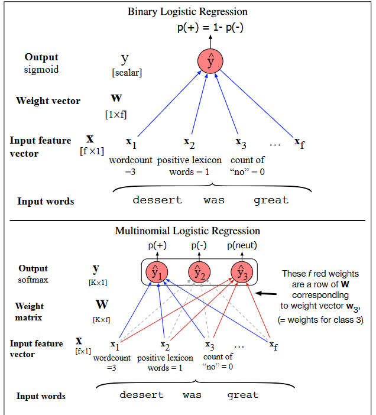

# Dogal Dil Isleme - Ayirt Edici Siniflandirma

**Toplam Sayfa:** 12
**Toplam Görsel:** 30

---

## Sayfa 1

### Görseller

*Görsel 1: Dogal Dil Isleme - Ayirt Edici Siniflandirma_sayfa1_gorsel1.png*

### İçerik

İLERİ DOĞAL DİL 
İŞLEME
BİLGİSAYAR MÜHENDİSLİĞİ BÖLÜMÜ
BURSA TEKNİK ÜNİVERSİTESİ
DR. ÖĞR. ÜYESİ HAYRİ VOLKAN AGUN

---

## Sayfa 2

### Görseller

*Görsel 1: Dogal Dil Isleme - Ayirt Edici Siniflandirma_sayfa2_gorsel1.png*

### İçerik

Özet
❑Ayırt edici sınıflandırma (discrimantive)
❑Logistic regression, gradient 
❑Multinomial logistic regression

---

## Sayfa 3

### Görseller

*Görsel 1: Dogal Dil Isleme - Ayirt Edici Siniflandirma_sayfa3_gorsel1.png*

*Görsel 2: Dogal Dil Isleme - Ayirt Edici Siniflandirma_sayfa3_gorsel2.png*

### İçerik

Sınıflandırma Türleri – Ayırt Edici 
(Discriminative)
❑Ayırt edici sınıflandırmada veri dağılımına
bakılmaksızın
bir
sınır
fonksiyonu
elde
edilmektedir.
Kullanılan
sınır
fonksiyonu
girilen
bir
girdi
için
doğru
sınıfın
bulunmasında kullanılır.

---

## Sayfa 4

### Görseller

*Görsel 1: Dogal Dil Isleme - Ayirt Edici Siniflandirma_sayfa4_gorsel1.png*

*Görsel 2: Dogal Dil Isleme - Ayirt Edici Siniflandirma_sayfa4_gorsel2.png*

### İçerik

Sınıflandırma Türleri – Ayırt Edici 
(Discriminative)
❑Ayırt edici sınıflandırmada veri dağılımına
bakılmaksızın
bir
sınır
fonksiyonu
elde
edilmektedir.
Kullanılan
sınır
fonksiyonu
girilen
bir
girdi
için
doğru
sınıfın
bulunmasında kullanılır.
❑Ayırt
edici
sınıflandırma
ve
üretici
sınıflandırma
modellerinde
kullanılan
matematik birbirine çok benzer olabilir ancak
temel bu iki sınıflandırma yöntemi ya girdiyi
yada ayırt edici modeli oluşturmada kullanılır.
Girdi modellemesi
Sınır modellemesi

---

## Sayfa 5

### Görseller

*Görsel 1: Dogal Dil Isleme - Ayirt Edici Siniflandirma_sayfa5_gorsel1.png*

*Görsel 2: Dogal Dil Isleme - Ayirt Edici Siniflandirma_sayfa5_gorsel2.png*

*Görsel 3: Dogal Dil Isleme - Ayirt Edici Siniflandirma_sayfa5_gorsel3.png*

### İçerik

Sınıflandırma Türleri – Ayırt Edici 
(Discriminative)
• Ayırt edici sınıflandırma türleri için ayırt edici
sınır bir doğru, düzlem gibi iki farklı örneklemi
ayırt etmekte kullanılan bir denklem şeklinde
elde edilmelidir.
• Eğer
bu
denklem
doğru
yada
düzlem
denklemi
ise
o
zaman
sınıflandırma
fonksiyonu doğrusal (lineer) olacaktır.
• En temel doğrusal sınıflandırma yöntemleri
arasında Logistic Regression gösterilebilir.

---

## Sayfa 6

### Görseller

*Görsel 1: Dogal Dil Isleme - Ayirt Edici Siniflandirma_sayfa6_gorsel1.png*

*Görsel 2: Dogal Dil Isleme - Ayirt Edici Siniflandirma_sayfa6_gorsel2.png*

*Görsel 3: Dogal Dil Isleme - Ayirt Edici Siniflandirma_sayfa6_gorsel3.png*

*Görsel 4: Dogal Dil Isleme - Ayirt Edici Siniflandirma_sayfa6_gorsel4.png*

*Görsel 5: Dogal Dil Isleme - Ayirt Edici Siniflandirma_sayfa6_gorsel5.png*

*Görsel 6: Dogal Dil Isleme - Ayirt Edici Siniflandirma_sayfa6_gorsel6.png*

### İçerik

Naive Bayes ve Logistic Regression 
Benzerlikler 
• Önceki sunumlarda Naive Bayes sınıflandırma
için kullandığımız modelde her bir kelime yada
özelliğin bir birinden bağımsız olduğunu kabul
etmiştik.
Bu
durumda
bir
dokümanda
geçen
kelimelerin o sınıfta geçme olasılığını çarparak
dokümanın
o
sınıfa
ait
olma
olasılığını
bulabiliyoruz.
• Logistic
Regression
doğrusal
bir
sınıflandırma
yapmak için bir sınıfa ait ağırlıklardan yararlanarak
dokümanın
doğrusal
bir
ayırt
edici
fonksiyonun
neresinde kaldığına karar verir. Bu karar sonucunda
sınıflandırılmak istenen doküman sınıfa ait etikete ya
sahiptir yada değildir.
• Burada özellik değerleri ve ağırlık değerleri logistic
(soft-max) fonksiyounda çarpılarak bir puan elde
edilir. Bu puan sınıfırdan büyük ise bu doküman bu
sınıfa aittir denir.

---

## Sayfa 7

### Görseller

*Görsel 1: Dogal Dil Isleme - Ayirt Edici Siniflandirma_sayfa7_gorsel1.png*

*Görsel 2: Dogal Dil Isleme - Ayirt Edici Siniflandirma_sayfa7_gorsel2.png*

### İçerik

Logistic Rgression
• Logistic
Regression
ağırlık
parametrelerinin
gradient
metodları
ile öğrenilmesi sonucu eğitilir.
• Logistic (soft-max) fonksiyonu tek bir
x girdi değeri için yanda verilmiştir.
• Bu
fonksionun
değerinin
0.5’den
büyük olduğu sayılar için girdiye ait
sınıf pozitif olacaktır.

---

## Sayfa 8

### Görseller

*Görsel 1: Dogal Dil Isleme - Ayirt Edici Siniflandirma_sayfa8_gorsel1.png*

*Görsel 2: Dogal Dil Isleme - Ayirt Edici Siniflandirma_sayfa8_gorsel2.png*

### İçerik

Ağırlıkların bulunması
• Ağırlıkların
bulunması için
tüm
girdiler için
oluşan
hata değerleri
elde
edilmeli
ve
bu
değerleri
minimum
yapan
ağırlıklar
hesaplanmalıdır.
• Logistic Regression için hata fonksiyonu çok
kolay
türevlenebilirdir.
Bu
durumda
türevin
(gradient) 0 olduğu noktaya doğru azalan bir
arama
yaparak
hata
fonksiyonuna
karşılık
gelen ağırlıkları bulabiliriz.
ağırlıklar
Hata 
fonksiyonu
Türev 0

---

## Sayfa 9

### Görseller

*Görsel 1: Dogal Dil Isleme - Ayirt Edici Siniflandirma_sayfa9_gorsel1.png*

*Görsel 2: Dogal Dil Isleme - Ayirt Edici Siniflandirma_sayfa9_gorsel2.png*

*Görsel 3: Dogal Dil Isleme - Ayirt Edici Siniflandirma_sayfa9_gorsel3.png*

*Görsel 4: Dogal Dil Isleme - Ayirt Edici Siniflandirma_sayfa9_gorsel4.png*

### İçerik

Hata fonksiyonu
eğitim örneklemlerinin sayısı
eğitim örneklem vektörü (özellik vektörü)
Şimdiki parametreler
ile elde edilen 
logistic fonksiyonu

---

## Sayfa 10

### Görseller

*Görsel 1: Dogal Dil Isleme - Ayirt Edici Siniflandirma_sayfa10_gorsel1.png*

*Görsel 2: Dogal Dil Isleme - Ayirt Edici Siniflandirma_sayfa10_gorsel2.png*

*Görsel 3: Dogal Dil Isleme - Ayirt Edici Siniflandirma_sayfa10_gorsel3.png*

### İçerik

Hatanın Türevi ve Güncelleme
• α adım miktarını belirtir.
• m eğitim örneklemlerinin sayısını belirtir. Bu sayı batch sayısı olarak seçilebilir.

---

## Sayfa 11

### Görseller

*Görsel 1: Dogal Dil Isleme - Ayirt Edici Siniflandirma_sayfa11_gorsel1.png*

*Görsel 2: Dogal Dil Isleme - Ayirt Edici Siniflandirma_sayfa11_gorsel2.png*

*Görsel 3: Dogal Dil Isleme - Ayirt Edici Siniflandirma_sayfa11_gorsel3.png*

### İçerik

Birden fazla sınıf
• Örneğin bir cümlenin duygu durumu pozitif, negatif
ve nötr olsun.
• Yandaki örnekde bu multinomial logistic regression
ile açıklanmaktadır. Buna göre her bir sınıf için ayrı
bir parametre vektörü vardır. Tüm sınıflar için bu bir
matristir. Aynı anda tüm çıktılar için parametreler
güncellenir.
• Bunun için örneğin aşağıdaki vektör K farklı sınıfın
çıktısı için hata fonksiyonunun hesaplanmasında
ve güncellemede kullanılır.

---

## Sayfa 12

### Görseller

*Görsel 1: Dogal Dil Isleme - Ayirt Edici Siniflandirma_sayfa12_gorsel1.png*

### İçerik

Kaynaklar
1. https://web.stanford.edu/~jurafsky/slp3/5.pdf
2. https://www.coursera.org/learn/machine-learning
3. https://towardsdatascience.com/optimization-loss-function-under-the-hood-
part-ii-d20a239cde11
4. https://towardsdatascience.com/understanding-logistic-regression-step-by-
step-704a78be7e0a

---

