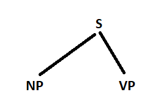
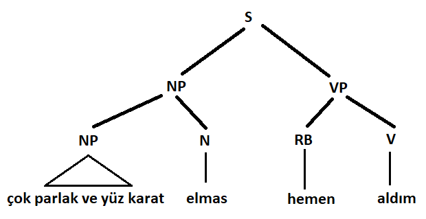

# Dogal Dil Isleme - Ayristirma Ornegi

**Toplam Sayfa:** 12
**Toplam Görsel:** 29

---

## Sayfa 1

### Görseller

*Görsel 1: Dogal Dil Isleme - Ayristirma Ornegi_sayfa1_gorsel1.png*

### İçerik

DOĞAL DİL İŞLEMEYE 
GİRİŞ
BAHAR DÖNEMİ - 2021-2022
BİLGİSAYAR MÜHENDİSLİĞİ BÖLÜMÜ
BURSA TEKNİK ÜNİVERSİTESİ
DR. HAYRI VOLKAN AGUN

---

## Sayfa 2

### Görseller

*Görsel 1: Dogal Dil Isleme - Ayristirma Ornegi_sayfa2_gorsel1.png*

### İçerik

❑
Sözdizimsel Ayrıştırma Örneği
❑Aşağıdaki kuralları kullanarak aşağıdaki cümlenin sözdizimsel ağaç yapısını oluşturunuz.
❑S -> NP VP
❑NP -> ADJ NP
❑NP -> ADJ N
❑NP -> ADJ ADJ
❑VP -> RB VP
❑VP -> RB V
❑CP -> CONJ NP
❑NP -> NP CP
❑Sözlük: [karat/N, çok/RB, parlak/ADJ, çok/ADJ, elmas/N, V/aldım, yüz/ADJ, yüz/V, RB/hemen]

---

## Sayfa 3

### Görseller

*Görsel 1: Dogal Dil Isleme - Ayristirma Ornegi_sayfa3_gorsel1.png*

*Görsel 2: Dogal Dil Isleme - Ayristirma Ornegi_sayfa3_gorsel2.png*

### İçerik

çok parlak ve yüz karat elmas 
hemen aldım.
Sözdizimsel Ayrıştırma Örneği
Çok -> RB
Çok -> ADJ
Parlak -> ADJ
Ve -> 
CONJ
Yüz -> ADJ
Yüz -> V
Karat -> N
Elmas -> N
Hemen -> RB
Aldım -> V

---

## Sayfa 4

### Görseller

*Görsel 1: Dogal Dil Isleme - Ayristirma Ornegi_sayfa4_gorsel1.png*

*Görsel 2: Dogal Dil Isleme - Ayristirma Ornegi_sayfa4_gorsel2.png*

### İçerik

Sözdizimsel Ayrıştırma Örneği
Çok -> RB
Çok -> ADJ
NP-> ADJ 
ADJ
Parlak -> ADJ
Ve -> 
CONJ
Yüz -> ADJ
Yüz -> V
Karat -> N
Elmas -> N
Hemen -> RB
Aldım -> V

---

## Sayfa 5

### Görseller

*Görsel 1: Dogal Dil Isleme - Ayristirma Ornegi_sayfa5_gorsel1.png*

*Görsel 2: Dogal Dil Isleme - Ayristirma Ornegi_sayfa5_gorsel2.png*

*Görsel 3: Dogal Dil Isleme - Ayristirma Ornegi_sayfa5_gorsel3.png*

### İçerik

Sözdizimsel Ayrıştırma Örneği
Çok -> RB
Çok -> ADJ
NP-> ADJ 
ADJ
Parlak -> ADJ
Ve -> 
CONJ
Yüz -> ADJ
Yüz -> V
NP -> ADJ N
Karat -> N
Elmas -> N
Hemen -> RB
Aldım -> V

---

## Sayfa 6

### Görseller

*Görsel 1: Dogal Dil Isleme - Ayristirma Ornegi_sayfa6_gorsel1.png*

*Görsel 2: Dogal Dil Isleme - Ayristirma Ornegi_sayfa6_gorsel2.png*

*Görsel 3: Dogal Dil Isleme - Ayristirma Ornegi_sayfa6_gorsel3.png*

*Görsel 4: Dogal Dil Isleme - Ayristirma Ornegi_sayfa6_gorsel4.png*

### İçerik

çok parlak ve yüz karat elmas hemen aldım.
Sözdizimsel Ayrıştırma Örneği
Çok -> RB
Çok -> ADJ
NP-> ADJ 
ADJ
Parlak -> ADJ
Ve -> 
CONJ1
CP -> CONJ1 NP2
Yüz -> ADJ
Yüz -> V
NP2 -> ADJ N
Karat -> N
Elmas -> N
Hemen -> RB
Aldım -> V
3
2
1

---

## Sayfa 7

### Görseller

*Görsel 1: Dogal Dil Isleme - Ayristirma Ornegi_sayfa7_gorsel1.png*

*Görsel 2: Dogal Dil Isleme - Ayristirma Ornegi_sayfa7_gorsel2.png*

*Görsel 3: Dogal Dil Isleme - Ayristirma Ornegi_sayfa7_gorsel3.png*

*Görsel 4: Dogal Dil Isleme - Ayristirma Ornegi_sayfa7_gorsel4.png*

*Görsel 5: Dogal Dil Isleme - Ayristirma Ornegi_sayfa7_gorsel5.png*

*Görsel 6: Dogal Dil Isleme - Ayristirma Ornegi_sayfa7_gorsel6.png*

### İçerik

çok parlak ve yüz karat elmas hemen aldım.
Sözdizimsel Ayrıştırma Örneği
Çok -> RB
Çok -> ADJ
NP-> ADJ ADJ
NP -> NP CP 
NP -> NP N
Parlak -> ADJ
Ve -> 
CONJ
CP -> CONJ NP
Yüz -> ADJ
Yüz -> V
NP -> ADJ N
Karat -> N
Elmas -> N
VB -> RB V
Hemen -> RB
Aldım -> V
2
1
3
5
3
4
4
2
1
5
6
7

---

## Sayfa 8

### Görseller

*Görsel 1: Dogal Dil Isleme - Ayristirma Ornegi_sayfa8_gorsel1.png*

*Görsel 2: Dogal Dil Isleme - Ayristirma Ornegi_sayfa8_gorsel2.png*

*Görsel 3: Dogal Dil Isleme - Ayristirma Ornegi_sayfa8_gorsel3.png*

*Görsel 4: Dogal Dil Isleme - Ayristirma Ornegi_sayfa8_gorsel4.png*

### İçerik

çok parlak ve yüz karat elmas hemen aldım.
Sözdizimsel Ayrıştırma Örneği
Çok -> RB
Çok -> ADJ
NP-> ADJ ADJ
NP -> NP CP 
NP -> NP N
S -> NP  VP
Parlak -> ADJ
Ve -> 
CONJ
CP -> CONJ NP
Yüz -> ADJ
Yüz -> V
NP -> ADJ N
Karat -> N
Elmas -> N
Hemen -> RB
VB -> RB V
Aldım -> V

---

## Sayfa 9

### Görseller

*Görsel 1: Dogal Dil Isleme - Ayristirma Ornegi_sayfa9_gorsel1.png*

### İçerik

❑Ayrıştırma örneği CYK algoritmasını kullanılarak kelime öbeklerini belirli bir sırada soldan sağa ve aşağıdan yukarı bir 
birleştirir. 
 
Matris(i, j) = Matris(i, k) ʌ Matris(k + 1 , j)
❑Örneğin: S -> NP VP
Matris(1, 8)  =   Matris(1, 5) ʌ 
Matris(6, 8)
S            =         NP                  VP
Sözdizimsel Ayrıştırma

---

## Sayfa 10

### Görseller

*Görsel 1: Dogal Dil Isleme - Ayristirma Ornegi_sayfa10_gorsel1.png*

*Görsel 2: Dogal Dil Isleme - Ayristirma Ornegi_sayfa10_gorsel2.png*

### İçerik

Sözdizimsel Ayrıştırma
❑Söz dizimsel ayrıştırmada her bir tablo elemanı birleşerek yeni bir tablo 
elemanı içeriğine eklenir.
❑Bu içerik hangi elemanları barındırıyorsa o elemanlar bir ağaç yapısı şeklinde 
gösterilir.
❑Örnekten yola çıkarsak; 
S-> NP VP kuralı için ağaç yapısı gösterimi:

---

## Sayfa 11

### Görseller

*Görsel 1: Dogal Dil Isleme - Ayristirma Ornegi_sayfa11_gorsel1.png*

*Görsel 2: Dogal Dil Isleme - Ayristirma Ornegi_sayfa11_gorsel2.png*

### İçerik

Sözdizimsel Ayrıştırma

---

## Sayfa 12

### Görseller

*Görsel 1: Dogal Dil Isleme - Ayristirma Ornegi_sayfa12_gorsel1.png*

### İçerik

Referanslar
https://www.geeksforgeeks.org/cyk-algorithm-for-context-free-grammar/

---

