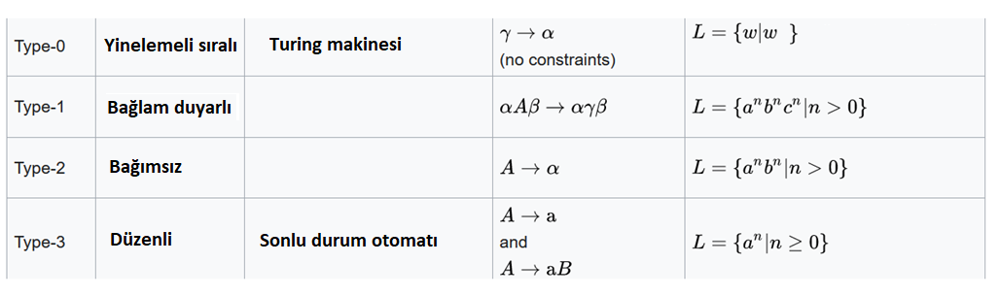
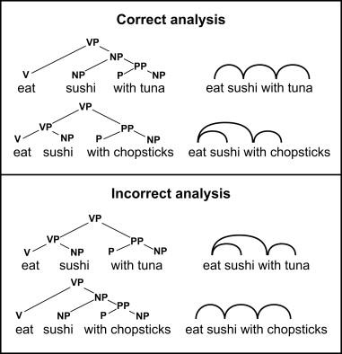
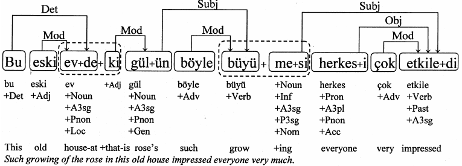
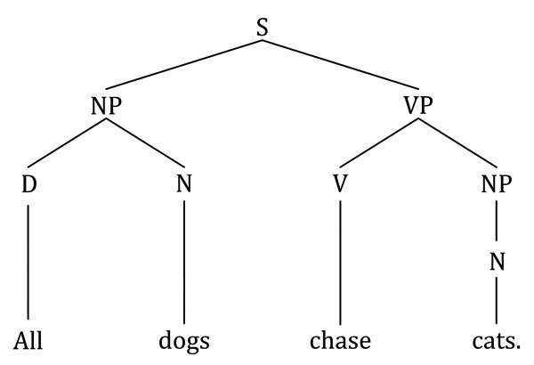
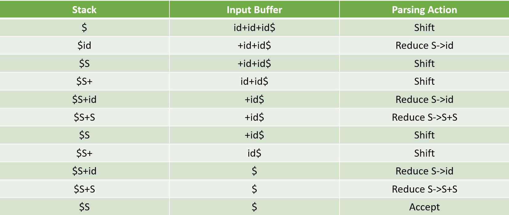
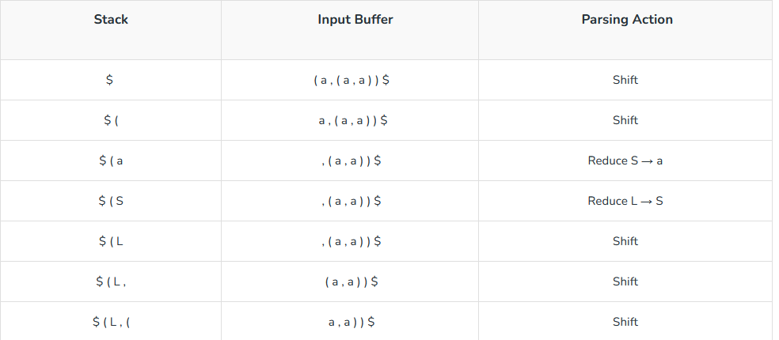
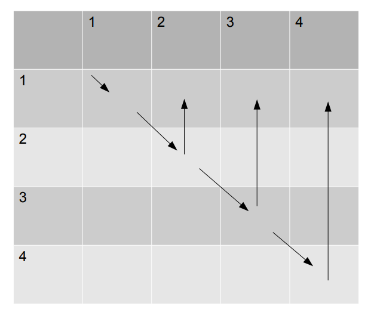

# Dogal Dil Isleme - Ayristirma

**Toplam Sayfa:** 21
**Toplam Görsel:** 35

---

## Sayfa 1

### Görseller

*Görsel 1: Dogal Dil Isleme - Ayristirma_sayfa1_gorsel1.png*

### İçerik

DOĞAL DİL 
İŞLEMEYE GİRİŞ
BİLGİSAYAR MÜHENDİSLİĞİ BÖLÜMÜ
BURSA TEKNİK ÜNİVERSİTESİ
DR. HAYRI VOLKAN AGUN

---

## Sayfa 2

### Görseller

*Görsel 1: Dogal Dil Isleme - Ayristirma_sayfa2_gorsel1.png*

### İçerik

Özet
•Söz-dizimsel ayrıştırma

---

## Sayfa 3

### Görseller

*Görsel 1: Dogal Dil Isleme - Ayristirma_sayfa3_gorsel1.png*

### İçerik

Özet
❑Söz dizimsel ayıştırma nedir?
❑Ayrıştırmada kullanılan yöntemler nelerdir?
❑Gramer nedir? Kaç farklı gramer vardır?
❑İstatistiksel ayrıştırmada kullanılan yöntemler nelerdir?

---

## Sayfa 4

### Görseller

*Görsel 1: Dogal Dil Isleme - Ayristirma_sayfa4_gorsel1.png*

*Görsel 2: Dogal Dil Isleme - Ayristirma_sayfa4_gorsel2.png*

### İçerik

Ayrıştırma
❑Ayrıştırma farklı etiketlere sahip kelime/sembol gruplarının kural tabanlı olarak birleştirilmesi 
işlemidir.
❑Ayrıştırma kod editörlerinde, XML/JSON kütüphanelerinde, HTML işleyen doküman nesne modeli 
(DOM) oluşturan Web tarayıcılarında, SQL dilini yorumlayan veri tabanlarında ve her hangi bir dil 
derleyicisinde kullanılan bir işleme yöntemidir.
❑Ayrıştırma genel olarak ardışık ilişkili bir veriyi ağaç yapısına çevirir. Bu işlem ile birleşim oluşturan 
öbekler ağaç yapısına sahip forma dönüştürülür.
❑Örneğin:
❑4 * 5 + 7 – 2 / 5 işlemi yandaki gibi ağaç yapısına dönüşür.
❑

---

## Sayfa 5

### Görseller

*Görsel 1: Dogal Dil Isleme - Ayristirma_sayfa5_gorsel1.png*

*Görsel 2: Dogal Dil Isleme - Ayristirma_sayfa5_gorsel2.png*

### İçerik

Düzenli ifadeler uzun ardışık formda geçen tekrarlı ifadeleri her
zaman doğru bir şekilde yakalayamazlar. Bunun en önemli
nedeni ayrıştırılmak istenen dilin karmaşıklık düzeyidir.
Dilin karmaşıklık düzeyi dili üreten gramer ile anlaşılabilir.
Örneğin; XML veya HTML metinlerini ayrıştırmak için kullanılan
dil düzenli dildir. Bu düzenli ifadeler ile ayrıştırılabilen bir dile
karşılık gelir.
Nesneye Yönelik Programlamada kullanılan Java ve .NET
dilleri bağlam bağımsız dillerdir. Bağlam bağımsız dillerde
temel ayırt edici nokta bağlamdan bağımsız olan iç içe tekrarlı
yapıların bulunmasıdır. Örneğin bir sıfat tamlamasında; NP ->
ADJ NP tamlama iç içe tekrarlıdır.
Sıfat tamlaması: «İri buz kristallerinin süslediği görkemli 
şatoda» 
Sıfat tamlaması: NP -> [İri] ADJ  NP
Ayrıştırma

---

## Sayfa 6

### Görseller

*Görsel 1: Dogal Dil Isleme - Ayristirma_sayfa6_gorsel1.png*

*Görsel 2: Dogal Dil Isleme - Ayristirma_sayfa6_gorsel2.png*

### İçerik

Ayrıştırma
❑Bir
dilde
tüm
ikili
kelime/sembol
grupları
düşünüldüğünde
oluşabilecek
toplam
birleşim
sayısı ve toplam farklı ağaç yapısı en fazla kaç
olabilir?
❑Örneğin:
❑A B C sembollerinden oluşan her bir ikili kelimeye karşılık
gelen bir etiket olsun.
❑Bu durumda A ve B’nin birleştiği ve B ve C nin birleştiği
durumlardan oluşan iki farklı ağaç şeması oluşturulabilir.
❑Toplam kaç adet ağaç şeması oluşur?
❑
𝑁
2 −1 adet farklı ağaç oluşabilir.

---

## Sayfa 7

### Görseller

*Görsel 1: Dogal Dil Isleme - Ayristirma_sayfa7_gorsel1.png*

*Görsel 2: Dogal Dil Isleme - Ayristirma_sayfa7_gorsel2.png*

### İçerik

Ayrıştırma
Terminal olmayan sembol
Terminal olan sembol

---

## Sayfa 8

### Görseller

*Görsel 1: Dogal Dil Isleme - Ayristirma_sayfa8_gorsel1.png*

### İçerik

Ayrıştırma
❑Ayrıştırma
algoritmaları
ağaç
yapısının
oluşma şekline göre aşağıdan yukarı, ve
birleşme sırasına göre soldan sağa gibi
farklı kategorilerde ifade edilir.
❑LR Ayrıştırıcısı (LeftRight Parser) aşağıdan
yukarı ve soldan sağa yönlü birleştirme
yapan bir ayrıştırıcıdır.

---

## Sayfa 9

### Görseller

*Görsel 1: Dogal Dil Isleme - Ayristirma_sayfa9_gorsel1.png*

*Görsel 2: Dogal Dil Isleme - Ayristirma_sayfa9_gorsel2.png*

### İçerik

Ayrıştırma
❑Ayrıştırmada kullanılan ayrıştırma kurallarına
gramer denir. Her bir dilin bir adet grameri
vardır.
❑Diller için bu gramere söz dizim (syntax)
denmektedir.
❑Gramer öz yinelemeli ise kurallar kendi içinde
başka
kuralları
barındıran
sonlu
durum
olmayan sembollerle ifade edilir.
❑Örneğin aşağıdaki gramer (recursive) öz 
yinelemeli değildir.
A -> a a b
A -> a a
B -> a b
❑Yukarıda 3 kuraldan oluşan gramer ile 
aşağıdaki ifade ayrıştırılsaydı, ağaç (birleşim) 
yapısı nasıl olurdur?

---

## Sayfa 10

### Görseller

*Görsel 1: Dogal Dil Isleme - Ayristirma_sayfa10_gorsel1.png*

### İçerik

Gramer Kuralları
Gramerler bir sonlu olmayan sembolün açılımı şeklinde yazılır. Örneğin: 
A -> a A b 
A -> c 
şeklinde yazılan bir gramer bir karakter dizisi türetseydi. Aşağıdaki şekilde olurdu
A ->   a a A b b
A -> a a a c b b b 

---

## Sayfa 11

### Görseller

*Görsel 1: Dogal Dil Isleme - Ayristirma_sayfa11_gorsel1.png*

*Görsel 2: Dogal Dil Isleme - Ayristirma_sayfa11_gorsel2.png*

### İçerik

Gramer
Bazen gramer sonucu oluşan ağaç yapısı sayısı çok olabilir veya bu ağaç
yapılarından küçük bir kısmı doğru olabilir. Bu durumda gramerin belirsizliği
yüksektir denir.
Yandaki örnekte doğru ağaç sonucu ve yanlış ağaç sonucu alt alta verilmiştir.
Gramer her zaman doğru sonuç elde edecek düzgün bir kural yapısına sahip
olmayabilir.
Bu tür gramerlere belirsizliği yüksek gramer denir. Örneğin aşağıdaki gramer
hem soldan hem de sağdan öz yinelemelidir. Bu belirsizliği yüksek bir gramerdir.
A -> a A
A -> A b
A -> a
A -> b
Aşağıdaki karakter dizileri bu gramer ile farklı ağaç yapıları oluşturabilir.
abab
baaa
bbbb

---

## Sayfa 12

### Görseller

*Görsel 1: Dogal Dil Isleme - Ayristirma_sayfa12_gorsel1.png*

*Görsel 2: Dogal Dil Isleme - Ayristirma_sayfa12_gorsel2.png*

### İçerik

Bağımlı Gramer / Ayrıştırma

---

## Sayfa 13

### Görseller

*Görsel 1: Dogal Dil Isleme - Ayristirma_sayfa13_gorsel1.png*

*Görsel 2: Dogal Dil Isleme - Ayristirma_sayfa13_gorsel2.png*

### İçerik

Ayrıştırma
❑Ayrıştırma işlemi 2 ana bileşene sahiptir. Bunlar;
❑Ayrıştırma metodu: Ayrıştırma algoritmasını barındıran yöntem yada
yaklaşım.
❑Gramer: Ayrıştırmadan kullanılan kurallar bütünü.
❑Ayrıştırma metodu gramer kurallarını kullanarak bir
ağaç yapısı oluşturur.
❑Eğer gramer bağımlı (dependency) gramer ise bağımlı
yapı oluşur ve eğer gramer bağımlı yapı değilse ağaç
yapısı (tree) oluşur.
❑Yandaki şekilde ayrıştırma işlemi sonucu oluşan ağaç
yapısı gösterilmektedir. Bu ağaç yapısını oluşturmada
kullanılan gramer kuralları neler olabilir?

---

## Sayfa 14

### Görseller

*Görsel 1: Dogal Dil Isleme - Ayristirma_sayfa14_gorsel1.png*

### İçerik

Ayrıştırma 
Arama şekli : Aşağıdan yukarı (öz yinelemeli)
Arama şekli: Yukarıdan aşağıya (öz yinelemeli)
Tablo kullanıp kullanmamasına göre (chart)

---

## Sayfa 15

### Görseller

*Görsel 1: Dogal Dil Isleme - Ayristirma_sayfa15_gorsel1.png*

*Görsel 2: Dogal Dil Isleme - Ayristirma_sayfa15_gorsel2.png*

### İçerik

Shift Reduce Ayrıştırma
Assign ←id = Sums
Sums ← Sums + Products
Sums ← Products
Products ← Products * Value
Products ← Value
Value ←int
Value ←id
Gramer kuralları
Adım
Ayrıştırma Yığını
Bir sonraki adım
İşlenmemiş
Ayrıştırma Olayı
0
empty
id
= B + C*2 Shift
1
id
=
B + C*2 Shift
2
id =
id
+ C*2 Shift
3
id = id
+
C*2 Reduce by Value ←id
4
id = Value
+
C*2 Reduce by Products ← Value
5
id = Products
+
C*2 Reduce by Sums ← Products
6
id = Sums
+
C*2 Shift
7
id = Sums +
id
*2 Shift
8
id = Sums + id
*
2 Reduce by Value ←id
9
id = Sums + Value
*
2 Reduce by Products ← Value
10
id = Sums + Products
*
2 Shift
11
id = Sums + Products *
int
eof Shift
12
id = Sums + Products * int
eof
Reduce by Value ←int
13
id = Sums + Products * Value
eof
Reduce by Products ← Products * Value
14
id = Sums + Products
eof
Reduce by Sums ← Sums + Products
15
id = Sums
eof
Reduce by Assign ←id = Sums
16
Assign
eof
Done
A = B + C * 2
❑Shift reduce ayrıştırma  
işleminde ayrıştır ikili bir karar 
mekanizması şeklinde yapılır.
❑Ayrıştırıcı ya girdi metini 
içerisinde bir sembol sağa kayar 
yada var olan yığın içindekileri 
birleştirerek yığına  ekler.

---

## Sayfa 16

### Görseller

*Görsel 1: Dogal Dil Isleme - Ayristirma_sayfa16_gorsel1.png*

*Görsel 2: Dogal Dil Isleme - Ayristirma_sayfa16_gorsel2.png*

### İçerik

Shift Reduce Ayrıştırma
❑S –> S + S 
❑S –> S * S 
❑S –> id 
İfade: id + id + id
Gramer kuralları
❑Shift reduce ayrıştırma  
işleminde ayrıştır ikili bir karar 
mekanizması şeklinde yapılır.
❑Ayrıştırıcı ya girdi metini 
içerisinde bir sembol sağa kayar 
yada var olan yığın içindekileri 
birleştirerek yığına  ekler.

---

## Sayfa 17

### Görseller

*Görsel 1: Dogal Dil Isleme - Ayristirma_sayfa17_gorsel1.png*

*Görsel 2: Dogal Dil Isleme - Ayristirma_sayfa17_gorsel2.png*

### İçerik

Shift Reduce Ayrıştırma
❑
S –>  ( L ) | a        
❑
L –>  L , S | S
İfade: ( a, ( a, a ) )
Gramer kuralları
❑Shift
reduce
ayrıştırma
işleminde ayrıştır ikili bir karar
mekanizması şeklinde yapılır.
❑Ayrıştırıcı
ya
girdi
metini
içerisinde bir sembol sağa kayar
yada var olan yığın içindekileri
birleştirerek yığına ekler.

---

## Sayfa 18

### Görseller

*Görsel 1: Dogal Dil Isleme - Ayristirma_sayfa18_gorsel1.png*

### İçerik

Chart Parsing
Gramer içerisinde her zaman sembole karşılık bir kural çalışmaz. Çoğu zaman gramer 
belirsizlik gösterir. Bu ayrıştırma sonucu oluşan ağaç yapısının birden çok olacağı anlamına 
gelir.
Bu belirsizliğin ayrıştırma işlemi içerisinde kısmen giderilmesi için tablo tabanlı bir veri 
yapısı kullanılır. Bu yapıda oluşan tüm kombinasyonlar test edilerek birleşimler oluşturulur.  

---

## Sayfa 19

### Görseller

*Görsel 1: Dogal Dil Isleme - Ayristirma_sayfa19_gorsel1.png*

*Görsel 2: Dogal Dil Isleme - Ayristirma_sayfa19_gorsel2.png*

### İçerik

CYK Algoritması 
(John Cocke, Daniel H. Younger, and Tadao Kasami)

---

## Sayfa 20

### Görseller

*Görsel 1: Dogal Dil Isleme - Ayristirma_sayfa20_gorsel1.png*

*Görsel 2: Dogal Dil Isleme - Ayristirma_sayfa20_gorsel2.png*

*Görsel 3: Dogal Dil Isleme - Ayristirma_sayfa20_gorsel3.png*

### İçerik

CYK Algoritması

---

## Sayfa 21

### Görseller

*Görsel 1: Dogal Dil Isleme - Ayristirma_sayfa21_gorsel1.png*

### İçerik

Referanslar
https://en.wikipedia.org/wiki/Shift-
reduce_parser
https://en.wikipedia.org/wiki/CYK_algorithm
https://www.coli.uni-
saarland.de/~yzhang/rapt-
ws1112/slides/schmidt.pdf

---

