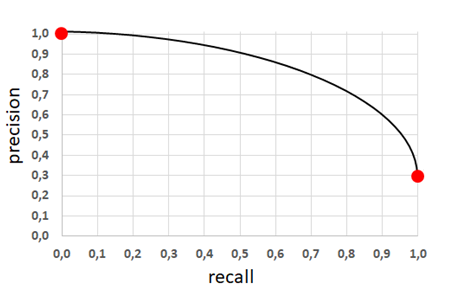
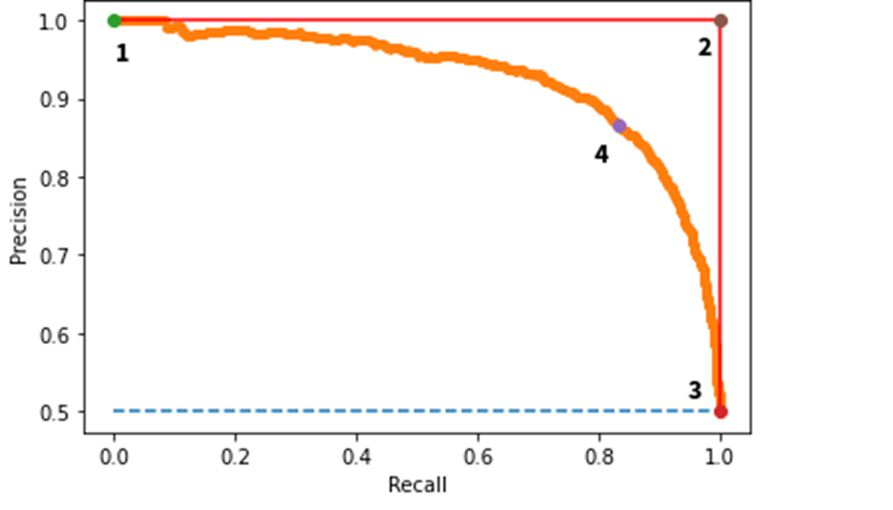

# Dogal Dil Isleme - Basari Olcutleri

**Toplam Sayfa:** 14
**Toplam Görsel:** 17

---

## Sayfa 1

### Görseller

*Görsel 1: Dogal Dil Isleme - Basari Olcutleri_sayfa1_gorsel1.png*

### İçerik

DOĞAL DİL İŞLEMEYE 
GİRİŞ
BİLGİSAYAR MÜHENDİSLİĞİ BÖLÜMÜ
BURSA TEKNİK ÜNİVERSİTESİ
DR. HAYRI VOLKAN AGUN

---

## Sayfa 2

### Görseller

*Görsel 1: Dogal Dil Isleme - Basari Olcutleri_sayfa2_gorsel1.png*

### İçerik

Özet
❑Değerlendirme ölçütleri nelerdir?
❑Değerlendirme ölçütlerini hesaplamada neler önemlidir?

---

## Sayfa 3

### Görseller

*Görsel 1: Dogal Dil Isleme - Basari Olcutleri_sayfa3_gorsel1.png*

### İçerik

❑
Değerlendirme ölçütleri (Evaluation Measures)
❑Bir problemin yada bir sınıflandırmanın ne kadar doğru şekilde çözüldüğünü ölçmede kullanılan
ölçütlerdir.
❑Bir sınıflandırma işleminde örneğin cümlenin özne/yüklem öbeklerini bulunmasında %70 doğruluk
sağlanıyorsa bu problem sadece özne veya sadece yüklem öbeklerini bulmada daha önce hiç
karşılaşmadığı bir test metninde ne kadar başarılıdır?
❑Yukarıdaki sorunun cevabını verebilmek için kullanılan farklı başarı ölçütleri vardır.
❑Sınıflandırma yöntemlerinde bu ölçütler sınıflandırma değerlendirmesi (classification evaluation)
olarak bilinir.
❑Bir sınıflandırma gereksiz/gerekli olmak üzere iki sınıf (binary) yada spor, politika, yaşam, ve
ekonomi olmak üzere çok sınıflı (multiclass) olabilir. Her iki durum içinde kullanılan sınıflandırma
ölçütleri aynıdır.

---

## Sayfa 4

### Görseller

*Görsel 1: Dogal Dil Isleme - Basari Olcutleri_sayfa4_gorsel1.png*

### İçerik

Değerlendirme Ölçütleri
❑Değerlendirme ölçütleri iki ortalama değer ile hesaplanır. Bunlar ham sınıf ortalaması (average), ve 
ağırlıklı ortalama (weighted average) dır. 
❑Ortalama ölçütünde her bir sınıf için toplam ortalamanın sınıf sayısına bölümü ile elde edilir. 
❑Ağırlıklı ortalama ölçütünde ise sınıfların içerisinde geçen örneklem sayısı dikkate alınarak ortalama 
hesaplanır. 
❑Bir metin test kümesinden 100 adet spor, 100 adet politika ve 200 adet ekonomi dokümanı olsun. Bu 
kategoriler için bir metin sınıflandırması yapıldığında 20 adet spor metni, 30 adet politika metni, 20 
adet ekonomi metni doğru kategori ile sınıflandırılsın.
Ortalama hesabı = (20/100 + 30/100 + 20/200) / 3 = 0.6 / 3 = 0.2 =    20 % 
Ağırlıklı ortalama hesabı  = σ sınıf oranı ∗başarı oranı
= 100/500 * 20/100 + 100/500 * 30/100 + 200/500 * 20/200 
= 0.04 + 0.06 + 0.04         = 0.14 =  14 %

---

## Sayfa 5

### Görseller

*Görsel 1: Dogal Dil Isleme - Basari Olcutleri_sayfa5_gorsel1.png*

### İçerik

Değerlendirme Ölçütleri
❑Bir SMS veri kümesinde gereksiz (spam) ve gerekli sms ayırımı yapmak isteseydik.
Başarı oranının belirlerken ağırlıklı ortalama yada sınıf ortalaması mı tercih edilirdi?
Nedenini açıklayınız?
❑Örneğin 1000 SMS içerisinde bulunan 200 Normal SMS mesajı içerisinden 100 adeti
doğru sınıflandırılmış ve geri kalan 800 gereksiz (spam) SMS mesajının 400 adeti doğru
sınıflandırılmıştır. Sizce başarı oranı nedir?

---

## Sayfa 6

### Görseller

*Görsel 1: Dogal Dil Isleme - Basari Olcutleri_sayfa6_gorsel1.png*

### İçerik

Değerlendirme Ölçütleri
❑
Örneğin: 1000 adet cümle içerisinde geçen 1000 adet özne öbeği içerisinden 750 adeti ve 500
adet yüklem öbeği içerisinde 400 adeti doğru bilinmiştir.
❑
Geri kalan 250 adet özne öbeği içerisinden 10 adeti yüklem öbeği olarak tahmin edilmiş ve 240
adeti ise hiç saptanamamıştır.
❑
Geri kalan 100 adet yüklem öbeği içerisinden 90 adeti özne öbeği olarak tahmin edilmiş ve 10
adeti saptanamamıştır.
❑
Saptanamayan sınıflar gerçekte doğru olup işaretlenemeyen yada tahmin edilemeyen sınıflardır.

---

## Sayfa 7

### Görseller

*Görsel 1: Dogal Dil Isleme - Basari Olcutleri_sayfa7_gorsel1.png*

### İçerik

Örnek
❑1000 adet doküman içerisinde 500 adeti spor haberleri, 200 adeti politika haberleri, ve geri
kalan dokümanlar ise önemsiz sayılmaktadır.
❑Konu sınıflandıran bir metin sınıflandırma algoritması bu metinlerden 200 adeti spor ve 200
adeti ise politika dokümanı olarak sınıflandırmaktadır.
❑Bu durumda bu sınıflandırıcının genel olarak sınıflandırma başarısı ne kadar dır?
❑Doğru sayılan örnekler göz önününde bulundurulduğunda sınıf ortalaması
❑Ortalama doğruluk oranı = (200 / 500 + 200 / 200) / 2 = 70 %
❑Ağırlıklı doğruluk oranı
= (200 / 500 * 500/1000 + 200/200 * 200/1000) = 40 %

---

## Sayfa 8

### Görseller

*Görsel 1: Dogal Dil Isleme - Basari Olcutleri_sayfa8_gorsel1.png*

*Görsel 2: Dogal Dil Isleme - Basari Olcutleri_sayfa8_gorsel2.png*

### İçerik

Hata Matrisi (Confusion Matrix)
Birden 
çok
sınıflandırma
etiketi
kullanılan
sınıflandırma
problemlerinde
hangi
etiketlerin
daha
çok
yanlış
sınıflandırıldığını
veya
hangi
sınıflandırma
etiketlerinin
daha
doğru
sınıflandırıldığını saptamak için, sınıfların doğruluk
ve
F-measure
değerlendirme
ölçütlerini
hesaplamak için hata matrisi oluşturulur.
Yandaki
örnekte
Setosa
türü
çiçek
için
sınıflandırma
doğruluğu
ve
f-measure
değeri
%100 dür. Çünkü ne Setosa örneklemleri başka
bir çiçek türü olarak sınıflandırılmış ne de başka
çiçek türleri Setosa olarak sınıflandırılmıştır.

---

## Sayfa 9

### Görseller

*Görsel 1: Dogal Dil Isleme - Basari Olcutleri_sayfa9_gorsel1.png*

### İçerik

Hata Matrisi
❑Bir sınıflandırma probleminde değerlendirme ölçütleri aşağıdaki tablo ile ifade edilebilir.
❑Örneğin 1000 SMS içerisinde bulunan 200 Normal SMS mesajı içerisinden 100 adeti doğru 
sınıflandırılmış ve geri kalan 800 gereksiz (spam) SMS mesajının 300 adeti doğru sınıflandırılmıştır. 
Sizce başarı oranı nedir?
❑Her bir etiket için başarı oranı aşağıdaki tabloda verilir. 
SPAM/GEREKSİZ
Sınıfa ait mevcut 
örneklemler
Sınıfa ait olmayan mevcut 
örneklemler
Toplam
Tahmin edilen sınıfa ait 
örneklemler
300
100
400
Tahmin edilen sınıfa ait 
olmayan 
örneklemler
500
100
600
Toplam
800
200
1000

---

## Sayfa 10

### Görseller

*Görsel 1: Dogal Dil Isleme - Basari Olcutleri_sayfa10_gorsel1.png*

### İçerik

Hata Matrisi
SINIF/ETİKET
Sınıfa ait mevcut 
örneklemler
Sınıfa ait olmayan 
mevcut 
örneklemler
Toplam
Tahmin edilen sınıfa ait 
örneklemler
TRUE POSITIVE
(DOĞRU VE POZİTİF)
FALSE POSITIVE 
(YANLIŞ VE POZİTİF)
TOPLAM POZİTİF 
ÖRNEKLEM
Tahmin edilen sınıfa ait 
olmayan 
örneklemler
TRUE NEGATIVE (DOĞRU 
VE NEGATİF)
FALSE NEGATIVE 
(YANLIŞ VE NEGATIF)
TOPLAM NEGATİF 
ÖRNEKLEM
Toplam
TOPLAM DOĞRU 
ÖRNEKLEM
TOPLAM YANLIŞ 
ÖRNEKLEM
1000

---

## Sayfa 11

### Görseller

*Görsel 1: Dogal Dil Isleme - Basari Olcutleri_sayfa11_gorsel1.png*

### İçerik

Sınıf/Etiket Başarı oranları
❑Her bir sınıf için başarı oranları ayrı ayrı hesaplanır. Tahmin içerisinde geçen sınıfa ait olarak belirtilen tüm 
örneklemler pozitif örneklemdir. Mevcut içerisinde geçen sınıfa ait olarak belirtilen tüm örneklemler doğru 
örneklemdir.
❑Örneğin; Spor ve politika dokümanları barındıran 1000 adetlik doküman kümesinde  500 adet spor metnin 
200 adeti politika olarak sınıflandırılmıştır. Geri kalan 300 adedi ise spor metni olarak sınıflandırılmıştır. 500 
adet politika metninden 100 adedi doğru sınıflandırılmıştır. Geriye kalan 400 adedi ise spor metni olarak 
yanlış sınıflandırılmıştır. 
❑Bu durumda  spor sınıf için negatif ve doğru olan (True Negaitve - TN) tahmin sayısı kaçtır. 
❑Doğru negatif örneklem sayısı spor metini olmayan ve doğru şekilde sınıflandırılan örneklem sayısıdır. Bu 
toplamdan çıkarılarak bulunur. 1000 adet dokümandan doğru pozitif sayısı ve yanlış tahmin sayılarını 
çıkartalım. 
❑1000 – Yanlış Pozitif – Yanlış Negatif – Doğru Pozitif = 1000 – 400 – 200 – 300 = 100
❑Bu durumda 100 adet doküman spor metni olmayan doküman doğru şekilde sınıflandırılmıştır. İki adet sınıf 
olduğu için bu rakam doğru sınıflandırılan politika metinlerine denk gelir.

---

## Sayfa 12

### Görseller

*Görsel 1: Dogal Dil Isleme - Basari Olcutleri_sayfa12_gorsel1.png*

### İçerik

Değerlendirme Ölçütleri
❑TP – True Positives – Doğru ve Pozitif Örneklem Sayısı
❑TN – True Negatives – Doğru ve Negatif Örneklem Sayısı
❑FP – False Positives – Yanlış ve Pozitif Örneklem Sayısı
❑FN – False Negatives – Yanlış ve Negatif Örneklem Sayısı
Doğruluk (Accuracy) =
𝑇𝑃 + 𝑇𝑁
𝑇𝑃 + 𝑇𝑁 + 𝐹𝑃+ 𝐹𝑁
Kesinlik (Precision) =
𝑇𝑃
𝑇𝑃 + 𝐹𝑃
Duyarlılık (Recall) = 
𝑇𝑃
𝑇𝑃+ 𝐹𝑁
F-Measure =
2
1
𝑃𝑟𝑒𝑐𝑖𝑠𝑖𝑜𝑛+
1
𝑅𝑒𝑐𝑎𝑙𝑙
=
2∗𝑝𝑟𝑒𝑐𝑖𝑠𝑖𝑜𝑛 ∗𝑟𝑒𝑐𝑎𝑙𝑙
𝑝𝑟𝑒𝑐𝑖𝑠𝑖𝑜𝑛+𝑟𝑒𝑐𝑎𝑙𝑙
P0 = 
𝑇𝑃 + 𝑇𝑁
𝑇𝑃 + 𝑇𝑁 + 𝐹𝑃+ 𝐹𝑁,   Pe=
𝑇𝑃 +𝐹𝑃𝑥𝑇𝑃+𝑇𝑁+ 𝑇𝑁+𝐹𝑁𝑥𝐹𝑃+𝐹𝑁
𝑇𝑃+𝑇𝑁+𝐹𝑃+𝐹𝑁2
Kappa = (P0-Pe)/(1-Pe)

---

## Sayfa 13

### Görseller

*Görsel 1: Dogal Dil Isleme - Basari Olcutleri_sayfa13_gorsel1.png*

*Görsel 2: Dogal Dil Isleme - Basari Olcutleri_sayfa13_gorsel2.png*

*Görsel 3: Dogal Dil Isleme - Basari Olcutleri_sayfa13_gorsel3.png*

### İçerik

Precision & Recall

---

## Sayfa 14

### Görseller

*Görsel 1: Dogal Dil Isleme - Basari Olcutleri_sayfa14_gorsel1.png*

### İçerik

Referanslar
❑https://en.wikipedia.org/wiki/Evaluation_measures_(information_ret
rieval)
❑https://towardsdatascience.com/the-5-classification-evaluation-
metrics-you-must-know-aa97784ff226
❑https://nlp.stanford.edu/IR-book/html/htmledition/evaluation-of-text-
classification-1.html
❑https://en.wikipedia.org/wiki/Cohen%27s_kappa

---

