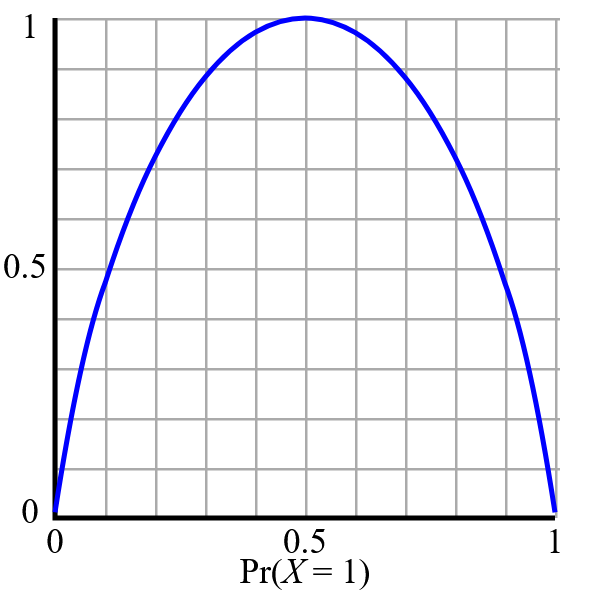
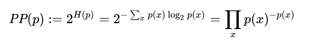
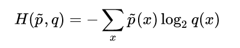
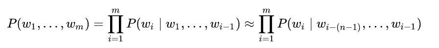
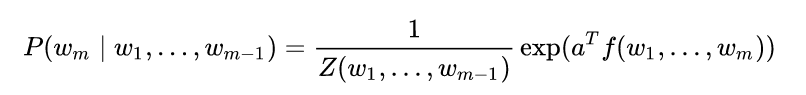
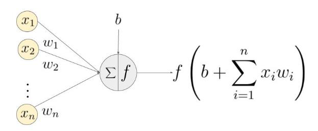
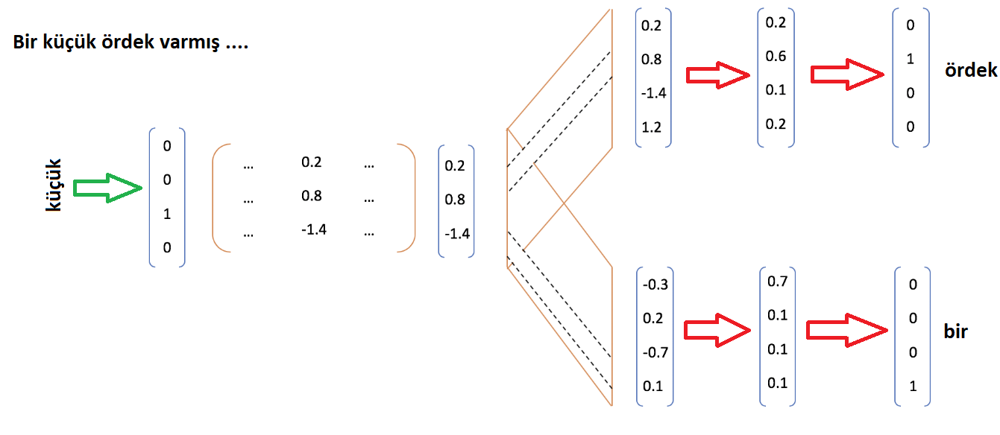
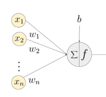
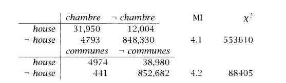

# Dogal Dil Isleme - Dil Modelleri

**Toplam Sayfa:** 20
**Toplam Görsel:** 30

---

## Sayfa 1

### Görseller

*Görsel 1: Dogal Dil Isleme - Dil Modelleri_sayfa1_gorsel1.png*

### İçerik

DOĞAL DİL 
İŞLEMEYE GİRİŞ
BAHAR DÖNEMİ - 2022-2023
BİLGİSAYAR MÜHENDİSLİĞİ BÖLÜMÜ
BURSA TEKNİK ÜNİVERSİTESİ
DR. HAYRI VOLKAN AGUN

---

## Sayfa 2

### Görseller

*Görsel 1: Dogal Dil Isleme - Dil Modelleri_sayfa2_gorsel1.png*

### İçerik

Özet
•Dil Olasılık Modelleri
•Eş dizimlilik
•Yapay Sinir Ağları Dil Modelleri

---

## Sayfa 3

### Görseller

*Görsel 1: Dogal Dil Isleme - Dil Modelleri_sayfa3_gorsel1.png*

### İçerik

Özet
❑Cümlenin kelime bölütlemesi yapılırken tüm kelimelerin boşluk ile ayrıldığını kabul ediyoruz. 
Örneğin:
❑“San Francisco köprüsü altın kapı köprüsü olarak adlandırılan bir asma köprüdür ve 1937 yılında 
inşa edilmiştir.”
❑Bölütler: [San, Francisco, köprüsü, altın, kapı, köprüsü, olarak, adlandırılan, bir asma, köprüdür, ve 
1937, yılında, inşa, edilmiştir, .]
❑Tüm bulunan bu kelimeler aslında tam olarak ayrık değildir. 
❑Özel isimler: San Francisco
❑Adlar: altın kapı köprüsü
❑Eylemler: inşa edilmiştir

---

## Sayfa 4

### Görseller

*Görsel 1: Dogal Dil Isleme - Dil Modelleri_sayfa4_gorsel1.png*

### İçerik

Zipf Yasası
❑Dildeki tüm kelimeler ve frekansları göz önüne alındığında bir dilde kullanılan toplam sözcük sayısı 
sözlük ile ifade edilir.
❑Ancak bu sözlük içerisinde her bir sözcüğün tüm dil kaynaklarında kullanım sıklığı o sözcüğün 
sıralamasını belirler.
❑Örneğin “bir” sözcüğü büyük bir metin havuzunda 31215 kez geçsin ve ‘yaş’ sözcüğü ise 25000 kez 
geçsin. Bu durumda bir sözcüğünün frekansı daha yüksektir ve sıralaması daha baştadır. 
❑Zipf kanuna göre doğada geçen tüm rastsal sıralamalarda (örneğin şehir nüfus sıralamaları) kelime 
geçme sıklığı ile sırası arasındaki katsayı sabittir. Örneğin:
❑5. sırada geçen bir kelimenin geçme sıklığı ile 6. sırada geçen kelimenin sıklığı arasındaki oran bir 
birine çok yakındır.
N
toplam = 90800, 
Kelime (ile) R = (2. sıra) = 3, F = (frekans) = 676, Zipf = 3 * 676/90800 = 0.022 
Kelime (ile) R = (6. sıra) = 6, F = (frekans) = 511, Zipf = 6 * 511/90800 = 0.033

---

## Sayfa 5

### Görseller

*Görsel 1: Dogal Dil Isleme - Dil Modelleri_sayfa5_gorsel1.png*

### İçerik

Zipf Yasası
❑Zipf yasası ile açıklanmak istenen bir dilde kullanılan kelimeler ne olursa olsun o dildeki
kelimenin kullanım sıklığı ile sıralaması arasında sabit bir oran vardır.
❑İnsanlar ve diğer tüm canlılar doğası gereği enerjiyi koruyarak hareket ederler. Konuşma
ve anlamlaştırmada da bir kelimenin sık kullanılması diğerinin az kullanılması dilin
gelişiminde enerjin korunması olarak açıklanabilir.
❑Bir dile bir anlamı açıklamak için yeni
bir kelime eklendiğinde bu kelimenin kullanım
sıklığı ve sırası doğal olarak belirlenmiş olmaktadır.
❑Dildeki sözcüklere yeni sözcükler ekleyerek farklı anlamlar açıklanabilir ve dilin gelişimi
ile bu sözcükler arasındaki frekans sıralamaları değişebilir.

---

## Sayfa 6

### Görseller

*Görsel 1: Dogal Dil Isleme - Dil Modelleri_sayfa6_gorsel1.png*

### İçerik

Cümle olasılıkları 
❑Bir cümlenin içerisinde barındırdığı her bir kelime için belirlenen olasılık büyük bir metin 
havuzundaki toplam kelime sayısı ve o kelimenin geçme sayısı kullanılarak hesaplanır.
❑𝑃(𝑤= 𝑏𝑖𝑟) = 𝑓𝑟𝑒𝑘𝑎𝑛𝑠(𝑏𝑖𝑟) / 𝑡𝑜𝑝𝑙𝑎𝑚= 3180/10900
❑Cümle olasılığı ise her bir kelimenin cümle içinde bulunduğu konuma bakılmaksızın 
kelime olasılığının çarpımıdır.    
❑Örneğin: ‘yüz oldu’ ile ‘oldu yüz’ olasılıkları aynıdır.
❑𝑃𝑤1, 𝑤2 = 𝑃𝑤1 ∗𝑃𝑤2
❑Cümle olasılığı neden gereklidir. Örnek uygulamalar neler olabilir?

---

## Sayfa 7

### Görseller

*Görsel 1: Dogal Dil Isleme - Dil Modelleri_sayfa7_gorsel1.png*

*Görsel 2: Dogal Dil Isleme - Dil Modelleri_sayfa7_gorsel2.png*

### İçerik

Entropi
❑Entropi genel olarak enerjinin korunması kanunu ile açıklanmaktadır. 
❑Benzer bir şekilde bir bilginin ifade edilmesinde gereken bit sayısının hesabında da kullanılmaktadır. 
❑Entropy bir durumun gerçekleşmesi yada gözlemlenmesindeki olası etki olarak da ifade edilebilir.
❑Örneğin: bir AVM’ye her gün gelen arabalar sırasıyla  sedan, sedan, hatcback, sedan, hatchback, .., sedan 
olsun.
❑Bu arabaların her birinin gelme olasılığı p(x) olsun. Tüm bir ay borunca
P(sedan) = sayısı/toplam = 100/200 = 0.5
P(hatchback) = sayı/toplam = 50/200 = 0.25
P(station) = sayı/toplam = 25/200 = 0.0125
P(sport) = sayı/toplam = 25/200 = 0.0125 
❑Bu durumda bir gün için gelen araçların entropisi (log 2 tabanına göre) :
❑H(x) = σ𝑥𝑃𝑥∗log( 1/𝑃(𝑥))
H(x) = 0.50 * 1.0 + 0.25 * 2 + 2 x 0.125 * 3  = 1.5

---

## Sayfa 8

### Görseller

*Görsel 1: Dogal Dil Isleme - Dil Modelleri_sayfa8_gorsel1.png*

*Görsel 2: Dogal Dil Isleme - Dil Modelleri_sayfa8_gorsel2.png*

### İçerik

❑Örneğin: Yoldan geçen her bir araba
eşit olasılıkla geçmiş olsaydı.
❑P(sedan) = P(station) = P(heçbek) = P(spor)
= 0.25
❑Yoldan geçen arabalar sırasıyla 0.75,
0.125, 0.0125, 0.0 olasılıkla geçseydi.
❑Beklenen entropi birincide her zaman
daha yüksektir. Neden?
❑Entropi beklenen durumların çeşitliliğini
fazla olmasıdır.
Aşağıdaki şekilde bu
entropi gözlemlenmektedir.
Entropi
2 durum için en yüksek 
Entropy 
olasılıkların eşit olduğu 
0.5 
ise gerçekleşir.

---

## Sayfa 9

### Görseller

*Görsel 1: Dogal Dil Isleme - Dil Modelleri_sayfa9_gorsel1.png*

*Görsel 2: Dogal Dil Isleme - Dil Modelleri_sayfa9_gorsel2.png*

### İçerik

•
Entropy ile bir dilin tüm kelimelerini kullanarak ne kadar bilgi içerdiğini hesaplayabilirdik.
•
Ancak bunun için çok büyük bir metin kümesine sahip olmamız gerekirdi. Peki çok daha
az metin kullanarak bir dilin olasıksal olarak ne ürettiğini nasıl hesaplayabiliriz.
•
Bunun için tüm olasılıksal durumları yerine örneğin tüm kelimelerin gerçek olasılıkları
yerine kendimiz bir model oluşturup bu modelin ürettiği olasılıkları kullanırsak bu durumda
gerçek dünyaya bir yakınsama yapabiliriz.
•
Modelin bilgi oluşturma kapasitesini ölçmek için Perplexity kullanılabilir.
Perplexity

---

## Sayfa 10

### Görseller

*Görsel 1: Dogal Dil Isleme - Dil Modelleri_sayfa10_gorsel1.png*

*Görsel 2: Dogal Dil Isleme - Dil Modelleri_sayfa10_gorsel2.png*

### İçerik

• Perplexity yerine cross entropy kullanarak bir modelin ne kadar iyi tahmin 
yaptığını tespit etmede kullanılır.
Perplexity ks Cross Entropy
Model olasılığı
Gerçek olasılık

---

## Sayfa 11

### Görseller

*Görsel 1: Dogal Dil Isleme - Dil Modelleri_sayfa11_gorsel1.png*

### İçerik

Dil Modelleri
❑Bir cümle yada kelime torbası içindeki her bir kelimenin ayrı ayrı perplexity değeri
hesaplanabilir.
❑Ancak ayrık hesaplamada farz edilen bağımsız özdeş dağılım (independent and identically
distributed – i.i.d.) gerçek dünya için çok eksik bir yaklaşımdır.
❑Gerçek dünyada her bir kelimenin olasılığı birbirini etkiler. Örneğin: spor kelimesinin geçmesi
ile futbol kelimesinin geçmesi birbirinden bağımsız değildir. Burada cümlenin yada sıralı kelime
dizisinin kullanılması ile cümledeki kelimelerin dağılımları farklı oluşur. Bu fark ile olası veya
olası olmayan durumlar belirlenir.
❑Ardışık kelime dizileri için örneğin “Savaş tazminatı aldılar .”
cümlesi için her bir kelime
yanındaki kelime ile ilişki kabul edilirse o zaman dil modelinde olasılık hesabı aşağıdaki gibi
yapılmaktadır.
❑p(cümle) = p(savaş | BASLANGIC) * p(tazminatı | savaş) * p(aldılar | tazminatı) * p(. | aldılar)

---

## Sayfa 12

### Görseller

*Görsel 1: Dogal Dil Isleme - Dil Modelleri_sayfa12_gorsel1.png*

*Görsel 2: Dogal Dil Isleme - Dil Modelleri_sayfa12_gorsel2.png*

### İçerik

Dil Modelleri
❑Aşağıda bir kelimenin bağlı olasılık hesabı bir önceki tüm kelimeler ile olan koşullu olasılık 
hesabına göre yapılmaktadır.
❑Bir kelimenin kendinden önceki kelimelere göre olan koşullu olasılık hesabı aşağıdaki gibi 
yapılmaktadır.
❑𝑝𝑤𝑖, … . , 𝑤𝑚= #(𝑤𝑖, … . , 𝑤𝑚)/# 𝑤𝑖, … . , 𝑤𝑚−1
❑Örneğin bir metin havuzunda savaş kelimesi 1011 kez, ve savaş yasası kelimesi ise 605 
kez, ve savaş tazminatı birlikte 11 kez geçmiş olsun. Bu durumda 
❑p(“savaş tazminatı”)  = #(“savaş tazminatı”) / #(“savaş”) = 11/1011 = 0.0108
❑p(“savaş yasası”) = #(“savaş yasası”) / #(“savaş”) = 605 / 1011 = 0.5984

---

## Sayfa 13

### Görseller

*Görsel 1: Dogal Dil Isleme - Dil Modelleri_sayfa13_gorsel1.png*

### İçerik

Dil Modelleri
❑Dil modelleri bir kelimeden sonra başka hangi kelimenin geleceğini tahmin etmek için de 
kullanılabilirler. Bu özellikle SMS, E-Posta, Microsoft Word, Google Document gibi yazım 
araçlarında kelime tamamlama özelliğinde kullanılır.
❑Dil modelleri yönlü sonlu yapıda olup Bayes yaklaşımını barındırırlar. 
❑Dil modelleri ayrıca yapay sinir ağları ile ifade edilebilirler kullanılabilir.  

---

## Sayfa 14

### Görseller

*Görsel 1: Dogal Dil Isleme - Dil Modelleri_sayfa14_gorsel1.png*

*Görsel 2: Dogal Dil Isleme - Dil Modelleri_sayfa14_gorsel2.png*

*Görsel 3: Dogal Dil Isleme - Dil Modelleri_sayfa14_gorsel3.png*

### İçerik

Yapay Sinir Ağları
Yapay sinir ağları ayrımcı (discriminative) sınıflandırıcılardır. Sınıflandırmak için lineer ağırlık matrisi 
kullanırlar ve bu ağırlık matrisi gradyan (gradient) kullanılarak veri üzerinden eğitilir.
Dil modellerinde eğitim için ne kullanılır. Bir sınıf yada kategori bilgisi yoktur.  

---

## Sayfa 15

### Görseller

*Görsel 1: Dogal Dil Isleme - Dil Modelleri_sayfa15_gorsel1.png*

*Görsel 2: Dogal Dil Isleme - Dil Modelleri_sayfa15_gorsel2.png*

*Görsel 3: Dogal Dil Isleme - Dil Modelleri_sayfa15_gorsel3.png*

### İçerik

Yapay Sinir Ağı – Dil Modelleri

---

## Sayfa 16

### Görseller

*Görsel 1: Dogal Dil Isleme - Dil Modelleri_sayfa16_gorsel1.png*

### İçerik

Eşdizimlilik
❑Mevcut dil analizlerinde kullanılan ardışık dil modellerinde çoğu zaman tüm 
kelimeler ayrık kabul edilir.
❑Örneğin
❑İngilizce için New York, fast food, do a favor, take a holiday
❑Türkçe için zaman kaybı, sık sık, olan biten, rekor kırmak, rast gelmek, İstanbul boğazı, 
avrupa yakası,…, 

---

## Sayfa 17

### Görseller

*Görsel 1: Dogal Dil Isleme - Dil Modelleri_sayfa17_gorsel1.png*

*Görsel 2: Dogal Dil Isleme - Dil Modelleri_sayfa17_gorsel2.png*

### İçerik

Pointwise Mutual Information
❑Belirli hipotezlerin olasılıkların tutarlı olup
olmadığını test etmek için kullanılır.
❑Örneğin bir metin içinde geçen kelimelerin bir
eş dizimlilik oluşturduğunu test etmek için
kullanılabilir.
❑Örneğin
yandaki
tabloya
göre
mutual
information
ve
Chi-square
hipotez
testi
değerleri verilmiştir. Burada house chambre
ve
house
communes
çevirileri
için
MI
hesaplaması yapılmıştır. Doğru çeviri house
champre çevirisidir.
• 𝐼𝑥, 𝑦= log2
𝑃𝑥𝑦
𝑃𝑥∗𝑃𝑦

---

## Sayfa 18

### Görseller

*Görsel 1: Dogal Dil Isleme - Dil Modelleri_sayfa18_gorsel1.png*

### İçerik

Eşdizimlilik
❑Bir kelime grubunun birlikte sık geçmesine göre kelimeler eş-dizim olarak kabul edilebilir.
❑Bir kelime grubu eş - dizim midir? Nasıl bulunabilir?
❑Örneğin: “New York” kelimesi New ve York kelimelerinden oluşur. New ve York kelimeleri tek başlarına 
tüm metin havuzunda 541 ve 212 kez geçmiş olsun. 
❑Bu durumda “New York” birlikte 5 kez geçiyorsa ve metin havuzun 1500 toplam kelime sayısı var ise 
bu kelime ikilisi eş dizim midir?
❑Genel olarak:
❑p(New | York) 
❑H0: P(New) * P(York) > P(New York)
❑H0 null hipotezidir. Null hipotezi bir durumun rastgele oluştuğu belirli bir öbeğin yada özel bir bağın olmadığı durumu temsil eder. 
❑Yukarıdaki durumda null hipotezi New ve York kelimelerinin ilişkisel bir bağıntı barındırmadığını gösterir.  Bu 
durumda New ve York kelimeleri birbirinden bağımsızdır. Birlikte bir eş dizimi temsil etmezler.

---

## Sayfa 19

### Görseller

*Görsel 1: Dogal Dil Isleme - Dil Modelleri_sayfa19_gorsel1.png*

### İçerik

Eşdizimlilik
❑p(“New York”) = 5/1500 = 0.003
❑p(“New”) = 541 / 1500 = 0.36
❑p(“York”) = 212 / 1500 = 0.14
❑p(“New York”) < p(“New”) * p(“York”) ➔ 0.003 < 0.05
❑Bu durumda `null hipotezi` geçerli olur.  

---

## Sayfa 20

### Görseller

*Görsel 1: Dogal Dil Isleme - Dil Modelleri_sayfa20_gorsel1.png*

### İçerik

Interpolasyon – Seyrek geçme
❑Bazen hesaplamak istediğimiz olasılıklar elimizdeki veride olmayabilir. Örneğin zamazingolar
kelimesi elimizdeki metinde geçmemiş olabilir. Bu durumda bu kelime ile öbek oluşturacak
kelimelerde 0 olasılık maduru olacaklardır. Bunu engellemek için interpolasyondan faydalanılır.
❑P(wn|wn-2,wn-1) = λ1P(wn) + λ2P(wn| wn-1) + λ2P(wn| wn-1,wn-2)
❑Yukaridaki hesaplamada lambda λ ifadesi pozif bir katsayır. Bu durumda zamazingo kelimesi 
wn-2 ise sadece bir terim sıfır olacaktır. Diğer terimlerle hesaplamaya devam edilebilir.

---

