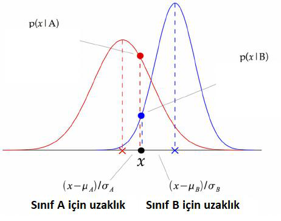
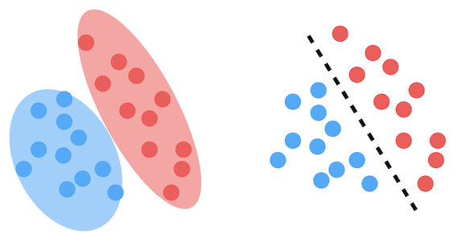
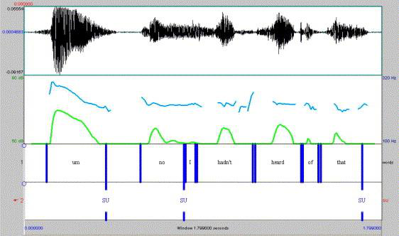
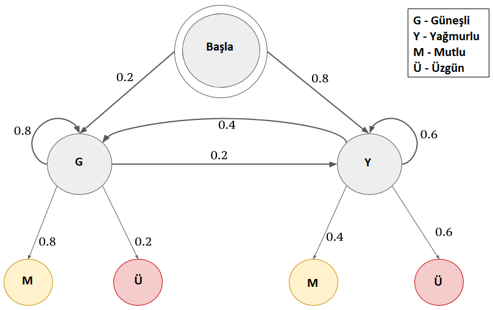
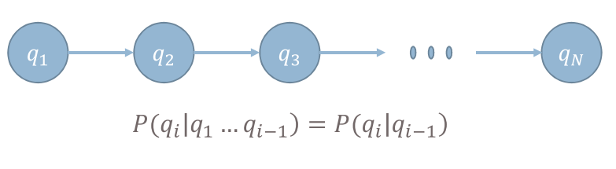
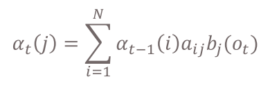
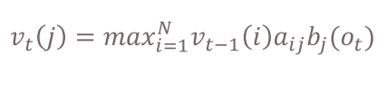
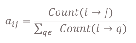
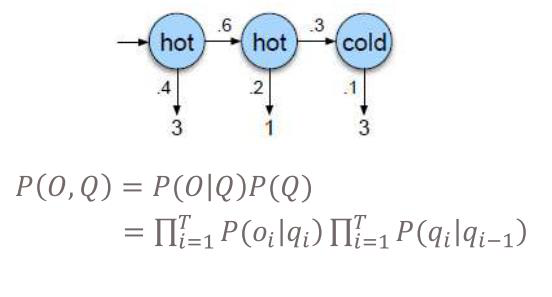
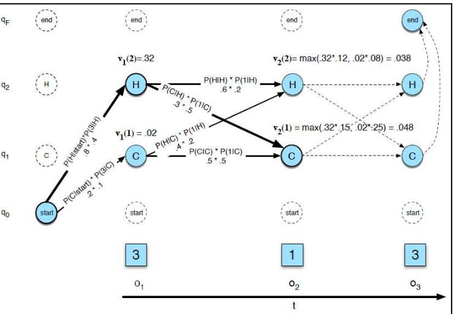

# Dogal Dil Isleme - Sakli Markov Modeller

**Toplam Sayfa:** 19
**Toplam Görsel:** 41

---

## Sayfa 1

### Görseller

*Görsel 1: Dogal Dil Isleme - Sakli Markov Modeller_sayfa1_gorsel1.png*

### İçerik

DOĞAL DİL 
İŞLEMEYE GİRİŞ
BİLGİSAYAR MÜHENDİSLİĞİ BÖLÜMÜ
BURSA TEKNİK ÜNİVERSİTESİ
DR. ÖĞR. ÜYESİ HAYRİ VOLKAN AGUN

---

## Sayfa 2

### Görseller

*Görsel 1: Dogal Dil Isleme - Sakli Markov Modeller_sayfa2_gorsel1.png*

### İçerik

Özet
❑Üretici sınıflandırma (generative)
❑Ayırt edici sınıflandırma (discrimantive)
❑Saklı Markov Modeller (hidden Markov models)
❑Viterbi Algoritması 
❑Saklı Markov Model örnekleri

---

## Sayfa 3

### Görseller

*Görsel 1: Dogal Dil Isleme - Sakli Markov Modeller_sayfa3_gorsel1.png*

### İçerik

Sınıflandırma Türleri – Üretici (Generative)
❑Gözetimli sınıflandırma yöntemleri makine öğrenmesi literatüründe en temel olarak iki ayrı türede ifade 
edilir.
❑Bunlar üretici sınıflandırma ve ayırt edici sınıflandırmadır.
❑Üretici sınıflandırma veri üzerinde sonsal (posterior) olasılık değerini hesaplamak için o sınıfa ait olan 
verinin istatistik analizinden yararlanır.  
❑İstatiksel analiz için gereken parametreleri girdiye ait veri üzerine yakınsayarak hesaplar. 
❑Sınıflandırma için bu yakınsanan parametrelerin ayırt edilecek verileri ne ölçüde kapsadığını bulmak 
için sonsal olasılığı hesaplar. 
❑Sonsal olasılık hangi sınıf modeli için en yüksek ise o zaman girdi/öğe o sınıftadır.

---

## Sayfa 4

### Görseller

*Görsel 1: Dogal Dil Isleme - Sakli Markov Modeller_sayfa4_gorsel1.png*

*Görsel 2: Dogal Dil Isleme - Sakli Markov Modeller_sayfa4_gorsel2.png*

### İçerik

❑Sınıflandırma yöntemleri makine öğrenmesi literatüründe en 
temel olarak iki ayrı türede ifade edilir.
❑Bunlar üretici sınıflandırma ve ayırt edici sınıflandırmadır.
❑Genel yaklaşımda naive Bayes kullanılarak P(x | A) 
olasılığından P(A | x) hesaplanır.
❑Yanda bir X girdi değeri A ve B sınıfları için 
❑
Elde edilen iki farklı ortalama ve standart  sapma parametreleri ve 
normal dağılım kullanılarak yapılan sınıflandırma yandaki şekilde 
gösterilmektedir.
❑
Sınıflandırma için tek bir sınır yerine iki farklı sınıf için tek bir uzaklık 
foksiyonu yerine iki farklı uzaklık kullanılmaktadır.
❑
Bunun sebebi sizce nedir?
Sınıflandırma Türleri – Üretici (Generative)

---

## Sayfa 5

### Görseller

*Görsel 1: Dogal Dil Isleme - Sakli Markov Modeller_sayfa5_gorsel1.png*

*Görsel 2: Dogal Dil Isleme - Sakli Markov Modeller_sayfa5_gorsel2.png*

### İçerik

Sınıflandırma Türleri – Ayırt Edici 
(Discriminative)
❑Ayırt
edici
sınıflandırmada
veri
dağılımına
bakılmaksızın
bir
sınır
fonksiyonu
elde
edilmektedir. Kullanılan sınır fonksiyonu girilen
bir
girdi
için
doğru
sınıfın
bulunmasında
kullanılır.

---

## Sayfa 6

### Görseller

*Görsel 1: Dogal Dil Isleme - Sakli Markov Modeller_sayfa6_gorsel1.png*

*Görsel 2: Dogal Dil Isleme - Sakli Markov Modeller_sayfa6_gorsel2.png*

### İçerik

Sınıflandırma Türleri – Ayırt Edici 
(Discriminative)
❑Ayırt edici sınıflandırmada veri dağılımına
bakılmaksızın
bir
sınır
fonksiyonu
elde
edilmektedir.
Kullanılan
sınır
fonksiyonu
girilen
bir
girdi
için
doğru
sınıfın
bulunmasında kullanılır.

---

## Sayfa 7

### Görseller

*Görsel 1: Dogal Dil Isleme - Sakli Markov Modeller_sayfa7_gorsel1.png*

*Görsel 2: Dogal Dil Isleme - Sakli Markov Modeller_sayfa7_gorsel2.png*

### İçerik

Sınıflandırma Türleri – Ayırt Edici 
(Discriminative)
❑Ayırt edici sınıflandırmada veri dağılımına
bakılmaksızın
bir
sınır
fonksiyonu
elde
edilmektedir.
Kullanılan
sınır
fonksiyonu
girilen
bir
girdi
için
doğru
sınıfın
bulunmasında kullanılır.
❑Ayırt
edici
sınıflandırma
ve
üretici
sınıflandırma
modellerinde
kullanılan
matematik birbirine çok benzer olabilir ancak
temel bu iki sınıflandırma yöntemi ya girdiyi
yada ayırt edici modeli oluşturmada kullanılır.
Girdi modellemesi
Sınır modellemesi

---

## Sayfa 8

### Görseller

*Görsel 1: Dogal Dil Isleme - Sakli Markov Modeller_sayfa8_gorsel1.png*

*Görsel 2: Dogal Dil Isleme - Sakli Markov Modeller_sayfa8_gorsel2.png*

*Görsel 3: Dogal Dil Isleme - Sakli Markov Modeller_sayfa8_gorsel3.png*

### İçerik

Sınıflandırma – Sınır Bulma
❑Bir paragraftaki her bir cümlenin başlangıç ve
bitişinin bulunması.
❑Bir kelime yada bir deyimin başlangıç ve
bitişinin bulunması
❑Bir
metin
içerisinde
geçen özel
isimlerin
başlangıç ve bitişlerini bulunması
❑Bir metin içerisinde geçen ardışık kelimelerin
yada
eklerin
belirli
bir
sınıfa
ait
olma
durumunun bulunması.
❑Sınır bulma doğal dil işleme dışında en sık
ses ve görüntü işlemede kullanılmaktadır.

---

## Sayfa 9

### Görseller

*Görsel 1: Dogal Dil Isleme - Sakli Markov Modeller_sayfa9_gorsel1.png*

*Görsel 2: Dogal Dil Isleme - Sakli Markov Modeller_sayfa9_gorsel2.png*

*Görsel 3: Dogal Dil Isleme - Sakli Markov Modeller_sayfa9_gorsel3.png*

*Görsel 4: Dogal Dil Isleme - Sakli Markov Modeller_sayfa9_gorsel4.png*

*Görsel 5: Dogal Dil Isleme - Sakli Markov Modeller_sayfa9_gorsel5.png*

*Görsel 6: Dogal Dil Isleme - Sakli Markov Modeller_sayfa9_gorsel6.png*

### İçerik

Tim Cook eski Apple CEO’su yeniden Apple’ın başına geçti. 
❑Yukarıdaki örnek için sınıflandırma her bir kelimenin yada her bir karakterin bir özel 
isim başlangıcı yada bitişi olduğu şeklinde yapılabilir.
Sınır Bulma Problemi
Kişi Adı:
Başlangıç 
Karakteri
Kişi Adı:
Bitiş
Karakteri
Şirket  Adı:
Bitiş
Karakteri
Şirket Adı:
Bitiş
Karakteri

---

## Sayfa 10

### Görseller

*Görsel 1: Dogal Dil Isleme - Sakli Markov Modeller_sayfa10_gorsel1.png*

### İçerik

❑Sınır bulma probleminde kullanılan ardışık öğeler (kelimeler, heceler, ekler yada karakterler) 
birbirinden bağımsız değildir. Bu durumda;
❑P(k2 | k1) = P(k1 ∩ k2) ≠ P(k1) * P(k2)  
❑Sadece karakterler bağımsız değildir. Sınıf bilgisi verildiğinde bir kelimenin başlangıç
karakteri kişi sınıfına ait başlangıcı temsil ediyorsa o zaman bitiş karakterinin de başka bir
sınıfa ait olma olasılığı 0 dır. Bu durumda sınıf olasılıkları da birbirine bağlıdır veya biririnden
bağımsız olamaz.
❑P(k2, k1|sinif) = P(k2 ∩k1|sinif) ≠ P(k1|sinif) * P(k2|sinif) 
Sınır Bulma Problemi

---

## Sayfa 11

### Görseller

*Görsel 1: Dogal Dil Isleme - Sakli Markov Modeller_sayfa11_gorsel1.png*

### İçerik

Üretici Sınıflandırma
❑Genellikle Normal (Gausian) dağılım kullanılarak sınıflandırılacak sınır öğelerinin geçme 
frekansları olasılık dağılıma dönüştürülür. 
❑Olasılık dağılım için normal dağılım parametreleri olan ortalama ve standart sapma her bir sınıf 
için hesaplanır.
❑Hesaplanan değerler sınıflandırılacak öğelerin ardışık olarak geçme dağılımları için 1 ile diğer 
durumlar için 0 ile çarpılarak tüm ardışık geçen öğelerin o sınıf için olasılığı hesaplanır. Olasılık 
hangi sınıf için yüksek ise o zaman o sınıf seçilir.
❑Sınıfların ardışık geçme olasıkları, karakter yada ardışık öğelerin geçme olasılıkları ve ardışık 
öğelerin belirli bir sınıfa ait olma olasılıkları olmak üzere toplamda 3 farklı olasılık dağılımı 
mevcuttur. 

---

## Sayfa 12

### Görseller

*Görsel 1: Dogal Dil Isleme - Sakli Markov Modeller_sayfa12_gorsel1.png*

### İçerik

❑Saklı Markov modelleri (Hidden Markov Model) ardışık sınıflandırma probleminde geçen 3
olasılık dağılımını birleşik (joint) dağılıma çevirerek modellemektedir.
❑Birleşik
dağılımda
gözlemlenebilir
olan
ardışık
kelime
dağılımını
(conditional
output),
gözlemlenemeyen ardışık sınıf dağılımını (conditional hidden) ve ilksel/ön (prior) olasılık
dağılımını birleştirilir.
❑Gözlemlenebilir dağılım daha önce gördüğümüz dil modelidir. Ardışık olarak geçen kelime, ek
gibi durumların şartlı olasılık modelidir.
❑Gözlemleneyen dağılım arka plandaki durumlar ve durumlar arası geçişlerin koşullu olasılık
modelidir. Bunlar sınıf veya etiket dağılımlarıdır.
Saklı Markov Modelleri

---

## Sayfa 13

### Görseller

*Görsel 1: Dogal Dil Isleme - Sakli Markov Modeller_sayfa13_gorsel1.png*

*Görsel 2: Dogal Dil Isleme - Sakli Markov Modeller_sayfa13_gorsel2.png*

### İçerik

Saklı Markov Modelleri
❑Yandaki şekilde bir saklı Markov modeli ifade
edilmektedir.
❑Markov modellerinin tümünde bir durum ve bu
durumun
gerçekleşme
olasılığı
sadece
ilişkili
olduğu durumun koşullu olasılığı olarak belirlenir.
❑Yandaki şekilde koşullu olasılıklar ok bağlantıları
ile ifade edilmektedir.
❑Yandaki şekilde bir kişinin mutlu yada üzgün olma
durumu ifade edilmektedir. Buna göre havanın
güneşli
olması
ve
kişinin
mutlu
olması
P(mutlu|güneşli)

---

## Sayfa 14

### Görseller

*Görsel 1: Dogal Dil Isleme - Sakli Markov Modeller_sayfa14_gorsel1.png*

*Görsel 2: Dogal Dil Isleme - Sakli Markov Modeller_sayfa14_gorsel2.png*

*Görsel 3: Dogal Dil Isleme - Sakli Markov Modeller_sayfa14_gorsel3.png*

### İçerik

Saklı Markov Modelleri
❑P(mutlu|güneşli) = P(mutlu) * (güneşli|mutlu) / p(güneşli)
❑Aşağıdaki ilk model 1. derece Markov modelidir ve ikinci model ise 2. derece 
Markov modelidir

---

## Sayfa 15

### Görseller

*Görsel 1: Dogal Dil Isleme - Sakli Markov Modeller_sayfa15_gorsel1.png*

*Görsel 2: Dogal Dil Isleme - Sakli Markov Modeller_sayfa15_gorsel2.png*

### İçerik

Saklı Markov Modeli
❑Saklı Markov modelinde olasılığın hesaplanması (likelihood), çözümleme (decoding/forward
pass) ve öğrenme olmak üzere 2 adım vardır.
❑Likelihood: gözlemlenen durum kullanılarak oluşabilecek tüm olası ardışık durum dizilerinin her
biri için olasılığın hesaplanması.

---

## Sayfa 16

### Görseller

*Görsel 1: Dogal Dil Isleme - Sakli Markov Modeller_sayfa16_gorsel1.png*

*Görsel 2: Dogal Dil Isleme - Sakli Markov Modeller_sayfa16_gorsel2.png*

*Görsel 3: Dogal Dil Isleme - Sakli Markov Modeller_sayfa16_gorsel3.png*

### İçerik

Saklı Markov Modeli
❑Çözümleme (decoding/forward) : Sadece maksimum oluşacak olasılığın 
bulunması.
❑Öğrenme (learning): Durumlar arasında geçişlerin olasılıklarının 
hesaplanması. Veri üzerinde sayma işlemi ile üretici model ile öğrenilir.

---

## Sayfa 17

### Görseller

*Görsel 1: Dogal Dil Isleme - Sakli Markov Modeller_sayfa17_gorsel1.png*

*Görsel 2: Dogal Dil Isleme - Sakli Markov Modeller_sayfa17_gorsel2.png*

*Görsel 3: Dogal Dil Isleme - Sakli Markov Modeller_sayfa17_gorsel3.png*

### İçerik

Saklı Markov Modeli
❑Yandaki şekilde sıcak ve soğuk gizli/saklı
durumları için sayılar gösterilmiştir. Bu sayılar
her
bir
durum
için
farklı
olasılık
ile
gözlemlenmektedir.
❑Bu durumda 3 1 3 için gözlemlenebilecek her
bir durum dizisi nedir ve olasılıkları nedir?
HOT, HOT, HOT
HOT, HOT, COLD
HOT, COLD, HOT
HOT, COLD, COLD
COLD, HOT, HOT
COLD, HOT, COLD
COLD, COLD, HOT
COLD, COLD, COLD

---

## Sayfa 18

### Görseller

*Görsel 1: Dogal Dil Isleme - Sakli Markov Modeller_sayfa18_gorsel1.png*

*Görsel 2: Dogal Dil Isleme - Sakli Markov Modeller_sayfa18_gorsel2.png*

*Görsel 3: Dogal Dil Isleme - Sakli Markov Modeller_sayfa18_gorsel3.png*

*Görsel 4: Dogal Dil Isleme - Sakli Markov Modeller_sayfa18_gorsel4.png*

### İçerik

Saklı Markov Modeli
Gözlemlenen öğeler
Saklı durumlar öğeler ve 
soldan sağa kombinasyonları

---

## Sayfa 19

### Görseller

*Görsel 1: Dogal Dil Isleme - Sakli Markov Modeller_sayfa19_gorsel1.png*

### İçerik

Saklı Markov Modelleri
❑Saklı markov modelleri üretici model sınıfındadır. 
❑Doğal dil işlemede –
❑Kelime türü belirleme (Part of Speech Taging) de kullanılabilir.
❑Alp    dün     akşam   yemeğinde     soslu    makarna        yedi         .
❑NN/  ADV/     ADV/         NN/            ADJ/        NN/            VBD/    PUNC/
❑Kelime isim öbeklerinin bulumasında kullanılabilir.

---

