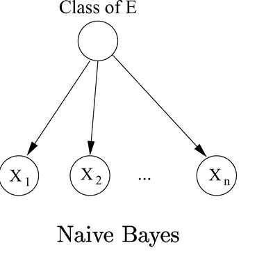
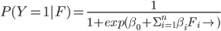
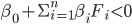
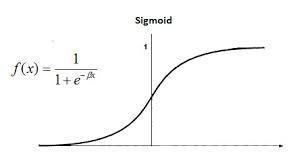
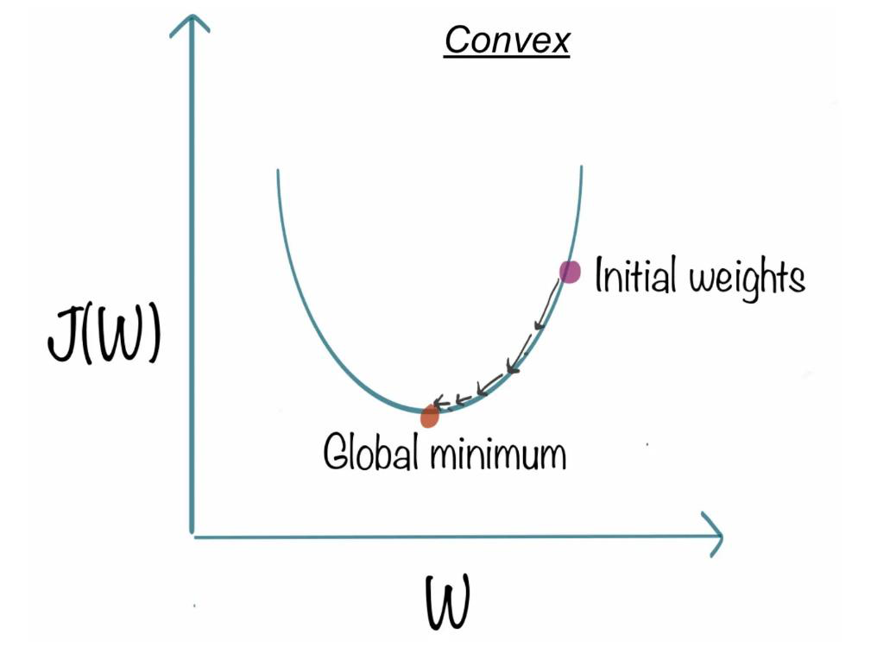
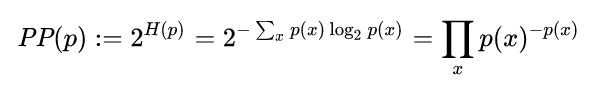
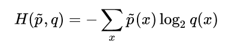
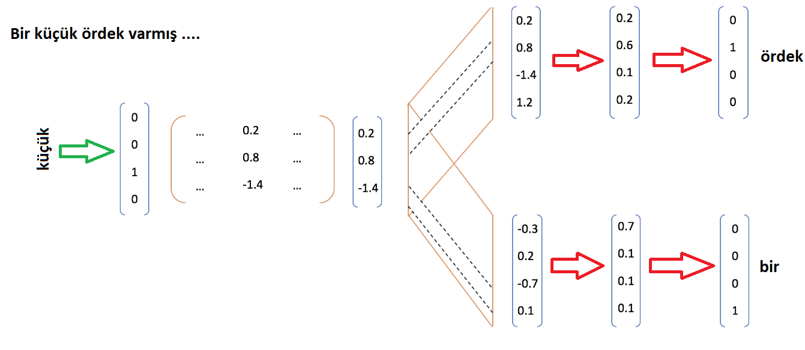
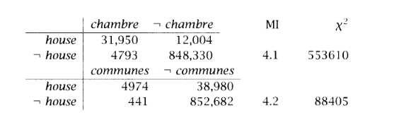

# Doğal Dil İşleme - Kapsamlı Ders Notları

**Toplam Dosya:** 8
**Toplam Sayfa:** 152
**Toplam Görsel:** 270

## İçindekiler

1. [4PwfeI-Dogal Dil Isleme - Duzenli Ifadeler](#4pwfei-dogal-dil-isleme---duzenli-ifadeler)
2. [Dogal Dil Isleme - Ayirt Edici Siniflandirma](#dogal-dil-isleme---ayirt-edici-siniflandirma)
3. [Dogal Dil Isleme - Ayristirma Ornegi](#dogal-dil-isleme---ayristirma-ornegi)
4. [Dogal Dil Isleme - Ayristirma](#dogal-dil-isleme---ayristirma)
5. [Dogal Dil Isleme - Basari Olcutleri](#dogal-dil-isleme---basari-olcutleri)
6. [Dogal Dil Isleme - Dil Modelleri](#dogal-dil-isleme---dil-modelleri)
7. [Dogal Dil Isleme - Sakli Markov Modeller](#dogal-dil-isleme---sakli-markov-modeller)
8. [Dogal Dil İsleme - Metin Siniflandirma](#dogal-dil-i̇sleme---metin-siniflandirma)

---

# 4PwfeI-Dogal Dil Isleme - Duzenli Ifadeler

## 4PwfeI-Dogal Dil Isleme - Duzenli Ifadeler - Sayfa 1

### Görseller

### İçerik

Doğal Dil İşlemeye Giriş
Dr. Öğr. Üyesi Hayri Volkan Agun
Bilgisayar Mühendisliği

---

## 4PwfeI-Dogal Dil Isleme - Duzenli Ifadeler - Sayfa 2

### Görseller

### İçerik

❑Düzenli ifadeler
❑Düzenli ifadelerde 
❑Düzenli ifade örnekleri
❑Chomsky hiyerarşisi
İçerik

---

## 4PwfeI-Dogal Dil Isleme - Duzenli Ifadeler - Sayfa 3

### Görseller

### İçerik

❑Cümleler, kelimeler, kelimelere eklenen ekler ardışık olarak belirli karakter 
dizgelerinden oluşurlar.
❑Bu karakterler içerisinde geçen ardışık anlamlı öbeklerden oluşur. 
❑Örneğin: 
❑‘Takım kaptanı Gökhan 15 Haziran 2013 saat 08:05 de otobüse bindi.’ cümlesinde geçen 
farklı öbekler:
❑08:05 aslında bir öbektir. Benzer saat öbekleri 12:25, 24:00
❑15 Haziran 2013 aslında bir öbektir. Benzer tarih öbekleri 12 Temmuz 2020, 23 Nisan 
1919, 16 Mayıs 1233, …
❑Takım kaptanı aslında bir öbektir. Benzer isim öbekleri Gemi kaptanı, Uzakyol kaptanı, 
Yat kaptanı, Seyrüsefer Kaptanı.
❑Gökhan aslında bir öbektir. Benzer isim öbekleri Hunhan, Barkhan, Tunhan, …   
Düzenli İfadeler

---

## 4PwfeI-Dogal Dil Isleme - Duzenli Ifadeler - Sayfa 4

### Görseller

### İçerik

❑Düzenli ifadeleri kullanarak benzer olan öbekleri metin içerisinde arayabiliriz.
❑Metin içerisinde arama için en basit yöntem karakterlere bakarak yapılan 
aramadır.
❑Belirli bir karakterden başlayarak metin içerisinde aranan öbeğin geçip 
geçmediğine bakılır.
❑Ancak bu yöntem her bir karakter ile aranan öbekteki her bir karakterin 
kıyaslamasını içerdiğinden dolayı O(n * m) zaman karmaşıklığına sahiptir. 
❑O(n * m) zaman karmaşıklığında n metin uzunluğu ve m ise aranan öbek 
uzunluğudur.
Düzenli İfadeler

---

## 4PwfeI-Dogal Dil Isleme - Duzenli Ifadeler - Sayfa 5

### Görseller

### İçerik

❑
Düzenli
ifadeler
aslında
deterministik
sonlu
durum
otomatlarıdır
(makineleridir).
❑
Sonraki sunumda gösterilen ifadede sonlu durum otomatları ile bir veri yapısı
gösterilmektedir.
❑
Bu veri yapısında kullanılan düğümlerden çift çizgili olanlar son durumu
göstermektedir.
Düzenli İfadeler

---

## 4PwfeI-Dogal Dil Isleme - Duzenli Ifadeler - Sayfa 6

### Görseller

### İçerik

❑Regex: (a+)(d(a+)c|bd)
❑Yukarıdaki düzenli ifade ile ifade edilen S1, S2, S3, ve S4 düğümleri ile ilgili olarak düğümler 
arasında geçiş için kullanılan a, b, c, ve d karakterlerini kullanarak tüm düzenli ifadenin 
tüketilmesi gerekir. 
❑Örneğin: aaaadaac, adac, adaabd, ve adbd ifadeleri yukarıdaki düzenli ifade tarafından 
üretilebilir yada tüketilebilir.
Düzenli İfadeler

---

## 4PwfeI-Dogal Dil Isleme - Duzenli Ifadeler - Sayfa 7

### Görseller

### İçerik

❑
[A-Z]   :   A ve Z arasındaki bütün büyük harfleri yakalamak için kullanılır. Bu harfler 
sadece İngilizce alfabeden gelmektedir. 
❑
[A-ZÜŞİÇÖĞ] :  A ve Z arasındaki İngilizce alfabeye ek olarak Türkçe karakterleri 
yakalamak için kullanılır.
❑
[1-9]   : 1 ve 9 dahil tüm sayıları temsil eder.
❑
[1-9]+ : 1 ve 9 dahil tüm sayıların bir veya daha çok geçtiği durumlar örneğin: 2, 
123, 111, 122339 gibi sayı dizilerinin yakalanması için kullanılır.
❑
\p{Lu}{2, 5} : 2 veya en fazla 5 karakterden oluşan büyük harflerin yakalnmasında
kullanılır. Örneğin: ASV, AB, ABDFR gibi harf dizilerini yakalar.
❑
[^A-Z] : A ve Z karakterleri dışındaki harfler.
❑
[.] :  Herhangi bir sembol, karakter, yada sayı: &, A, 5, …
Düzenli İfadeler

---

## 4PwfeI-Dogal Dil Isleme - Duzenli Ifadeler - Sayfa 8

### Görseller

### İçerik

Düzenli İfade örnekleri
İfade
Örnek
woodchucks?
woodchuck
colou?r
color or colour
^ 
Satır başı
\ $
Satır sonu
\b
Kelime sınırı
\B
Kelime sınırı olmayan
\d 
\D
\w
\W
\s 
\S
[0-9] : Rakam 
[^0-9] : Rakam olmayan
[a-zA-Z0-9] : Harf yada rakam
[^\w] : Harf yada rakam olmayan
[ \r\t\n\f] : Boşluk
[^\s] : Boşluk olmayan

---

## 4PwfeI-Dogal Dil Isleme - Duzenli Ifadeler - Sayfa 9

### Görseller

### İçerik

•
Yandaki doküman örneğinde bir 
kütüphaneye ait kitap borkodu 
verilmektedir. Bu kitap barkodunun 
içerisinde ayrıca kitabın basım yılı yer 
almaktadır. Buna göre kitabın basım 
yılını bulan düzenli ifade nedir?
Düzenli İfadeler Örnek
\d{4}
[1-9]+

---

## 4PwfeI-Dogal Dil Isleme - Duzenli Ifadeler - Sayfa 10

### Görseller

### İçerik

package test;
public class RegexTestStrings {
public static final String EXAMPLE_TEST = "Bu kitabın basım yılı 1998 ve bu da barkod numarası 1999-
20Z1.12 "
public static void main(String[] args) {
System.out.println(EXAMPLE_TEST.matches("\\d{4}"));
String[] splitString = (EXAMPLE_TEST.split("\\s+"));
System.out.println(splitString.length);
for (String string : splitString) {
System.out.println(string);
}
}
}
Düzenli İfade - Java Örneği

---

## 4PwfeI-Dogal Dil Isleme - Duzenli Ifadeler - Sayfa 11

### Görseller

### İçerik

• Aşağıdaki metin örnekleri içinde «büyük 
heykel» geçen örnekleri çıkaran düzenli 
ifadeyi yazınız. 
• Büyük yeşil boğa heykeli uzaktan çok 
minik göründü.
• büyük ve küçük heykeller sergilendi.
• Büyük güzel ağaç heykeli kapatıyor.
Büyük (.*) heykel
büyük (.*) heykel
???
Düzenli İfadeler - Problemleri

---

## 4PwfeI-Dogal Dil Isleme - Duzenli Ifadeler - Sayfa 12

### Görseller

### İçerik

•
Bir dili başka bir dile çeviren diller bağımsız ya da yinelemeli sıralı (recursively enumarable)
dillerdir.
•
Karmaşıklık yukarıdaki örnek düşünüldüğünde anlaşılması zor bir hal almaktadır. 
•
Bir dilin parçalarından oluşturularak dilde geçen tüm ifadeleri üretebilen kuralların tümüne 
gramer denir.
•
Düzenli ifadeler en basit ifade ile düzenli gramerler olarak adlandırılabilir.
Öbek karmaşıklıkları

---

## 4PwfeI-Dogal Dil Isleme - Duzenli Ifadeler - Sayfa 13

### Görseller

### İçerik

•
İki sevyeli morfolojik analiz : Sonlu durum çeviricileri
•
Düzenli ifadeler belirli bir öbeği yakalarken sonlu durum otomatlarını kullanırlar.
•
Ancak dildeki tüm yapılar sonlu durum otomatları ile modellenemez. Örneğin
•
Satılacaklar : kitap +laş +tır +ıl +an +lar
•
Yukarıdaki kelimenin eklerinin bulunması için ekler arasındaki bağıntılar dikkate alınır. Örneğin
+laş isimden fiil türeten ekten sonra +lar çoğul eki gelmez.
•
Bazı durumlarda örneğin pçtk sessiz benzeşmesi (kitapım => kitabım), yada hece düşmesi (alın
=> alnımda) durumlarında eklerin ayrıştırılması için sonlu durum çeviriciler kullanılır.
Düzenli ifade çeşitleri

---

## 4PwfeI-Dogal Dil Isleme - Duzenli Ifadeler - Sayfa 14

### Görseller

### İçerik

Yandaki düzenli ifade epsilon (ε) karakteri boş karakteri
ifade eder.
A: ε şeklinde yazıldığında tüketim için A karakteri ve
üretim için boş karakter kullanılır.
Buna göre kitabın kelimesini kitap ve ın şeklinde kitap+ın
şeklinde yazmak için ne kullanılır.
Boş karakter tüketim için kullanıldığında sonlu durumlar
deterministik olmayabilir.
Deterministik olma durumunda birden çok dallanma
ortaya çıkacaktır.
Düzenli ifade çeşitleri

---

## 4PwfeI-Dogal Dil Isleme - Duzenli Ifadeler - Sayfa 15

### Görseller

### İçerik

Sonlu durum otomatları bir metin içerisinde geçen
düzenli öbekleri yakalamak için kullanılırlar.
Sonlu durum otomatları ile metin içerisinde geçen
örneğin tarih, saat, isimler, ekler yakalanabilir.
Sonlu durum otomatları yakalanan ifade üzerinde bir
değişiklik yapmazlar.
Türkçe
gibi
dillerde
otomatlar
eklerin
yakalanmasında kullanılabilir. Ancak bir kelimenin
kökünün sondan tüketim ile elde edilmesinde yeterli
değildir.
Ekler:
kitaplar => kitap + lar
kitabı => kitap + ı
alnından => alın + ın + dan
Yukarıdaki ek çözümlemelerinde bir otomat için bitiş
durumları ek sonlarını ifade etmektedir.
Yukarıdaki otomatın b=>p ve ε => ı dönüşümlerini
yapabilmesi için sonlu durum otomatının, sonlu
durum çeviricisi olması gerekmektedir.
Burada
ε
epsilon
yani
boş
karakteri
temsil
etmektedir.
Bu çevirici sadece yukarıdaki üç örnek için ne
olmalıdır.
Düzenli çeviriciler 

---

## 4PwfeI-Dogal Dil Isleme - Duzenli Ifadeler - Sayfa 16

### Görseller

### İçerik

AAAAA BBBB – içerisinde 5 kez A ve sonrasında
da 4 kez B geçsin.
Bu ifade de A sayısı n, B sayısı da m olsun.
A{n}B{m} düzenli ifadesi
sadece n ve m sabit ise doğru çıkarım yapabilir.
N ve m sayısı önceden bilinmiyorsa örneğin n >
m koşulu için çıkarım yapamaz.
Yandaki ifadeleri çıkarım yapabilecek bir düzenli
ifade yok.
Yakalanacak öbekler:
AAAAA BBB
AAA B
AAB
Yakalanmayacak öbekler
ABB
AB
AABB
AAABB
Düzenli ifadeler

---

## 4PwfeI-Dogal Dil Isleme - Duzenli Ifadeler - Sayfa 17

### Görseller

### İçerik

Dilleri
ve
yakalamak
istediğimiz
metin
karmaşıklıklarını
ifade
ederken
daha
önce
tanımlanmış
olan
Chomsky
hiyerarşisiniz
kullanıyoruz.
Bu hiyerarşide öbek yada dil karmaşıklığı açılım
yöntemi ile gösteriliyor.
A -> c A
S -> g S c
Yukarıdaki örneklerde A yerine c A ve S yerine g S c
yazılarak açılım daha da türetilebilir.
Öbek karmaşıklıkları –
Chomsky Hiyerarşisi 

---

## 4PwfeI-Dogal Dil Isleme - Duzenli Ifadeler - Sayfa 18

### Görseller

### İçerik

https://bilgisayarkavramlari.com/2009/06/27/chomsky-hiyerarsisi-chomsky-hierarchy/
https://bilgisayarkavramlari.com/2007/04/14/regular-expression-regexp-duzenli-deyimler-
ifadeler/
https://web.cs.hacettepe.edu.tr/~ilyas/Courses/BBM401/lec03-
RegularExpressionsRegularLanguages.pdf
https://tr.wikipedia.org/wiki/D%C3%BCzenli_ifade
Referanslar

---

# Dogal Dil Isleme - Ayirt Edici Siniflandirma

## Dogal Dil Isleme - Ayirt Edici Siniflandirma - Sayfa 1

### Görseller

### İçerik

İLERİ DOĞAL DİL 
İŞLEME
BİLGİSAYAR MÜHENDİSLİĞİ BÖLÜMÜ
BURSA TEKNİK ÜNİVERSİTESİ
DR. ÖĞR. ÜYESİ HAYRİ VOLKAN AGUN

---

## Dogal Dil Isleme - Ayirt Edici Siniflandirma - Sayfa 2

### Görseller

### İçerik

Özet
❑Ayırt edici sınıflandırma (discrimantive)
❑Logistic regression, gradient 
❑Multinomial logistic regression

---

## Dogal Dil Isleme - Ayirt Edici Siniflandirma - Sayfa 3

### Görseller

### İçerik

Sınıflandırma Türleri – Ayırt Edici 
(Discriminative)
❑Ayırt edici sınıflandırmada veri dağılımına
bakılmaksızın
bir
sınır
fonksiyonu
elde
edilmektedir.
Kullanılan
sınır
fonksiyonu
girilen
bir
girdi
için
doğru
sınıfın
bulunmasında kullanılır.

---

## Dogal Dil Isleme - Ayirt Edici Siniflandirma - Sayfa 4

### Görseller

### İçerik

Sınıflandırma Türleri – Ayırt Edici 
(Discriminative)
❑Ayırt edici sınıflandırmada veri dağılımına
bakılmaksızın
bir
sınır
fonksiyonu
elde
edilmektedir.
Kullanılan
sınır
fonksiyonu
girilen
bir
girdi
için
doğru
sınıfın
bulunmasında kullanılır.
❑Ayırt
edici
sınıflandırma
ve
üretici
sınıflandırma
modellerinde
kullanılan
matematik birbirine çok benzer olabilir ancak
temel bu iki sınıflandırma yöntemi ya girdiyi
yada ayırt edici modeli oluşturmada kullanılır.
Girdi modellemesi
Sınır modellemesi

---

## Dogal Dil Isleme - Ayirt Edici Siniflandirma - Sayfa 5

### Görseller

### İçerik

Sınıflandırma Türleri – Ayırt Edici 
(Discriminative)
• Ayırt edici sınıflandırma türleri için ayırt edici
sınır bir doğru, düzlem gibi iki farklı örneklemi
ayırt etmekte kullanılan bir denklem şeklinde
elde edilmelidir.
• Eğer
bu
denklem
doğru
yada
düzlem
denklemi
ise
o
zaman
sınıflandırma
fonksiyonu doğrusal (lineer) olacaktır.
• En temel doğrusal sınıflandırma yöntemleri
arasında Logistic Regression gösterilebilir.

---

## Dogal Dil Isleme - Ayirt Edici Siniflandirma - Sayfa 6

### Görseller

### İçerik

Naive Bayes ve Logistic Regression 
Benzerlikler 
• Önceki sunumlarda Naive Bayes sınıflandırma
için kullandığımız modelde her bir kelime yada
özelliğin bir birinden bağımsız olduğunu kabul
etmiştik.
Bu
durumda
bir
dokümanda
geçen
kelimelerin o sınıfta geçme olasılığını çarparak
dokümanın
o
sınıfa
ait
olma
olasılığını
bulabiliyoruz.
• Logistic
Regression
doğrusal
bir
sınıflandırma
yapmak için bir sınıfa ait ağırlıklardan yararlanarak
dokümanın
doğrusal
bir
ayırt
edici
fonksiyonun
neresinde kaldığına karar verir. Bu karar sonucunda
sınıflandırılmak istenen doküman sınıfa ait etikete ya
sahiptir yada değildir.
• Burada özellik değerleri ve ağırlık değerleri logistic
(soft-max) fonksiyounda çarpılarak bir puan elde
edilir. Bu puan sınıfırdan büyük ise bu doküman bu
sınıfa aittir denir.

---

## Dogal Dil Isleme - Ayirt Edici Siniflandirma - Sayfa 7

### Görseller

### İçerik

Logistic Rgression
• Logistic
Regression
ağırlık
parametrelerinin
gradient
metodları
ile öğrenilmesi sonucu eğitilir.
• Logistic (soft-max) fonksiyonu tek bir
x girdi değeri için yanda verilmiştir.
• Bu
fonksionun
değerinin
0.5’den
büyük olduğu sayılar için girdiye ait
sınıf pozitif olacaktır.

---

## Dogal Dil Isleme - Ayirt Edici Siniflandirma - Sayfa 8

### Görseller

### İçerik

Ağırlıkların bulunması
• Ağırlıkların
bulunması için
tüm
girdiler için
oluşan
hata değerleri
elde
edilmeli
ve
bu
değerleri
minimum
yapan
ağırlıklar
hesaplanmalıdır.
• Logistic Regression için hata fonksiyonu çok
kolay
türevlenebilirdir.
Bu
durumda
türevin
(gradient) 0 olduğu noktaya doğru azalan bir
arama
yaparak
hata
fonksiyonuna
karşılık
gelen ağırlıkları bulabiliriz.
ağırlıklar
Hata 
fonksiyonu
Türev 0

---

## Dogal Dil Isleme - Ayirt Edici Siniflandirma - Sayfa 9

### Görseller

### İçerik

Hata fonksiyonu
eğitim örneklemlerinin sayısı
eğitim örneklem vektörü (özellik vektörü)
Şimdiki parametreler
ile elde edilen 
logistic fonksiyonu

---

## Dogal Dil Isleme - Ayirt Edici Siniflandirma - Sayfa 10

### Görseller

### İçerik

Hatanın Türevi ve Güncelleme
• α adım miktarını belirtir.
• m eğitim örneklemlerinin sayısını belirtir. Bu sayı batch sayısı olarak seçilebilir.

---

## Dogal Dil Isleme - Ayirt Edici Siniflandirma - Sayfa 11

### Görseller

### İçerik

Birden fazla sınıf
• Örneğin bir cümlenin duygu durumu pozitif, negatif
ve nötr olsun.
• Yandaki örnekde bu multinomial logistic regression
ile açıklanmaktadır. Buna göre her bir sınıf için ayrı
bir parametre vektörü vardır. Tüm sınıflar için bu bir
matristir. Aynı anda tüm çıktılar için parametreler
güncellenir.
• Bunun için örneğin aşağıdaki vektör K farklı sınıfın
çıktısı için hata fonksiyonunun hesaplanmasında
ve güncellemede kullanılır.

---

## Dogal Dil Isleme - Ayirt Edici Siniflandirma - Sayfa 12

### Görseller

### İçerik

Kaynaklar
1. https://web.stanford.edu/~jurafsky/slp3/5.pdf
2. https://www.coursera.org/learn/machine-learning
3. https://towardsdatascience.com/optimization-loss-function-under-the-hood-
part-ii-d20a239cde11
4. https://towardsdatascience.com/understanding-logistic-regression-step-by-
step-704a78be7e0a

---

# Dogal Dil Isleme - Ayristirma Ornegi

## Dogal Dil Isleme - Ayristirma Ornegi - Sayfa 1

### Görseller

### İçerik

DOĞAL DİL İŞLEMEYE 
GİRİŞ
BAHAR DÖNEMİ - 2021-2022
BİLGİSAYAR MÜHENDİSLİĞİ BÖLÜMÜ
BURSA TEKNİK ÜNİVERSİTESİ
DR. HAYRI VOLKAN AGUN

---

## Dogal Dil Isleme - Ayristirma Ornegi - Sayfa 2

### Görseller

### İçerik

❑
Sözdizimsel Ayrıştırma Örneği
❑Aşağıdaki kuralları kullanarak aşağıdaki cümlenin sözdizimsel ağaç yapısını oluşturunuz.
❑S -> NP VP
❑NP -> ADJ NP
❑NP -> ADJ N
❑NP -> ADJ ADJ
❑VP -> RB VP
❑VP -> RB V
❑CP -> CONJ NP
❑NP -> NP CP
❑Sözlük: [karat/N, çok/RB, parlak/ADJ, çok/ADJ, elmas/N, V/aldım, yüz/ADJ, yüz/V, RB/hemen]

---

## Dogal Dil Isleme - Ayristirma Ornegi - Sayfa 3

### Görseller

### İçerik

çok parlak ve yüz karat elmas 
hemen aldım.
Sözdizimsel Ayrıştırma Örneği
Çok -> RB
Çok -> ADJ
Parlak -> ADJ
Ve -> 
CONJ
Yüz -> ADJ
Yüz -> V
Karat -> N
Elmas -> N
Hemen -> RB
Aldım -> V

---

## Dogal Dil Isleme - Ayristirma Ornegi - Sayfa 4

### Görseller

### İçerik

Sözdizimsel Ayrıştırma Örneği
Çok -> RB
Çok -> ADJ
NP-> ADJ 
ADJ
Parlak -> ADJ
Ve -> 
CONJ
Yüz -> ADJ
Yüz -> V
Karat -> N
Elmas -> N
Hemen -> RB
Aldım -> V

---

## Dogal Dil Isleme - Ayristirma Ornegi - Sayfa 5

### Görseller

### İçerik

Sözdizimsel Ayrıştırma Örneği
Çok -> RB
Çok -> ADJ
NP-> ADJ 
ADJ
Parlak -> ADJ
Ve -> 
CONJ
Yüz -> ADJ
Yüz -> V
NP -> ADJ N
Karat -> N
Elmas -> N
Hemen -> RB
Aldım -> V

---

## Dogal Dil Isleme - Ayristirma Ornegi - Sayfa 6

### Görseller

### İçerik

çok parlak ve yüz karat elmas hemen aldım.
Sözdizimsel Ayrıştırma Örneği
Çok -> RB
Çok -> ADJ
NP-> ADJ 
ADJ
Parlak -> ADJ
Ve -> 
CONJ1
CP -> CONJ1 NP2
Yüz -> ADJ
Yüz -> V
NP2 -> ADJ N
Karat -> N
Elmas -> N
Hemen -> RB
Aldım -> V
3
2
1

---

## Dogal Dil Isleme - Ayristirma Ornegi - Sayfa 7

### Görseller

### İçerik

çok parlak ve yüz karat elmas hemen aldım.
Sözdizimsel Ayrıştırma Örneği
Çok -> RB
Çok -> ADJ
NP-> ADJ ADJ
NP -> NP CP 
NP -> NP N
Parlak -> ADJ
Ve -> 
CONJ
CP -> CONJ NP
Yüz -> ADJ
Yüz -> V
NP -> ADJ N
Karat -> N
Elmas -> N
VB -> RB V
Hemen -> RB
Aldım -> V
2
1
3
5
3
4
4
2
1
5
6
7

---

## Dogal Dil Isleme - Ayristirma Ornegi - Sayfa 8

### Görseller

### İçerik

çok parlak ve yüz karat elmas hemen aldım.
Sözdizimsel Ayrıştırma Örneği
Çok -> RB
Çok -> ADJ
NP-> ADJ ADJ
NP -> NP CP 
NP -> NP N
S -> NP  VP
Parlak -> ADJ
Ve -> 
CONJ
CP -> CONJ NP
Yüz -> ADJ
Yüz -> V
NP -> ADJ N
Karat -> N
Elmas -> N
Hemen -> RB
VB -> RB V
Aldım -> V

---

## Dogal Dil Isleme - Ayristirma Ornegi - Sayfa 9

### Görseller

### İçerik

❑Ayrıştırma örneği CYK algoritmasını kullanılarak kelime öbeklerini belirli bir sırada soldan sağa ve aşağıdan yukarı bir 
birleştirir. 
 
Matris(i, j) = Matris(i, k) ʌ Matris(k + 1 , j)
❑Örneğin: S -> NP VP
Matris(1, 8)  =   Matris(1, 5) ʌ 
Matris(6, 8)
S            =         NP                  VP
Sözdizimsel Ayrıştırma

---

## Dogal Dil Isleme - Ayristirma Ornegi - Sayfa 10

### Görseller

### İçerik

Sözdizimsel Ayrıştırma
❑Söz dizimsel ayrıştırmada her bir tablo elemanı birleşerek yeni bir tablo 
elemanı içeriğine eklenir.
❑Bu içerik hangi elemanları barındırıyorsa o elemanlar bir ağaç yapısı şeklinde 
gösterilir.
❑Örnekten yola çıkarsak; 
S-> NP VP kuralı için ağaç yapısı gösterimi:

---

## Dogal Dil Isleme - Ayristirma Ornegi - Sayfa 11

### Görseller

### İçerik

Sözdizimsel Ayrıştırma

---

## Dogal Dil Isleme - Ayristirma Ornegi - Sayfa 12

### Görseller

### İçerik

Referanslar
https://www.geeksforgeeks.org/cyk-algorithm-for-context-free-grammar/

---

# Dogal Dil Isleme - Ayristirma

## Dogal Dil Isleme - Ayristirma - Sayfa 1

### Görseller

### İçerik

DOĞAL DİL 
İŞLEMEYE GİRİŞ
BİLGİSAYAR MÜHENDİSLİĞİ BÖLÜMÜ
BURSA TEKNİK ÜNİVERSİTESİ
DR. HAYRI VOLKAN AGUN

---

## Dogal Dil Isleme - Ayristirma - Sayfa 2

### Görseller

### İçerik

Özet
•Söz-dizimsel ayrıştırma

---

## Dogal Dil Isleme - Ayristirma - Sayfa 3

### Görseller

### İçerik

Özet
❑Söz dizimsel ayıştırma nedir?
❑Ayrıştırmada kullanılan yöntemler nelerdir?
❑Gramer nedir? Kaç farklı gramer vardır?
❑İstatistiksel ayrıştırmada kullanılan yöntemler nelerdir?

---

## Dogal Dil Isleme - Ayristirma - Sayfa 4

### Görseller

### İçerik

Ayrıştırma
❑Ayrıştırma farklı etiketlere sahip kelime/sembol gruplarının kural tabanlı olarak birleştirilmesi 
işlemidir.
❑Ayrıştırma kod editörlerinde, XML/JSON kütüphanelerinde, HTML işleyen doküman nesne modeli 
(DOM) oluşturan Web tarayıcılarında, SQL dilini yorumlayan veri tabanlarında ve her hangi bir dil 
derleyicisinde kullanılan bir işleme yöntemidir.
❑Ayrıştırma genel olarak ardışık ilişkili bir veriyi ağaç yapısına çevirir. Bu işlem ile birleşim oluşturan 
öbekler ağaç yapısına sahip forma dönüştürülür.
❑Örneğin:
❑4 * 5 + 7 – 2 / 5 işlemi yandaki gibi ağaç yapısına dönüşür.
❑

---

## Dogal Dil Isleme - Ayristirma - Sayfa 5

### Görseller

### İçerik

Düzenli ifadeler uzun ardışık formda geçen tekrarlı ifadeleri her
zaman doğru bir şekilde yakalayamazlar. Bunun en önemli
nedeni ayrıştırılmak istenen dilin karmaşıklık düzeyidir.
Dilin karmaşıklık düzeyi dili üreten gramer ile anlaşılabilir.
Örneğin; XML veya HTML metinlerini ayrıştırmak için kullanılan
dil düzenli dildir. Bu düzenli ifadeler ile ayrıştırılabilen bir dile
karşılık gelir.
Nesneye Yönelik Programlamada kullanılan Java ve .NET
dilleri bağlam bağımsız dillerdir. Bağlam bağımsız dillerde
temel ayırt edici nokta bağlamdan bağımsız olan iç içe tekrarlı
yapıların bulunmasıdır. Örneğin bir sıfat tamlamasında; NP ->
ADJ NP tamlama iç içe tekrarlıdır.
Sıfat tamlaması: «İri buz kristallerinin süslediği görkemli 
şatoda» 
Sıfat tamlaması: NP -> [İri] ADJ  NP
Ayrıştırma

---

## Dogal Dil Isleme - Ayristirma - Sayfa 6

### Görseller

### İçerik

Ayrıştırma
❑Bir
dilde
tüm
ikili
kelime/sembol
grupları
düşünüldüğünde
oluşabilecek
toplam
birleşim
sayısı ve toplam farklı ağaç yapısı en fazla kaç
olabilir?
❑Örneğin:
❑A B C sembollerinden oluşan her bir ikili kelimeye karşılık
gelen bir etiket olsun.
❑Bu durumda A ve B’nin birleştiği ve B ve C nin birleştiği
durumlardan oluşan iki farklı ağaç şeması oluşturulabilir.
❑Toplam kaç adet ağaç şeması oluşur?
❑
𝑁
2 −1 adet farklı ağaç oluşabilir.

---

## Dogal Dil Isleme - Ayristirma - Sayfa 7

### Görseller

### İçerik

Ayrıştırma
Terminal olmayan sembol
Terminal olan sembol

---

## Dogal Dil Isleme - Ayristirma - Sayfa 8

### Görseller

### İçerik

Ayrıştırma
❑Ayrıştırma
algoritmaları
ağaç
yapısının
oluşma şekline göre aşağıdan yukarı, ve
birleşme sırasına göre soldan sağa gibi
farklı kategorilerde ifade edilir.
❑LR Ayrıştırıcısı (LeftRight Parser) aşağıdan
yukarı ve soldan sağa yönlü birleştirme
yapan bir ayrıştırıcıdır.

---

## Dogal Dil Isleme - Ayristirma - Sayfa 9

### Görseller

### İçerik

Ayrıştırma
❑Ayrıştırmada kullanılan ayrıştırma kurallarına
gramer denir. Her bir dilin bir adet grameri
vardır.
❑Diller için bu gramere söz dizim (syntax)
denmektedir.
❑Gramer öz yinelemeli ise kurallar kendi içinde
başka
kuralları
barındıran
sonlu
durum
olmayan sembollerle ifade edilir.
❑Örneğin aşağıdaki gramer (recursive) öz 
yinelemeli değildir.
A -> a a b
A -> a a
B -> a b
❑Yukarıda 3 kuraldan oluşan gramer ile 
aşağıdaki ifade ayrıştırılsaydı, ağaç (birleşim) 
yapısı nasıl olurdur?

---

## Dogal Dil Isleme - Ayristirma - Sayfa 10

### Görseller

### İçerik

Gramer Kuralları
Gramerler bir sonlu olmayan sembolün açılımı şeklinde yazılır. Örneğin: 
A -> a A b 
A -> c 
şeklinde yazılan bir gramer bir karakter dizisi türetseydi. Aşağıdaki şekilde olurdu
A ->   a a A b b
A -> a a a c b b b 

---

## Dogal Dil Isleme - Ayristirma - Sayfa 11

### Görseller

### İçerik

Gramer
Bazen gramer sonucu oluşan ağaç yapısı sayısı çok olabilir veya bu ağaç
yapılarından küçük bir kısmı doğru olabilir. Bu durumda gramerin belirsizliği
yüksektir denir.
Yandaki örnekte doğru ağaç sonucu ve yanlış ağaç sonucu alt alta verilmiştir.
Gramer her zaman doğru sonuç elde edecek düzgün bir kural yapısına sahip
olmayabilir.
Bu tür gramerlere belirsizliği yüksek gramer denir. Örneğin aşağıdaki gramer
hem soldan hem de sağdan öz yinelemelidir. Bu belirsizliği yüksek bir gramerdir.
A -> a A
A -> A b
A -> a
A -> b
Aşağıdaki karakter dizileri bu gramer ile farklı ağaç yapıları oluşturabilir.
abab
baaa
bbbb

---

## Dogal Dil Isleme - Ayristirma - Sayfa 12

### Görseller

### İçerik

Bağımlı Gramer / Ayrıştırma

---

## Dogal Dil Isleme - Ayristirma - Sayfa 13

### Görseller

### İçerik

Ayrıştırma
❑Ayrıştırma işlemi 2 ana bileşene sahiptir. Bunlar;
❑Ayrıştırma metodu: Ayrıştırma algoritmasını barındıran yöntem yada
yaklaşım.
❑Gramer: Ayrıştırmadan kullanılan kurallar bütünü.
❑Ayrıştırma metodu gramer kurallarını kullanarak bir
ağaç yapısı oluşturur.
❑Eğer gramer bağımlı (dependency) gramer ise bağımlı
yapı oluşur ve eğer gramer bağımlı yapı değilse ağaç
yapısı (tree) oluşur.
❑Yandaki şekilde ayrıştırma işlemi sonucu oluşan ağaç
yapısı gösterilmektedir. Bu ağaç yapısını oluşturmada
kullanılan gramer kuralları neler olabilir?

---

## Dogal Dil Isleme - Ayristirma - Sayfa 14

### Görseller

### İçerik

Ayrıştırma 
Arama şekli : Aşağıdan yukarı (öz yinelemeli)
Arama şekli: Yukarıdan aşağıya (öz yinelemeli)
Tablo kullanıp kullanmamasına göre (chart)

---

## Dogal Dil Isleme - Ayristirma - Sayfa 15

### Görseller

### İçerik

Shift Reduce Ayrıştırma
Assign ←id = Sums
Sums ← Sums + Products
Sums ← Products
Products ← Products * Value
Products ← Value
Value ←int
Value ←id
Gramer kuralları
Adım
Ayrıştırma Yığını
Bir sonraki adım
İşlenmemiş
Ayrıştırma Olayı
0
empty
id
= B + C*2 Shift
1
id
=
B + C*2 Shift
2
id =
id
+ C*2 Shift
3
id = id
+
C*2 Reduce by Value ←id
4
id = Value
+
C*2 Reduce by Products ← Value
5
id = Products
+
C*2 Reduce by Sums ← Products
6
id = Sums
+
C*2 Shift
7
id = Sums +
id
*2 Shift
8
id = Sums + id
*
2 Reduce by Value ←id
9
id = Sums + Value
*
2 Reduce by Products ← Value
10
id = Sums + Products
*
2 Shift
11
id = Sums + Products *
int
eof Shift
12
id = Sums + Products * int
eof
Reduce by Value ←int
13
id = Sums + Products * Value
eof
Reduce by Products ← Products * Value
14
id = Sums + Products
eof
Reduce by Sums ← Sums + Products
15
id = Sums
eof
Reduce by Assign ←id = Sums
16
Assign
eof
Done
A = B + C * 2
❑Shift reduce ayrıştırma  
işleminde ayrıştır ikili bir karar 
mekanizması şeklinde yapılır.
❑Ayrıştırıcı ya girdi metini 
içerisinde bir sembol sağa kayar 
yada var olan yığın içindekileri 
birleştirerek yığına  ekler.

---

## Dogal Dil Isleme - Ayristirma - Sayfa 16

### Görseller

### İçerik

Shift Reduce Ayrıştırma
❑S –> S + S 
❑S –> S * S 
❑S –> id 
İfade: id + id + id
Gramer kuralları
❑Shift reduce ayrıştırma  
işleminde ayrıştır ikili bir karar 
mekanizması şeklinde yapılır.
❑Ayrıştırıcı ya girdi metini 
içerisinde bir sembol sağa kayar 
yada var olan yığın içindekileri 
birleştirerek yığına  ekler.

---

## Dogal Dil Isleme - Ayristirma - Sayfa 17

### Görseller

### İçerik

Shift Reduce Ayrıştırma
❑
S –>  ( L ) | a        
❑
L –>  L , S | S
İfade: ( a, ( a, a ) )
Gramer kuralları
❑Shift
reduce
ayrıştırma
işleminde ayrıştır ikili bir karar
mekanizması şeklinde yapılır.
❑Ayrıştırıcı
ya
girdi
metini
içerisinde bir sembol sağa kayar
yada var olan yığın içindekileri
birleştirerek yığına ekler.

---

## Dogal Dil Isleme - Ayristirma - Sayfa 18

### Görseller

### İçerik

Chart Parsing
Gramer içerisinde her zaman sembole karşılık bir kural çalışmaz. Çoğu zaman gramer 
belirsizlik gösterir. Bu ayrıştırma sonucu oluşan ağaç yapısının birden çok olacağı anlamına 
gelir.
Bu belirsizliğin ayrıştırma işlemi içerisinde kısmen giderilmesi için tablo tabanlı bir veri 
yapısı kullanılır. Bu yapıda oluşan tüm kombinasyonlar test edilerek birleşimler oluşturulur.  

---

## Dogal Dil Isleme - Ayristirma - Sayfa 19

### Görseller

### İçerik

CYK Algoritması 
(John Cocke, Daniel H. Younger, and Tadao Kasami)

---

## Dogal Dil Isleme - Ayristirma - Sayfa 20

### Görseller

### İçerik

CYK Algoritması

---

## Dogal Dil Isleme - Ayristirma - Sayfa 21

### Görseller

### İçerik

Referanslar
https://en.wikipedia.org/wiki/Shift-
reduce_parser
https://en.wikipedia.org/wiki/CYK_algorithm
https://www.coli.uni-
saarland.de/~yzhang/rapt-
ws1112/slides/schmidt.pdf

---

# Dogal Dil Isleme - Basari Olcutleri

## Dogal Dil Isleme - Basari Olcutleri - Sayfa 1

### Görseller

### İçerik

DOĞAL DİL İŞLEMEYE 
GİRİŞ
BİLGİSAYAR MÜHENDİSLİĞİ BÖLÜMÜ
BURSA TEKNİK ÜNİVERSİTESİ
DR. HAYRI VOLKAN AGUN

---

## Dogal Dil Isleme - Basari Olcutleri - Sayfa 2

### Görseller

### İçerik

Özet
❑Değerlendirme ölçütleri nelerdir?
❑Değerlendirme ölçütlerini hesaplamada neler önemlidir?

---

## Dogal Dil Isleme - Basari Olcutleri - Sayfa 3

### Görseller

### İçerik

❑
Değerlendirme ölçütleri (Evaluation Measures)
❑Bir problemin yada bir sınıflandırmanın ne kadar doğru şekilde çözüldüğünü ölçmede kullanılan
ölçütlerdir.
❑Bir sınıflandırma işleminde örneğin cümlenin özne/yüklem öbeklerini bulunmasında %70 doğruluk
sağlanıyorsa bu problem sadece özne veya sadece yüklem öbeklerini bulmada daha önce hiç
karşılaşmadığı bir test metninde ne kadar başarılıdır?
❑Yukarıdaki sorunun cevabını verebilmek için kullanılan farklı başarı ölçütleri vardır.
❑Sınıflandırma yöntemlerinde bu ölçütler sınıflandırma değerlendirmesi (classification evaluation)
olarak bilinir.
❑Bir sınıflandırma gereksiz/gerekli olmak üzere iki sınıf (binary) yada spor, politika, yaşam, ve
ekonomi olmak üzere çok sınıflı (multiclass) olabilir. Her iki durum içinde kullanılan sınıflandırma
ölçütleri aynıdır.

---

## Dogal Dil Isleme - Basari Olcutleri - Sayfa 4

### Görseller

### İçerik

Değerlendirme Ölçütleri
❑Değerlendirme ölçütleri iki ortalama değer ile hesaplanır. Bunlar ham sınıf ortalaması (average), ve 
ağırlıklı ortalama (weighted average) dır. 
❑Ortalama ölçütünde her bir sınıf için toplam ortalamanın sınıf sayısına bölümü ile elde edilir. 
❑Ağırlıklı ortalama ölçütünde ise sınıfların içerisinde geçen örneklem sayısı dikkate alınarak ortalama 
hesaplanır. 
❑Bir metin test kümesinden 100 adet spor, 100 adet politika ve 200 adet ekonomi dokümanı olsun. Bu 
kategoriler için bir metin sınıflandırması yapıldığında 20 adet spor metni, 30 adet politika metni, 20 
adet ekonomi metni doğru kategori ile sınıflandırılsın.
Ortalama hesabı = (20/100 + 30/100 + 20/200) / 3 = 0.6 / 3 = 0.2 =    20 % 
Ağırlıklı ortalama hesabı  = σ sınıf oranı ∗başarı oranı
= 100/500 * 20/100 + 100/500 * 30/100 + 200/500 * 20/200 
= 0.04 + 0.06 + 0.04         = 0.14 =  14 %

---

## Dogal Dil Isleme - Basari Olcutleri - Sayfa 5

### Görseller

### İçerik

Değerlendirme Ölçütleri
❑Bir SMS veri kümesinde gereksiz (spam) ve gerekli sms ayırımı yapmak isteseydik.
Başarı oranının belirlerken ağırlıklı ortalama yada sınıf ortalaması mı tercih edilirdi?
Nedenini açıklayınız?
❑Örneğin 1000 SMS içerisinde bulunan 200 Normal SMS mesajı içerisinden 100 adeti
doğru sınıflandırılmış ve geri kalan 800 gereksiz (spam) SMS mesajının 400 adeti doğru
sınıflandırılmıştır. Sizce başarı oranı nedir?

---

## Dogal Dil Isleme - Basari Olcutleri - Sayfa 6

### Görseller

### İçerik

Değerlendirme Ölçütleri
❑
Örneğin: 1000 adet cümle içerisinde geçen 1000 adet özne öbeği içerisinden 750 adeti ve 500
adet yüklem öbeği içerisinde 400 adeti doğru bilinmiştir.
❑
Geri kalan 250 adet özne öbeği içerisinden 10 adeti yüklem öbeği olarak tahmin edilmiş ve 240
adeti ise hiç saptanamamıştır.
❑
Geri kalan 100 adet yüklem öbeği içerisinden 90 adeti özne öbeği olarak tahmin edilmiş ve 10
adeti saptanamamıştır.
❑
Saptanamayan sınıflar gerçekte doğru olup işaretlenemeyen yada tahmin edilemeyen sınıflardır.

---

## Dogal Dil Isleme - Basari Olcutleri - Sayfa 7

### Görseller

### İçerik

Örnek
❑1000 adet doküman içerisinde 500 adeti spor haberleri, 200 adeti politika haberleri, ve geri
kalan dokümanlar ise önemsiz sayılmaktadır.
❑Konu sınıflandıran bir metin sınıflandırma algoritması bu metinlerden 200 adeti spor ve 200
adeti ise politika dokümanı olarak sınıflandırmaktadır.
❑Bu durumda bu sınıflandırıcının genel olarak sınıflandırma başarısı ne kadar dır?
❑Doğru sayılan örnekler göz önününde bulundurulduğunda sınıf ortalaması
❑Ortalama doğruluk oranı = (200 / 500 + 200 / 200) / 2 = 70 %
❑Ağırlıklı doğruluk oranı
= (200 / 500 * 500/1000 + 200/200 * 200/1000) = 40 %

---

## Dogal Dil Isleme - Basari Olcutleri - Sayfa 8

### Görseller

### İçerik

Hata Matrisi (Confusion Matrix)
Birden 
çok
sınıflandırma
etiketi
kullanılan
sınıflandırma
problemlerinde
hangi
etiketlerin
daha
çok
yanlış
sınıflandırıldığını
veya
hangi
sınıflandırma
etiketlerinin
daha
doğru
sınıflandırıldığını saptamak için, sınıfların doğruluk
ve
F-measure
değerlendirme
ölçütlerini
hesaplamak için hata matrisi oluşturulur.
Yandaki
örnekte
Setosa
türü
çiçek
için
sınıflandırma
doğruluğu
ve
f-measure
değeri
%100 dür. Çünkü ne Setosa örneklemleri başka
bir çiçek türü olarak sınıflandırılmış ne de başka
çiçek türleri Setosa olarak sınıflandırılmıştır.

---

## Dogal Dil Isleme - Basari Olcutleri - Sayfa 9

### Görseller

### İçerik

Hata Matrisi
❑Bir sınıflandırma probleminde değerlendirme ölçütleri aşağıdaki tablo ile ifade edilebilir.
❑Örneğin 1000 SMS içerisinde bulunan 200 Normal SMS mesajı içerisinden 100 adeti doğru 
sınıflandırılmış ve geri kalan 800 gereksiz (spam) SMS mesajının 300 adeti doğru sınıflandırılmıştır. 
Sizce başarı oranı nedir?
❑Her bir etiket için başarı oranı aşağıdaki tabloda verilir. 
SPAM/GEREKSİZ
Sınıfa ait mevcut 
örneklemler
Sınıfa ait olmayan mevcut 
örneklemler
Toplam
Tahmin edilen sınıfa ait 
örneklemler
300
100
400
Tahmin edilen sınıfa ait 
olmayan 
örneklemler
500
100
600
Toplam
800
200
1000

---

## Dogal Dil Isleme - Basari Olcutleri - Sayfa 10

### Görseller

### İçerik

Hata Matrisi
SINIF/ETİKET
Sınıfa ait mevcut 
örneklemler
Sınıfa ait olmayan 
mevcut 
örneklemler
Toplam
Tahmin edilen sınıfa ait 
örneklemler
TRUE POSITIVE
(DOĞRU VE POZİTİF)
FALSE POSITIVE 
(YANLIŞ VE POZİTİF)
TOPLAM POZİTİF 
ÖRNEKLEM
Tahmin edilen sınıfa ait 
olmayan 
örneklemler
TRUE NEGATIVE (DOĞRU 
VE NEGATİF)
FALSE NEGATIVE 
(YANLIŞ VE NEGATIF)
TOPLAM NEGATİF 
ÖRNEKLEM
Toplam
TOPLAM DOĞRU 
ÖRNEKLEM
TOPLAM YANLIŞ 
ÖRNEKLEM
1000

---

## Dogal Dil Isleme - Basari Olcutleri - Sayfa 11

### Görseller

### İçerik

Sınıf/Etiket Başarı oranları
❑Her bir sınıf için başarı oranları ayrı ayrı hesaplanır. Tahmin içerisinde geçen sınıfa ait olarak belirtilen tüm 
örneklemler pozitif örneklemdir. Mevcut içerisinde geçen sınıfa ait olarak belirtilen tüm örneklemler doğru 
örneklemdir.
❑Örneğin; Spor ve politika dokümanları barındıran 1000 adetlik doküman kümesinde  500 adet spor metnin 
200 adeti politika olarak sınıflandırılmıştır. Geri kalan 300 adedi ise spor metni olarak sınıflandırılmıştır. 500 
adet politika metninden 100 adedi doğru sınıflandırılmıştır. Geriye kalan 400 adedi ise spor metni olarak 
yanlış sınıflandırılmıştır. 
❑Bu durumda  spor sınıf için negatif ve doğru olan (True Negaitve - TN) tahmin sayısı kaçtır. 
❑Doğru negatif örneklem sayısı spor metini olmayan ve doğru şekilde sınıflandırılan örneklem sayısıdır. Bu 
toplamdan çıkarılarak bulunur. 1000 adet dokümandan doğru pozitif sayısı ve yanlış tahmin sayılarını 
çıkartalım. 
❑1000 – Yanlış Pozitif – Yanlış Negatif – Doğru Pozitif = 1000 – 400 – 200 – 300 = 100
❑Bu durumda 100 adet doküman spor metni olmayan doküman doğru şekilde sınıflandırılmıştır. İki adet sınıf 
olduğu için bu rakam doğru sınıflandırılan politika metinlerine denk gelir.

---

## Dogal Dil Isleme - Basari Olcutleri - Sayfa 12

### Görseller

### İçerik

Değerlendirme Ölçütleri
❑TP – True Positives – Doğru ve Pozitif Örneklem Sayısı
❑TN – True Negatives – Doğru ve Negatif Örneklem Sayısı
❑FP – False Positives – Yanlış ve Pozitif Örneklem Sayısı
❑FN – False Negatives – Yanlış ve Negatif Örneklem Sayısı
Doğruluk (Accuracy) =
𝑇𝑃 + 𝑇𝑁
𝑇𝑃 + 𝑇𝑁 + 𝐹𝑃+ 𝐹𝑁
Kesinlik (Precision) =
𝑇𝑃
𝑇𝑃 + 𝐹𝑃
Duyarlılık (Recall) = 
𝑇𝑃
𝑇𝑃+ 𝐹𝑁
F-Measure =
2
1
𝑃𝑟𝑒𝑐𝑖𝑠𝑖𝑜𝑛+
1
𝑅𝑒𝑐𝑎𝑙𝑙
=
2∗𝑝𝑟𝑒𝑐𝑖𝑠𝑖𝑜𝑛 ∗𝑟𝑒𝑐𝑎𝑙𝑙
𝑝𝑟𝑒𝑐𝑖𝑠𝑖𝑜𝑛+𝑟𝑒𝑐𝑎𝑙𝑙
P0 = 
𝑇𝑃 + 𝑇𝑁
𝑇𝑃 + 𝑇𝑁 + 𝐹𝑃+ 𝐹𝑁,   Pe=
𝑇𝑃 +𝐹𝑃𝑥𝑇𝑃+𝑇𝑁+ 𝑇𝑁+𝐹𝑁𝑥𝐹𝑃+𝐹𝑁
𝑇𝑃+𝑇𝑁+𝐹𝑃+𝐹𝑁2
Kappa = (P0-Pe)/(1-Pe)

---

## Dogal Dil Isleme - Basari Olcutleri - Sayfa 13

### Görseller

### İçerik

Precision & Recall

---

## Dogal Dil Isleme - Basari Olcutleri - Sayfa 14

### Görseller

### İçerik

Referanslar
❑https://en.wikipedia.org/wiki/Evaluation_measures_(information_ret
rieval)
❑https://towardsdatascience.com/the-5-classification-evaluation-
metrics-you-must-know-aa97784ff226
❑https://nlp.stanford.edu/IR-book/html/htmledition/evaluation-of-text-
classification-1.html
❑https://en.wikipedia.org/wiki/Cohen%27s_kappa

---

# Dogal Dil Isleme - Dil Modelleri

## Dogal Dil Isleme - Dil Modelleri - Sayfa 1

### Görseller

### İçerik

DOĞAL DİL 
İŞLEMEYE GİRİŞ
BAHAR DÖNEMİ - 2022-2023
BİLGİSAYAR MÜHENDİSLİĞİ BÖLÜMÜ
BURSA TEKNİK ÜNİVERSİTESİ
DR. HAYRI VOLKAN AGUN

---

## Dogal Dil Isleme - Dil Modelleri - Sayfa 2

### Görseller

### İçerik

Özet
•Dil Olasılık Modelleri
•Eş dizimlilik
•Yapay Sinir Ağları Dil Modelleri

---

## Dogal Dil Isleme - Dil Modelleri - Sayfa 3

### Görseller

### İçerik

Özet
❑Cümlenin kelime bölütlemesi yapılırken tüm kelimelerin boşluk ile ayrıldığını kabul ediyoruz. 
Örneğin:
❑“San Francisco köprüsü altın kapı köprüsü olarak adlandırılan bir asma köprüdür ve 1937 yılında 
inşa edilmiştir.”
❑Bölütler: [San, Francisco, köprüsü, altın, kapı, köprüsü, olarak, adlandırılan, bir asma, köprüdür, ve 
1937, yılında, inşa, edilmiştir, .]
❑Tüm bulunan bu kelimeler aslında tam olarak ayrık değildir. 
❑Özel isimler: San Francisco
❑Adlar: altın kapı köprüsü
❑Eylemler: inşa edilmiştir

---

## Dogal Dil Isleme - Dil Modelleri - Sayfa 4

### Görseller

### İçerik

Zipf Yasası
❑Dildeki tüm kelimeler ve frekansları göz önüne alındığında bir dilde kullanılan toplam sözcük sayısı 
sözlük ile ifade edilir.
❑Ancak bu sözlük içerisinde her bir sözcüğün tüm dil kaynaklarında kullanım sıklığı o sözcüğün 
sıralamasını belirler.
❑Örneğin “bir” sözcüğü büyük bir metin havuzunda 31215 kez geçsin ve ‘yaş’ sözcüğü ise 25000 kez 
geçsin. Bu durumda bir sözcüğünün frekansı daha yüksektir ve sıralaması daha baştadır. 
❑Zipf kanuna göre doğada geçen tüm rastsal sıralamalarda (örneğin şehir nüfus sıralamaları) kelime 
geçme sıklığı ile sırası arasındaki katsayı sabittir. Örneğin:
❑5. sırada geçen bir kelimenin geçme sıklığı ile 6. sırada geçen kelimenin sıklığı arasındaki oran bir 
birine çok yakındır.
N
toplam = 90800, 
Kelime (ile) R = (2. sıra) = 3, F = (frekans) = 676, Zipf = 3 * 676/90800 = 0.022 
Kelime (ile) R = (6. sıra) = 6, F = (frekans) = 511, Zipf = 6 * 511/90800 = 0.033

---

## Dogal Dil Isleme - Dil Modelleri - Sayfa 5

### Görseller

### İçerik

Zipf Yasası
❑Zipf yasası ile açıklanmak istenen bir dilde kullanılan kelimeler ne olursa olsun o dildeki
kelimenin kullanım sıklığı ile sıralaması arasında sabit bir oran vardır.
❑İnsanlar ve diğer tüm canlılar doğası gereği enerjiyi koruyarak hareket ederler. Konuşma
ve anlamlaştırmada da bir kelimenin sık kullanılması diğerinin az kullanılması dilin
gelişiminde enerjin korunması olarak açıklanabilir.
❑Bir dile bir anlamı açıklamak için yeni
bir kelime eklendiğinde bu kelimenin kullanım
sıklığı ve sırası doğal olarak belirlenmiş olmaktadır.
❑Dildeki sözcüklere yeni sözcükler ekleyerek farklı anlamlar açıklanabilir ve dilin gelişimi
ile bu sözcükler arasındaki frekans sıralamaları değişebilir.

---

## Dogal Dil Isleme - Dil Modelleri - Sayfa 6

### Görseller

### İçerik

Cümle olasılıkları 
❑Bir cümlenin içerisinde barındırdığı her bir kelime için belirlenen olasılık büyük bir metin 
havuzundaki toplam kelime sayısı ve o kelimenin geçme sayısı kullanılarak hesaplanır.
❑𝑃(𝑤= 𝑏𝑖𝑟) = 𝑓𝑟𝑒𝑘𝑎𝑛𝑠(𝑏𝑖𝑟) / 𝑡𝑜𝑝𝑙𝑎𝑚= 3180/10900
❑Cümle olasılığı ise her bir kelimenin cümle içinde bulunduğu konuma bakılmaksızın 
kelime olasılığının çarpımıdır.    
❑Örneğin: ‘yüz oldu’ ile ‘oldu yüz’ olasılıkları aynıdır.
❑𝑃𝑤1, 𝑤2 = 𝑃𝑤1 ∗𝑃𝑤2
❑Cümle olasılığı neden gereklidir. Örnek uygulamalar neler olabilir?

---

## Dogal Dil Isleme - Dil Modelleri - Sayfa 7

### Görseller

### İçerik

Entropi
❑Entropi genel olarak enerjinin korunması kanunu ile açıklanmaktadır. 
❑Benzer bir şekilde bir bilginin ifade edilmesinde gereken bit sayısının hesabında da kullanılmaktadır. 
❑Entropy bir durumun gerçekleşmesi yada gözlemlenmesindeki olası etki olarak da ifade edilebilir.
❑Örneğin: bir AVM’ye her gün gelen arabalar sırasıyla  sedan, sedan, hatcback, sedan, hatchback, .., sedan 
olsun.
❑Bu arabaların her birinin gelme olasılığı p(x) olsun. Tüm bir ay borunca
P(sedan) = sayısı/toplam = 100/200 = 0.5
P(hatchback) = sayı/toplam = 50/200 = 0.25
P(station) = sayı/toplam = 25/200 = 0.0125
P(sport) = sayı/toplam = 25/200 = 0.0125 
❑Bu durumda bir gün için gelen araçların entropisi (log 2 tabanına göre) :
❑H(x) = σ𝑥𝑃𝑥∗log( 1/𝑃(𝑥))
H(x) = 0.50 * 1.0 + 0.25 * 2 + 2 x 0.125 * 3  = 1.5

---

## Dogal Dil Isleme - Dil Modelleri - Sayfa 8

### Görseller

### İçerik

❑Örneğin: Yoldan geçen her bir araba
eşit olasılıkla geçmiş olsaydı.
❑P(sedan) = P(station) = P(heçbek) = P(spor)
= 0.25
❑Yoldan geçen arabalar sırasıyla 0.75,
0.125, 0.0125, 0.0 olasılıkla geçseydi.
❑Beklenen entropi birincide her zaman
daha yüksektir. Neden?
❑Entropi beklenen durumların çeşitliliğini
fazla olmasıdır.
Aşağıdaki şekilde bu
entropi gözlemlenmektedir.
Entropi
2 durum için en yüksek 
Entropy 
olasılıkların eşit olduğu 
0.5 
ise gerçekleşir.

---

## Dogal Dil Isleme - Dil Modelleri - Sayfa 9

### Görseller

### İçerik

•
Entropy ile bir dilin tüm kelimelerini kullanarak ne kadar bilgi içerdiğini hesaplayabilirdik.
•
Ancak bunun için çok büyük bir metin kümesine sahip olmamız gerekirdi. Peki çok daha
az metin kullanarak bir dilin olasıksal olarak ne ürettiğini nasıl hesaplayabiliriz.
•
Bunun için tüm olasılıksal durumları yerine örneğin tüm kelimelerin gerçek olasılıkları
yerine kendimiz bir model oluşturup bu modelin ürettiği olasılıkları kullanırsak bu durumda
gerçek dünyaya bir yakınsama yapabiliriz.
•
Modelin bilgi oluşturma kapasitesini ölçmek için Perplexity kullanılabilir.
Perplexity

---

## Dogal Dil Isleme - Dil Modelleri - Sayfa 10

### Görseller

### İçerik

• Perplexity yerine cross entropy kullanarak bir modelin ne kadar iyi tahmin 
yaptığını tespit etmede kullanılır.
Perplexity ks Cross Entropy
Model olasılığı
Gerçek olasılık

---

## Dogal Dil Isleme - Dil Modelleri - Sayfa 11

### Görseller

### İçerik

Dil Modelleri
❑Bir cümle yada kelime torbası içindeki her bir kelimenin ayrı ayrı perplexity değeri
hesaplanabilir.
❑Ancak ayrık hesaplamada farz edilen bağımsız özdeş dağılım (independent and identically
distributed – i.i.d.) gerçek dünya için çok eksik bir yaklaşımdır.
❑Gerçek dünyada her bir kelimenin olasılığı birbirini etkiler. Örneğin: spor kelimesinin geçmesi
ile futbol kelimesinin geçmesi birbirinden bağımsız değildir. Burada cümlenin yada sıralı kelime
dizisinin kullanılması ile cümledeki kelimelerin dağılımları farklı oluşur. Bu fark ile olası veya
olası olmayan durumlar belirlenir.
❑Ardışık kelime dizileri için örneğin “Savaş tazminatı aldılar .”
cümlesi için her bir kelime
yanındaki kelime ile ilişki kabul edilirse o zaman dil modelinde olasılık hesabı aşağıdaki gibi
yapılmaktadır.
❑p(cümle) = p(savaş | BASLANGIC) * p(tazminatı | savaş) * p(aldılar | tazminatı) * p(. | aldılar)

---

## Dogal Dil Isleme - Dil Modelleri - Sayfa 12

### Görseller

### İçerik

Dil Modelleri
❑Aşağıda bir kelimenin bağlı olasılık hesabı bir önceki tüm kelimeler ile olan koşullu olasılık 
hesabına göre yapılmaktadır.
❑Bir kelimenin kendinden önceki kelimelere göre olan koşullu olasılık hesabı aşağıdaki gibi 
yapılmaktadır.
❑𝑝𝑤𝑖, … . , 𝑤𝑚= #(𝑤𝑖, … . , 𝑤𝑚)/# 𝑤𝑖, … . , 𝑤𝑚−1
❑Örneğin bir metin havuzunda savaş kelimesi 1011 kez, ve savaş yasası kelimesi ise 605 
kez, ve savaş tazminatı birlikte 11 kez geçmiş olsun. Bu durumda 
❑p(“savaş tazminatı”)  = #(“savaş tazminatı”) / #(“savaş”) = 11/1011 = 0.0108
❑p(“savaş yasası”) = #(“savaş yasası”) / #(“savaş”) = 605 / 1011 = 0.5984

---

## Dogal Dil Isleme - Dil Modelleri - Sayfa 13

### Görseller

### İçerik

Dil Modelleri
❑Dil modelleri bir kelimeden sonra başka hangi kelimenin geleceğini tahmin etmek için de 
kullanılabilirler. Bu özellikle SMS, E-Posta, Microsoft Word, Google Document gibi yazım 
araçlarında kelime tamamlama özelliğinde kullanılır.
❑Dil modelleri yönlü sonlu yapıda olup Bayes yaklaşımını barındırırlar. 
❑Dil modelleri ayrıca yapay sinir ağları ile ifade edilebilirler kullanılabilir.  

---

## Dogal Dil Isleme - Dil Modelleri - Sayfa 14

### Görseller

### İçerik

Yapay Sinir Ağları
Yapay sinir ağları ayrımcı (discriminative) sınıflandırıcılardır. Sınıflandırmak için lineer ağırlık matrisi 
kullanırlar ve bu ağırlık matrisi gradyan (gradient) kullanılarak veri üzerinden eğitilir.
Dil modellerinde eğitim için ne kullanılır. Bir sınıf yada kategori bilgisi yoktur.  

---

## Dogal Dil Isleme - Dil Modelleri - Sayfa 15

### Görseller

### İçerik

Yapay Sinir Ağı – Dil Modelleri

---

## Dogal Dil Isleme - Dil Modelleri - Sayfa 16

### Görseller

### İçerik

Eşdizimlilik
❑Mevcut dil analizlerinde kullanılan ardışık dil modellerinde çoğu zaman tüm 
kelimeler ayrık kabul edilir.
❑Örneğin
❑İngilizce için New York, fast food, do a favor, take a holiday
❑Türkçe için zaman kaybı, sık sık, olan biten, rekor kırmak, rast gelmek, İstanbul boğazı, 
avrupa yakası,…, 

---

## Dogal Dil Isleme - Dil Modelleri - Sayfa 17

### Görseller

### İçerik

Pointwise Mutual Information
❑Belirli hipotezlerin olasılıkların tutarlı olup
olmadığını test etmek için kullanılır.
❑Örneğin bir metin içinde geçen kelimelerin bir
eş dizimlilik oluşturduğunu test etmek için
kullanılabilir.
❑Örneğin
yandaki
tabloya
göre
mutual
information
ve
Chi-square
hipotez
testi
değerleri verilmiştir. Burada house chambre
ve
house
communes
çevirileri
için
MI
hesaplaması yapılmıştır. Doğru çeviri house
champre çevirisidir.
• 𝐼𝑥, 𝑦= log2
𝑃𝑥𝑦
𝑃𝑥∗𝑃𝑦

---

## Dogal Dil Isleme - Dil Modelleri - Sayfa 18

### Görseller

### İçerik

Eşdizimlilik
❑Bir kelime grubunun birlikte sık geçmesine göre kelimeler eş-dizim olarak kabul edilebilir.
❑Bir kelime grubu eş - dizim midir? Nasıl bulunabilir?
❑Örneğin: “New York” kelimesi New ve York kelimelerinden oluşur. New ve York kelimeleri tek başlarına 
tüm metin havuzunda 541 ve 212 kez geçmiş olsun. 
❑Bu durumda “New York” birlikte 5 kez geçiyorsa ve metin havuzun 1500 toplam kelime sayısı var ise 
bu kelime ikilisi eş dizim midir?
❑Genel olarak:
❑p(New | York) 
❑H0: P(New) * P(York) > P(New York)
❑H0 null hipotezidir. Null hipotezi bir durumun rastgele oluştuğu belirli bir öbeğin yada özel bir bağın olmadığı durumu temsil eder. 
❑Yukarıdaki durumda null hipotezi New ve York kelimelerinin ilişkisel bir bağıntı barındırmadığını gösterir.  Bu 
durumda New ve York kelimeleri birbirinden bağımsızdır. Birlikte bir eş dizimi temsil etmezler.

---

## Dogal Dil Isleme - Dil Modelleri - Sayfa 19

### Görseller

### İçerik

Eşdizimlilik
❑p(“New York”) = 5/1500 = 0.003
❑p(“New”) = 541 / 1500 = 0.36
❑p(“York”) = 212 / 1500 = 0.14
❑p(“New York”) < p(“New”) * p(“York”) ➔ 0.003 < 0.05
❑Bu durumda `null hipotezi` geçerli olur.  

---

## Dogal Dil Isleme - Dil Modelleri - Sayfa 20

### Görseller

### İçerik

Interpolasyon – Seyrek geçme
❑Bazen hesaplamak istediğimiz olasılıklar elimizdeki veride olmayabilir. Örneğin zamazingolar
kelimesi elimizdeki metinde geçmemiş olabilir. Bu durumda bu kelime ile öbek oluşturacak
kelimelerde 0 olasılık maduru olacaklardır. Bunu engellemek için interpolasyondan faydalanılır.
❑P(wn|wn-2,wn-1) = λ1P(wn) + λ2P(wn| wn-1) + λ2P(wn| wn-1,wn-2)
❑Yukaridaki hesaplamada lambda λ ifadesi pozif bir katsayır. Bu durumda zamazingo kelimesi 
wn-2 ise sadece bir terim sıfır olacaktır. Diğer terimlerle hesaplamaya devam edilebilir.

---

# Dogal Dil Isleme - Sakli Markov Modeller

## Dogal Dil Isleme - Sakli Markov Modeller - Sayfa 1

### Görseller

### İçerik

DOĞAL DİL 
İŞLEMEYE GİRİŞ
BİLGİSAYAR MÜHENDİSLİĞİ BÖLÜMÜ
BURSA TEKNİK ÜNİVERSİTESİ
DR. ÖĞR. ÜYESİ HAYRİ VOLKAN AGUN

---

## Dogal Dil Isleme - Sakli Markov Modeller - Sayfa 2

### Görseller

### İçerik

Özet
❑Üretici sınıflandırma (generative)
❑Ayırt edici sınıflandırma (discrimantive)
❑Saklı Markov Modeller (hidden Markov models)
❑Viterbi Algoritması 
❑Saklı Markov Model örnekleri

---

## Dogal Dil Isleme - Sakli Markov Modeller - Sayfa 3

### Görseller

### İçerik

Sınıflandırma Türleri – Üretici (Generative)
❑Gözetimli sınıflandırma yöntemleri makine öğrenmesi literatüründe en temel olarak iki ayrı türede ifade 
edilir.
❑Bunlar üretici sınıflandırma ve ayırt edici sınıflandırmadır.
❑Üretici sınıflandırma veri üzerinde sonsal (posterior) olasılık değerini hesaplamak için o sınıfa ait olan 
verinin istatistik analizinden yararlanır.  
❑İstatiksel analiz için gereken parametreleri girdiye ait veri üzerine yakınsayarak hesaplar. 
❑Sınıflandırma için bu yakınsanan parametrelerin ayırt edilecek verileri ne ölçüde kapsadığını bulmak 
için sonsal olasılığı hesaplar. 
❑Sonsal olasılık hangi sınıf modeli için en yüksek ise o zaman girdi/öğe o sınıftadır.

---

## Dogal Dil Isleme - Sakli Markov Modeller - Sayfa 4

### Görseller

### İçerik

❑Sınıflandırma yöntemleri makine öğrenmesi literatüründe en 
temel olarak iki ayrı türede ifade edilir.
❑Bunlar üretici sınıflandırma ve ayırt edici sınıflandırmadır.
❑Genel yaklaşımda naive Bayes kullanılarak P(x | A) 
olasılığından P(A | x) hesaplanır.
❑Yanda bir X girdi değeri A ve B sınıfları için 
❑
Elde edilen iki farklı ortalama ve standart  sapma parametreleri ve 
normal dağılım kullanılarak yapılan sınıflandırma yandaki şekilde 
gösterilmektedir.
❑
Sınıflandırma için tek bir sınır yerine iki farklı sınıf için tek bir uzaklık 
foksiyonu yerine iki farklı uzaklık kullanılmaktadır.
❑
Bunun sebebi sizce nedir?
Sınıflandırma Türleri – Üretici (Generative)

---

## Dogal Dil Isleme - Sakli Markov Modeller - Sayfa 5

### Görseller

### İçerik

Sınıflandırma Türleri – Ayırt Edici 
(Discriminative)
❑Ayırt
edici
sınıflandırmada
veri
dağılımına
bakılmaksızın
bir
sınır
fonksiyonu
elde
edilmektedir. Kullanılan sınır fonksiyonu girilen
bir
girdi
için
doğru
sınıfın
bulunmasında
kullanılır.

---

## Dogal Dil Isleme - Sakli Markov Modeller - Sayfa 6

### Görseller

### İçerik

Sınıflandırma Türleri – Ayırt Edici 
(Discriminative)
❑Ayırt edici sınıflandırmada veri dağılımına
bakılmaksızın
bir
sınır
fonksiyonu
elde
edilmektedir.
Kullanılan
sınır
fonksiyonu
girilen
bir
girdi
için
doğru
sınıfın
bulunmasında kullanılır.

---

## Dogal Dil Isleme - Sakli Markov Modeller - Sayfa 7

### Görseller

### İçerik

Sınıflandırma Türleri – Ayırt Edici 
(Discriminative)
❑Ayırt edici sınıflandırmada veri dağılımına
bakılmaksızın
bir
sınır
fonksiyonu
elde
edilmektedir.
Kullanılan
sınır
fonksiyonu
girilen
bir
girdi
için
doğru
sınıfın
bulunmasında kullanılır.
❑Ayırt
edici
sınıflandırma
ve
üretici
sınıflandırma
modellerinde
kullanılan
matematik birbirine çok benzer olabilir ancak
temel bu iki sınıflandırma yöntemi ya girdiyi
yada ayırt edici modeli oluşturmada kullanılır.
Girdi modellemesi
Sınır modellemesi

---

## Dogal Dil Isleme - Sakli Markov Modeller - Sayfa 8

### Görseller

### İçerik

Sınıflandırma – Sınır Bulma
❑Bir paragraftaki her bir cümlenin başlangıç ve
bitişinin bulunması.
❑Bir kelime yada bir deyimin başlangıç ve
bitişinin bulunması
❑Bir
metin
içerisinde
geçen özel
isimlerin
başlangıç ve bitişlerini bulunması
❑Bir metin içerisinde geçen ardışık kelimelerin
yada
eklerin
belirli
bir
sınıfa
ait
olma
durumunun bulunması.
❑Sınır bulma doğal dil işleme dışında en sık
ses ve görüntü işlemede kullanılmaktadır.

---

## Dogal Dil Isleme - Sakli Markov Modeller - Sayfa 9

### Görseller

### İçerik

Tim Cook eski Apple CEO’su yeniden Apple’ın başına geçti. 
❑Yukarıdaki örnek için sınıflandırma her bir kelimenin yada her bir karakterin bir özel 
isim başlangıcı yada bitişi olduğu şeklinde yapılabilir.
Sınır Bulma Problemi
Kişi Adı:
Başlangıç 
Karakteri
Kişi Adı:
Bitiş
Karakteri
Şirket  Adı:
Bitiş
Karakteri
Şirket Adı:
Bitiş
Karakteri

---

## Dogal Dil Isleme - Sakli Markov Modeller - Sayfa 10

### Görseller

### İçerik

❑Sınır bulma probleminde kullanılan ardışık öğeler (kelimeler, heceler, ekler yada karakterler) 
birbirinden bağımsız değildir. Bu durumda;
❑P(k2 | k1) = P(k1 ∩ k2) ≠ P(k1) * P(k2)  
❑Sadece karakterler bağımsız değildir. Sınıf bilgisi verildiğinde bir kelimenin başlangıç
karakteri kişi sınıfına ait başlangıcı temsil ediyorsa o zaman bitiş karakterinin de başka bir
sınıfa ait olma olasılığı 0 dır. Bu durumda sınıf olasılıkları da birbirine bağlıdır veya biririnden
bağımsız olamaz.
❑P(k2, k1|sinif) = P(k2 ∩k1|sinif) ≠ P(k1|sinif) * P(k2|sinif) 
Sınır Bulma Problemi

---

## Dogal Dil Isleme - Sakli Markov Modeller - Sayfa 11

### Görseller

### İçerik

Üretici Sınıflandırma
❑Genellikle Normal (Gausian) dağılım kullanılarak sınıflandırılacak sınır öğelerinin geçme 
frekansları olasılık dağılıma dönüştürülür. 
❑Olasılık dağılım için normal dağılım parametreleri olan ortalama ve standart sapma her bir sınıf 
için hesaplanır.
❑Hesaplanan değerler sınıflandırılacak öğelerin ardışık olarak geçme dağılımları için 1 ile diğer 
durumlar için 0 ile çarpılarak tüm ardışık geçen öğelerin o sınıf için olasılığı hesaplanır. Olasılık 
hangi sınıf için yüksek ise o zaman o sınıf seçilir.
❑Sınıfların ardışık geçme olasıkları, karakter yada ardışık öğelerin geçme olasılıkları ve ardışık 
öğelerin belirli bir sınıfa ait olma olasılıkları olmak üzere toplamda 3 farklı olasılık dağılımı 
mevcuttur. 

---

## Dogal Dil Isleme - Sakli Markov Modeller - Sayfa 12

### Görseller

### İçerik

❑Saklı Markov modelleri (Hidden Markov Model) ardışık sınıflandırma probleminde geçen 3
olasılık dağılımını birleşik (joint) dağılıma çevirerek modellemektedir.
❑Birleşik
dağılımda
gözlemlenebilir
olan
ardışık
kelime
dağılımını
(conditional
output),
gözlemlenemeyen ardışık sınıf dağılımını (conditional hidden) ve ilksel/ön (prior) olasılık
dağılımını birleştirilir.
❑Gözlemlenebilir dağılım daha önce gördüğümüz dil modelidir. Ardışık olarak geçen kelime, ek
gibi durumların şartlı olasılık modelidir.
❑Gözlemleneyen dağılım arka plandaki durumlar ve durumlar arası geçişlerin koşullu olasılık
modelidir. Bunlar sınıf veya etiket dağılımlarıdır.
Saklı Markov Modelleri

---

## Dogal Dil Isleme - Sakli Markov Modeller - Sayfa 13

### Görseller

### İçerik

Saklı Markov Modelleri
❑Yandaki şekilde bir saklı Markov modeli ifade
edilmektedir.
❑Markov modellerinin tümünde bir durum ve bu
durumun
gerçekleşme
olasılığı
sadece
ilişkili
olduğu durumun koşullu olasılığı olarak belirlenir.
❑Yandaki şekilde koşullu olasılıklar ok bağlantıları
ile ifade edilmektedir.
❑Yandaki şekilde bir kişinin mutlu yada üzgün olma
durumu ifade edilmektedir. Buna göre havanın
güneşli
olması
ve
kişinin
mutlu
olması
P(mutlu|güneşli)

---

## Dogal Dil Isleme - Sakli Markov Modeller - Sayfa 14

### Görseller

### İçerik

Saklı Markov Modelleri
❑P(mutlu|güneşli) = P(mutlu) * (güneşli|mutlu) / p(güneşli)
❑Aşağıdaki ilk model 1. derece Markov modelidir ve ikinci model ise 2. derece 
Markov modelidir

---

## Dogal Dil Isleme - Sakli Markov Modeller - Sayfa 15

### Görseller

### İçerik

Saklı Markov Modeli
❑Saklı Markov modelinde olasılığın hesaplanması (likelihood), çözümleme (decoding/forward
pass) ve öğrenme olmak üzere 2 adım vardır.
❑Likelihood: gözlemlenen durum kullanılarak oluşabilecek tüm olası ardışık durum dizilerinin her
biri için olasılığın hesaplanması.

---

## Dogal Dil Isleme - Sakli Markov Modeller - Sayfa 16

### Görseller

### İçerik

Saklı Markov Modeli
❑Çözümleme (decoding/forward) : Sadece maksimum oluşacak olasılığın 
bulunması.
❑Öğrenme (learning): Durumlar arasında geçişlerin olasılıklarının 
hesaplanması. Veri üzerinde sayma işlemi ile üretici model ile öğrenilir.

---

## Dogal Dil Isleme - Sakli Markov Modeller - Sayfa 17

### Görseller

### İçerik

Saklı Markov Modeli
❑Yandaki şekilde sıcak ve soğuk gizli/saklı
durumları için sayılar gösterilmiştir. Bu sayılar
her
bir
durum
için
farklı
olasılık
ile
gözlemlenmektedir.
❑Bu durumda 3 1 3 için gözlemlenebilecek her
bir durum dizisi nedir ve olasılıkları nedir?
HOT, HOT, HOT
HOT, HOT, COLD
HOT, COLD, HOT
HOT, COLD, COLD
COLD, HOT, HOT
COLD, HOT, COLD
COLD, COLD, HOT
COLD, COLD, COLD

---

## Dogal Dil Isleme - Sakli Markov Modeller - Sayfa 18

### Görseller

### İçerik

Saklı Markov Modeli
Gözlemlenen öğeler
Saklı durumlar öğeler ve 
soldan sağa kombinasyonları

---

## Dogal Dil Isleme - Sakli Markov Modeller - Sayfa 19

### Görseller

### İçerik

Saklı Markov Modelleri
❑Saklı markov modelleri üretici model sınıfındadır. 
❑Doğal dil işlemede –
❑Kelime türü belirleme (Part of Speech Taging) de kullanılabilir.
❑Alp    dün     akşam   yemeğinde     soslu    makarna        yedi         .
❑NN/  ADV/     ADV/         NN/            ADJ/        NN/            VBD/    PUNC/
❑Kelime isim öbeklerinin bulumasında kullanılabilir.

---

# Dogal Dil İsleme - Metin Siniflandirma

## Dogal Dil İsleme - Metin Siniflandirma - Sayfa 1

### Görseller

### İçerik

DOĞAL DİL 
İŞLEMEYE GİRİŞ
BAHAR DÖNEMİ - 2023-2024
BİLGİSAYAR MÜHENDİSLİĞİ BÖLÜMÜ
BURSA TEKNİK ÜNİVERSİTESİ
DR. ÖĞR. ÜYESİ HAYRİ VOLKAN AGUN

---

## Dogal Dil İsleme - Metin Siniflandirma - Sayfa 2

### Görseller

### İçerik

Özet
❑Kelime Torbası Yaklaşımı - Bag of words ?
❑Sınıflandırma
❑Ağırlıklandırma
❑Kaynaklar 

---

## Dogal Dil İsleme - Metin Siniflandirma - Sayfa 3

### Görseller

### İçerik

Kelime Torbası
Doküman / İçerik
Kelime Çıkarımı
Sözlük
Edirne’de Meriç, Tunca ve Arda 
nehirleri etrafında 2315 parça bakımlı 
sebze, meyve ve dut bahçeleri vardır. 
Kayısı, erik, ayva, dut, muşmula ve 
diğer meyveleri boldur. 
{
Edirne, Meriç, Tunca, Arda,    
nehirleri, etrafında 2315, parça,   
bakımlı, sebze, meyve, ve, dut,   
bahçeleri, vardır, ., Kayısı, erik,   
ayva, dut, muşmula, ve, diğer,   
meyveleri, boldur, .  
}
edirne, meriç, tunca, arda, nehirleri,
etrafında, parça, bakımlı, sebze, meyve, 
dut, muşmula, meyveleri, lozan, 
yunanistan, savaş, tazminatı, kayısı, 
erik, ayva, anltaşması, karaağaç, türkiye, 
anısına, anıtı, anlaşma, ilçenin, inşa, 
eylül
ve, dan, ile, diğer, olarak, 
edilen, aldı, mahalesindedir, vardır, 
boldur, alınan, 
2315, 15, 1923
Lozan Antlaşması ile Yunanistan'dan 
savaş tazminatı olarak geri alınan 
Karaağaç'ın 15 Eylül 1923'te 
Türkiye'ye katılmasıyla ilin sınırı 
bugünkü halini aldı. Antlaşma anısına 
inşa edilen Lozan Anıtı ilçenin 
Karaağaç mahallesindedir. 
{
Lozan, Antlaşması, ile Yunanistan, 
dan, savaş, tazminatı, olarak, geri, 
alınan, Karaağaç,ın, 15, Eylül, 
1923, te, Türkiye, ye, ktılmasıyla, 
ilin, sınırı, bugünkü, halini, aldı, ., 
Antlaşma, anısına, inşa, edilen, 
Lozan, Anıtı, ileçenin, Karaağaç, 
mahallesindedir, .
}

---

## Dogal Dil İsleme - Metin Siniflandirma - Sayfa 4

### Görseller

### İçerik

Kelime Torbası
Doküman / İçerik
Kelime Çıkarımı
Sözlük
Edirne’de Meriç, Tunca ve Arda 
nehirleri etrafında 2315 parça bakımlı 
sebze, meyve ve dut bahçeleri vardır. 
Kayısı, erik, ayva, dut, muşmula ve 
diğer meyveleri boldur. 
{
Edirne, Meriç, Tunca, Arda,    
nehirleri, etrafında 2315, parça,   
bakımlı, sebze, meyve, ve, dut,   
bahçeleri, vardır, ., Kayısı, erik,   
ayva, dut, muşmula, ve, diğer,   
meyveleri, boldur, .  
}
edirne, meriç, tunca, arda, nehirleri,
etrafında, parça, bakımlı, sebze, meyve, 
dut, muşmula, meyveleri, lozan, 
yunanistan, savaş, tazminatı, kayısı, 
erik, ayva, antlaşması, karaağaç, 
türkiye, anısına, anıtı, antlaşma, ilçenin, 
inşa, eylül
ve, dan, ile, diğer, olarak, 
edilen, aldı, mahalesindedir, vardır, 
boldur, alınan, katılmasıyla
2315, 15, 1923
Lozan Antlaşması ile Yunanistan'dan 
savaş tazminatı olarak geri alınan 
Karaağaç'ın 15 Eylül 1923'te 
Türkiye'ye katılmasıyla ilin sınırı 
bugünkü halini aldı. Antlaşma anısına 
inşa edilen Lozan Anıtı ilçenin 
Karaağaç mahallesindedir. 
{
Lozan, Antlaşması, ile Yunanistan, 
dan, savaş, tazminatı, olarak, geri, 
alınan, Karaağaç,ın, 15, Eylül, 
1923, te, Türkiye, ye, ktılmasıyla, 
ilin, sınırı, bugünkü, halini, aldı, ., 
Antlaşma, anısına, inşa, edilen, 
Lozan, Anıtı, ileçenin, Karaağaç, 
mahallesindedir, .
}

---

## Dogal Dil İsleme - Metin Siniflandirma - Sayfa 5

### Görseller

### İçerik

Kelime Torbası
Doküman / İçerik
Kelime Çıkarımı
Sözlük
Edirne’de Meriç, Tunca ve Arda 
nehirleri etrafında 2315 parça bakımlı 
sebze, meyve ve dut bahçeleri vardır. 
Kayısı, erik, ayva, dut, muşmula ve 
diğer meyveleri boldur. 
{
Edirne, Meriç, Tunca, Arda,    
nehirleri, etrafında 2315, parça,   
bakımlı, sebze, meyve, ve, dut,   
bahçeleri, vardır, ., kayısı, erik,   
ayva, dut, muşmula, ve, diğer,   
meyveleri, boldur, .  
}
edirne, meriç, tunca, arda, nehir, etraf, 
parça, bakım, sebze, meyve, dut, kayısı, 
erik, ayva, muşmula, meyve, yunanistan, 
savaş tazminatı, lozan antlaşması, 
karaağaç, türkiye, lozan anıtı, ilçe, inşa
ve, dan, ile, diğer, ol, 
edilen, aldı, mahale, var, bol, al, katıl
15 Eylül 1923
2315
Lozan Antlaşması ile Yunanistan'dan 
savaş tazminatı olarak geri alınan 
Karaağaç'ın 15 Eylül 1923'te 
Türkiye'ye katılmasıyla ilin sınırı 
bugünkü halini aldı. Antlaşma anısına 
inşa edilen Lozan Anıtı ilçenin 
Karaağaç mahallesindedir. 
{
Lozan, Antlaşması, ile Yunanistan, 
dan, savaş, tazminatı, olarak, geri, 
alınan, Karaağaç, ın, 15, Eylül, 
1923, te, Türkiye, ye, katılmasıyla, 
ilin, sınırı, bugünkü, halini, aldı, ., 
Antlaşma, anısına, inşa, edilen, 
Lozan, Anıtı, ileçenin, Karaağaç, 
mahallesindedir, .
}

---

## Dogal Dil İsleme - Metin Siniflandirma - Sayfa 6

### Görseller

### İçerik

Kelime Torbası/Çantası
❑Her bir doküman için:
❑Kelime sınırlarının bulunması ile kelimeler çıkarılır.
❑Kelimeler sıralı bir şekilde bir dizide toplanır. Buna kelime dizisi denir. 
❑Kelime dizindeki kelimelerde bulunan ekler kaldırılır ve kelimeler birlikte geçme sıklıklarına göre 
gruplandırılır.
❑Kelime dizisinde bulunan tüm kelimeler sözlüğe eklenir.
❑Doküman torbası her bir kelimenin tek bir kez geçtiği bir küme şeklinde ifade edilir.
❑Her bir doküman sözlükte geçen kelimeleri barındırıp barındırmadığına göre bir vektör ile ifade edilir.
❑Bu vektörde doküamnda geçen kelimeler
▪
Geçip geçmeme durumuna göre 1 yada 0 ile
▪
Geçme sayısına göre rakamla.
▪
Geçme ağırlığına göre kayar nokta sayı ile (tf*idf)

---

## Dogal Dil İsleme - Metin Siniflandirma - Sayfa 7

### Görseller

### İçerik

❑Sözlükteki kelimelerin her bir kök olarak dokümanda kaç kere geçiyor.
Doküman / İçerik
Sözlük
Doküman Vektörü
Edirne’de Meriç, Tunca ve Arda 
nehirleri etrafında 2315 parça bakımlı 
sebze, meyve ve dut bahçeleri vardır. 
Kayısı, erik, ayva, dut, muşmula ve 
diğer meyveleri boldur. 
edirne, meriç, tunca, arda, nehir, etraf, 
parça, bakım, sebze, meyve, dut, 
muşmula,kayısı, erik, ayva, yunanistan, 
savaş tazminatı, lozan antlaşması, 
karaağaç, türkiye, lozan anıtı, ilçe, 
inşa, ve, dan, ile, diğer, ol, 
edilen, aldı, mahale, var, bol, al, katıl, 
15 Eylül 1923, 2315
Geçip/geçmeme durumu:
[1, 1, 1, 1, 1, 1, 1, 1, 1, 1, 1, 0, 0, 
0, 0, 0, …, 1, 0, 0, 0, 1]
Geçme sayısı:
[1, 1, 1, 1, 1, 1, 1, 1, 1, 1, 2, 0, 0, 
0, 0, 2, …, 1, 0, 0, 0, 1]
ve, meyve 2 kez geçiyor.
Doküman Vektörü

---

## Dogal Dil İsleme - Metin Siniflandirma - Sayfa 8

### Görseller

### İçerik

Doküman Vektörü
Doküman / İçerik
Doküman Vektörü
Edirne’de Meriç, Tunca ve Arda nehirleri etrafında 2315 parça bakımlı sebze, 
meyve ve dut bahçeleri vardır. Kayısı, erik, ayva, dut, muşmula ve diğer meyveleri 
boldur. Arda veya Arda Nehri güney Bulgaristan'da Rodop dağlarından doğar ve 
Yunanistan - Türkiye sınırında, Yunanistan topraklarında Meriç nehrine karışır.
Bugün Kırcaali'den geçen Arda nehri üzerindeki en büyük köprü eğlence 
merkezine dönüştü. Arda nehri nereden doğar nereye dökülür? Tunca hangi 
akarsuyun kolu? Aras nehri nereden geçiyor? Meriç ve Tunca Nehri nerede? 
[1, 1, 1, 1, 5, 1, 1, 1, 1, 1, 1, 0, 0, 
0, 2, 2,1, 1 …, 1, 0, 3, 5, 1]
Doküman uzunluğu (norm):
𝑥
2 =
14 + 58 + 9 = 9
❑Bazı dokümanlar çok kısa ve bazı dokümanlar çok uzun olabilir.
❑Dokümanların çok uzun olması içerisinde çok fazla kelime barındırması neyi etkiler? Neden önemlidir?
❑Bir dokümanın uzunluğu içerisinde barındırdığı toplam sözcük sayısı ve farklı sözcük sayısı ile ifade edilir.
❑Doküman vektörü bulunduktan sonra doküman uzunluğunun hesaplanmasında norm kullanılır.
❑
𝑥1 ∗𝑥1 + 𝑥2 ∗𝑥2 + ⋯+ 𝑥𝑛

---

## Dogal Dil İsleme - Metin Siniflandirma - Sayfa 9

### Görseller

### İçerik

Sınıflandırma
❑Dokümanlar birçok farklı şekilde sınıflandırılabilir, örneğin: konulara göre 
-
duygu duruma göre
-
gereksiz yada gerekli olma durumuna göre
-
içerisindeki dile göre türkçe, japonca gibi
-
nefret söylemi barındırıp barındırmamasına göre
-
gerçek bir sosyal medya kullanıcısı olup olmama durumuna göre

---

## Dogal Dil İsleme - Metin Siniflandirma - Sayfa 10

### Görseller

### İçerik

Sınıflandırma
❑Yapılan sınıflandırmada bir doküman birden fazla farklı sınıfa ait olabilir.
Buna çok etiketli çoklu sınıflı sınıflandırma denir.
❑Eğer bir doküman sadece birden fazla sınıf içerisinden sadece bir tanesine
ait ise o zaman buna çok sınıflı sınıflandırma denir.
❑Eğer bir doküman 2 sınıftan sadece birine ait ise o zaman buna ikili
sınıflandırma denir.

---

## Dogal Dil İsleme - Metin Siniflandirma - Sayfa 11

### Görseller

### İçerik

K - en yakın sınıflandırma
❑Bir dokümanın kendisine ait en yakın dokümana atanarak sınıflandırılmasına k-nn 
sınıflandırma denir.
❑K değeri dokümana en yakın olan k adet komşuyu temsil eder. Bu komşular içerisinde 
dokümana en yakın olan sınıf yoğunluğu ile dokümanın sınıfı bulunabilir.
❑Bazı durumlarda k-nn sınıflandırmada sınıfı temsil eden tüm dokümanların ortalaması 
kullanılır. Buna en yakın merkez yaklaşımı denir. Bir sınıfın merkez vektörüne en yakın olan 
doküman o sınıfa aittir.

---

## Dogal Dil İsleme - Metin Siniflandirma - Sayfa 12

### Görseller

### İçerik

Yakınlık hesabı
İki dokümanın birbirine olan uzaklığı vektörler üzerinden hesaplanır. Temelde iki 
farklı yakınlık hesabı vardır. 
❑Orantısal yakınlık hesabı: Dokümanın büyüklüğü göz önünde bulundurulmadan içerisinde
geçen kelimelerin ve bu kelimelerin geçme sayılarının orantısal olarak biririne benzer olup
olmadığını kıyaslar.
❑Mesafe hesabı: Euclid yada benzeri bir uzaklık hesabı kullanarak mesafesel uzaklığını
hesaplar.

---

## Dogal Dil İsleme - Metin Siniflandirma - Sayfa 13

### Görseller

### İçerik

Minkowski Uzaklığı
❑Genel olarak Euclid uzaklığı ve Manhattan uzaklığının bir türevidir.
❑X ve Y dokümanları için verilen X ve Y vektörleri yukarıdaki formülasyonda p değeri 1 için 
Manhattan ve p değeri 2 için Euclid uzaklığını göstermektedir. Tüm p değerleri için Minkowski 
uzaklığı aşağıdaki geometrik şekil çevresi üzerindeki tüm farklı değerleri alabilir.    
X = 1 ve 
Y = 0
X=1 ve 
Y=1

---

## Dogal Dil İsleme - Metin Siniflandirma - Sayfa 14

### Görseller

### İçerik

Manhattan Uzaklığı
❑New York’daki Manhattan bölgesinde bulunan iki nokta üzerinde yollar üzerinden taksi ile gidilerek ölçülen 
mesafedir. Bu bir düzlem üzerinde aşağıdaki şekilde ifade edilebilir.
Q noktası
P noktası
1    2     3    4   5     6    7
i=2 için 
pi=2 ve q1=3

---

## Dogal Dil İsleme - Metin Siniflandirma - Sayfa 15

### Görseller

### İçerik

Euclid Uzaklığı
❑Pisagor teoreminde hesaplanan hiptenüs mesafesidir. Ancak bu hesaplama
çok boyutlu vektörler için aşağıdaki gibidir.

---

## Dogal Dil İsleme - Metin Siniflandirma - Sayfa 16

### Görseller

### İçerik

Mahalanobis uzaklığı
❑Mahalanobis mesafesi bir doküman vektörü ile bir sınıfa ait merkez vektörü arasında 
aşağıdaki gibi hesaplanır. 
❑S vektörlerin her biri için kovaryans hesabını ifade eder.
❑Kovaryans nedir? Nasıl hesaplanır? Neyi ifade eder?

---

## Dogal Dil İsleme - Metin Siniflandirma - Sayfa 17

### Görseller

### İçerik

Mahalanobis uzaklığı
x1 ve x2 değerleri 
için kovaryans
Merkez vektörü

---

## Dogal Dil İsleme - Metin Siniflandirma - Sayfa 18

### Görseller

### İçerik

Jaccard index
❑Jaccard index ile iki vektörün sahip olduğu ortak eleman sayısı hesaplanır. 
❑Örneğin: X=[1, 0, 1, 1, 0] ile Y=[1, 0, 1, 0, 1] vektörlerinde ortak eleman indisleri: 1. ve 3. 
indislerdir. Bu durumda                   = 2 ve                 = 4 olacaktır.

---

## Dogal Dil İsleme - Metin Siniflandirma - Sayfa 19

### Görseller

### İçerik

Cosinüs uzaklığı 
❑A ve B vektörleri için cosinüs benzerliği yanda verilmiştir.
❑Cosinüs ile orantısal uzaklık ölçülür. Örneğin türkiye, anıtkabir,
elma dağ kelimelerinin geçtiği iki doküman vektörü aşağıda
verilmiştir.
❑
X= [1, 1, 1 ] ve Y = [1, 5, 5] ve Z = [3, 15, 15] dokümanları
arasındaki
❑cosinüs benzerliği X ve Y için 0.88 ve Y ve Z için 1.0 çıkmaktadır.
❑euclid uzaklığı X ve Y için
32, ~5.65 ve Y ve Z için 14.28
❑Bu cosinüs farkını uzaklığa dönüştürmek için (1 – cos) = 0.22 ve
0.0 değerleri elde edilir.
❑Bu durumda cosinüs içim Y ve Z bir birine çok yakın (0.0) iken
euclid için uzaklık X ve Y nin kinden (14.28) çok daha fazladır.

---

## Dogal Dil İsleme - Metin Siniflandirma - Sayfa 20

### Görseller

### İçerik

K-nn sınıflandırıcı
❑Cosinus yakınlık hesabı kullanarak aşağıdaki T vektörünü doğru sınıfa atayınız.
❑Her bir vektörün sınıfı: [X,Spor], [Y, Politika], [Z, Güncel], [A,Spor], [B, Politika], [C, 
Güncel] 
❑cosinus(T,X) = 0.5, cosinus(T, Y) = 0.6, cosinus(T, Z)=0.3, cosinus(T, A) = 0.6, cosinus(T, 
B) = 0.4, cosinus(T, C) = 0.4
❑K=1 için T hangi sınıftadır, K=4 için T hangi sınıftadır.
❑Merkez yakınlık hesabı kullanılmış olsaydı ne olurdu? 

---

## Dogal Dil İsleme - Metin Siniflandirma - Sayfa 21

### Görseller

### İçerik

Naive Bayes sınıflandırıcı 
❑Naïve Bayes en sık kullanılan sınıflandırıcıdır. Bu sınıflandırıcıda her bir kelimenin belirli bir sınıfa ait 
olasılığı kullanarak her bir sınıfı ait olsalık modellerini özellik dağılımından üretir. Dolayıyla naive 
Bayes üretici sınıflandırıcı türünde bir makine öğrenmesi yöntemidir.  
❑Eğer dokümandaki tüm kelimelerin bir sınıfa ait olma olasılıkları çarpımı yüksek ise o zaman bu 
doküman o sınıfa aittir denir.
❑Bu presnibe maksimum sonsal olasılık (maximum aposterior probability) – MAP denir. Buna göre 
tüm sınıfa ait olma olasılığı en yüksek olan sınıf doğru sınıf olarak kabul edilir.
𝑝𝑐𝑥= 𝑃𝑐∗ෑ
𝑖=1
𝑝𝑥𝑖𝑐
𝑝𝑥𝑖
𝑓𝑟𝑒𝑞𝑐/𝑡𝑜𝑡𝑎𝑙∗ෑ
𝑖=1
𝑓𝑟𝑒𝑞(𝑥𝑖, 𝑐)/𝑓𝑟𝑒𝑞(𝑥𝑖)

---

## Dogal Dil İsleme - Metin Siniflandirma - Sayfa 22

### Görseller

### İçerik

Naïve Bayes sınıflandırıcı
class
SAVAŞ
ZAFER
GEL
KAR
ZAM
DOLAR
ORAN
DAĞ
SU
ÇAM
TOPLAM
D1
A
1
1
1
0
0
0
0
0
1
0
5
D2
B
0
1
0
1
1
1
1
0
0
0
4
D3
C
0
0
0
0
0
0
1
1
1
1
2
D4
B
0
0
0
1
0
1
1
0
1
0
4
D5
B
0
1
0
0
1
0
1
0
0
0
4
D6
A
0
0
1
0
0
0
1
1
1
0
5
D7
A
1
0
1
0
0
0
0
0
1
0
5
D8
A
0
0
0
0
0
0
0
0
0
0
5
D9
A
1
0
1
0
0
0
0
1
0
0
5
D10
B
0
1
1
1
1
1
1
0
1
0
4
D11
C
0
0
0
0
0
1
1
1
1
1
2
Toplam
3
4
5
3
3
4
7
4
7
2

---

## Dogal Dil İsleme - Metin Siniflandirma - Sayfa 23

### Görseller

### İçerik

Naive Bayes sınıflandırıcı
Naive bayes ile;
❑𝑝(𝑆𝐴𝑉𝐴Ş | 𝐴) = #(𝑆𝐴𝑉𝐴Ş && 𝐴) / #(𝐴) = 3.0 / 5.0
❑𝑝(𝐴) = #𝐴/𝑇𝑜𝑡𝑎𝑙= 5.0 / 11.0
❑𝑝(𝑆𝐴𝑉𝐴Ş) = #(𝑆𝐴𝑉𝐴Ş)/𝑇𝑜𝑡𝑎𝑙= 3.0 / 11
❑𝑝( 𝐴| 𝑆𝐴𝑉𝐴Ş) = 𝑃(𝐴) ∗𝑃(𝑆𝐴𝑉𝐴Ş | 𝐴) / 𝑃(𝑆𝐴𝑉𝐴Ş) = 5.0/11.0 ∗3.0/5.0 ∗11.0/3.0
p( A  | D) = Doküman içerisindeki tüm kelimelerin A kategorisine ait olma olasılıkları çarpımı
= P(A|SAVAŞ) * P(A| ZAFER) * P(A| GEL) ...  P(A| ÇAM)
Peki bazı kelimeler D dokümanı içinde geçiyor fakat A kategorisinde hiç geçmiyorsa?

---

## Dogal Dil İsleme - Metin Siniflandirma - Sayfa 24

### Görseller

### İçerik

Naive Bayes sınıflandırıcı
❑Bu durumda Naive Bayes sınıflandırıcı yumuşatma yada düzleme yöntemi (smoothing) kullanılır.
❑Yumuşatma ile 0 yada sonsuz olan olasılık değerleri küçük sayılara yuvarlanır.
❑Örneğin: #(SAVAŞ && B) +1.0 / #(B)+1.0
❑Peki olasılık çarpımlarındaki en önemli problem nedir?
❑Olasılık 1.0 değerinden küçük olduğu için çarpım uzunluğu artıkça değer küçülür ve bunu
engelemek için negative logaritma kullanılır ve çarpım toplama dönüşür.
❑-log(a * b * ...) = - log(a) – log(b) ...

---

## Dogal Dil İsleme - Metin Siniflandirma - Sayfa 25

### Görseller

### İçerik

Kelime Çantası
❑Tüm gördüğümüz ağırlıklandırma, sınıflandırma ve uzaklık yöntemlerinde kelimeler arasındaki 
ilişki kullanılmadı.
❑Bu yöntemlere genel olarak özellikler (kelime/terimler) bağımsız özdeş dağılıma sahiptir. Kısaca 
kelime sınıf ve doküman dağılımları birbirinden bağımsızdır veya birbirini etkilemez. 
❑Bağımsız olma durumunda : örneğin; kale kelimesi ve futbol kelimesin savaş kategorisinde olan 
dokümanlarda geçme durumları birbirinden bağımsız ise o zaman geçme olasılıkları için aşağıdaki 
durum oluşur.
𝑃𝑓𝑢𝑡𝑏𝑜𝑙 ∩𝑘𝑎𝑙𝑒|𝑐= 𝑠𝑎𝑣𝑎ş = 𝑃𝑓𝑢𝑡𝑏𝑜𝑙|𝑐= 𝑠𝑎𝑣𝑎ş ∗𝑝(𝑘𝑎𝑙𝑒|𝑐= 𝑠𝑎𝑣𝑎ş)
❑İki olayın birbirinden bağımsız değilse bu durumda bağımlı durum oluşur. Örneğin yukarıdaki örnek 
için kategori spor olsun. Bu durumda futbol ve kale kelimelerinin kategori içerisinde birlikte geçme 
olasılıkları aşağıdaki gibi hesaplanabilir.
𝑃𝑓𝑢𝑡𝑏𝑜𝑙 ∩𝑘𝑎𝑙𝑒|𝑐= 𝑠𝑝𝑜𝑟= 𝑃𝑓𝑢𝑡𝑏𝑜𝑙|𝑐= 𝑠𝑝𝑜𝑟, 𝑤= 𝑘𝑎𝑙𝑒∗𝑝(𝑘𝑎𝑙𝑒|𝑐= 𝑠𝑝𝑜𝑟)

---

## Dogal Dil İsleme - Metin Siniflandirma - Sayfa 26

### Görseller

### İçerik

Ağırlıklandırma
❑Terimlerin doküman içerisindeki geçme sıklığı terim ve doküman arasındaki ilişkiyi belirler.
❑Bazen terimlerin dokümaları temsil etmesi mümkün olmaz. Örneğin fonksiyon kelimeleri (stop words)
olan ve, veya, nasıl gibi sık geçen kelimeler dokümanları temsil etmeyebilir. Bu durumda terimin
doküman içerisindeki ağırlığının bulunması sınıflandırma sonucunda çok etkilidir.
❑Standard yöntemde kelimeler geçip geçmeme ile ifade edilir.
❑İkili ağırlık (var/yok) = [0, 1, 1, 1, 0, 0, 0,..., 1]
❑Frekans ağırlık (kaç defa) = [0, 2, 1, 1, 0, 0, 0, ..., 7]
❑Frekans oran (norm) = frekans/doküman uzunluğu = [0, 2.0/11,1.0/11, 1.0/11.0,...,7.0/11.0]
❑Frekans log = log(frekans+1.0)
❑Ters doküman frekansı (IDF): (toplam doküman sayısı / terimin kaç dokümanda geçtiği) = N / df
❑TF*IDF = Frekans ağırlık * ters doküman frekansı

---

## Dogal Dil İsleme - Metin Siniflandirma - Sayfa 27

### Görseller

### İçerik

Örnek
❑Ters
doküman
ağırlığı
(IDF)
kullanarak
aşağıdaki
dokümanları
içerisinde geçen DAĞ terimini her bir
doküman için ağırlıklandırınız.
❑Dokümanlarda
sadece
3
terim
olduğunu kabul ediniz.
class
KAVŞAK
DENİZ
DAĞ
D1
A
1
3
5
D2
B
0
2
0
D3
C
3
0
4
D4
B
0
0
0
D5
B
0
1
0
D6
A
1
0
4
Toplam
3
4
5

---

## Dogal Dil İsleme - Metin Siniflandirma - Sayfa 28

### Görseller

### İçerik

Tek değişkenli normal dağılım 
Normal dağılım çoğu zaman karşımıza çıkan
bir dağılım fonksiyonudur.
Genelde
çan
eğrisi
dağılımı
olarak
da
bilinmektedir.
Her bir kelime ağırlıklandırıldıktan sonra üç
farklı kategori için yandaki gibi üç farklı normal
dağılım ile modellenebilir.
Burada x kelimesinin geçme ortalaması yeşil
kategori ile belirtilen durum için 3 tür. Buna
göre yeşil kategoriden bir doküman seçtiğimde
kelime
ağırlığı
en
yüksek
ihtiamalle
üç
olacaktır.

---

## Dogal Dil İsleme - Metin Siniflandirma - Sayfa 29

### Görseller

### İçerik

Tek değişkenli normal dağılım
Yandaki formül belirli bir noktada normal dağılım üzerinde x
girdisi için dağılımın olasılık değerini vermektedir. Burada μ
ortlama, σ standard sapma ve 𝜋(pi) 3.14 sabit olarak alınmalıdır.
Örneğin spor dokümanları için futbol kelimesi aşağıdaki gibi tf x
idf değerler alsın;
Doküman 1: 5.0
Doküman 2: 3.75
Doküman 5: 1.25
Doküman 8: 2.0
Bu durumda spor dokümanları için ortalama 3.0 olacaktır. Bu
durumda yandaki formülde ortalama μ = 3 tür.
Ve standard sapmada yandaki formüle göre ve xi dokümanda
geçme miktarını belirtirse;
((5 – 3)2 + (3.75 – 3)2 + (1.25 – 3)2 + (2 – 3)2 )/4

---

## Dogal Dil İsleme - Metin Siniflandirma - Sayfa 30

### Görseller

### İçerik

Tek değişkenli normal dağılım
Bu
durumda
yandaki
formülü
kullanarak spor kategorisi için olasılığı
hesaplayalım.
Eğer ortalama μ=3 ve standard sapma
σ=2 ise dokümandaki futbol kelimesine
ait tf x idf 3 ise o zaman bu değer
Adım 1: ((3 – 3)/2)2 = 0
Adım 2: e-1/2 x 0= e0 = 1
Adım 3: f(x) = 1 / 5.011 = 0.19

---

## Dogal Dil İsleme - Metin Siniflandirma - Sayfa 31

### Görseller

### İçerik

Çok değişkenli normal dağılım
Çoğu zaman kelimeler arasında belirli bir
bağımlılık vardır ve bir kelimelenin geçmesi
diğer bir kelimenin geçme olasılığını yada
kaç kere geçeceğini etkiler.
Böyle
bir
durumda
çok
değişkenli
bir
olasılık
dağılım
fonksiyonu
olan
çok
değişkenli
normal
dağılım
(multivariate
gaussian) fonskiyonunu kullanmamız daha
doğru sonuçlar üretecektir.

---

## Dogal Dil İsleme - Metin Siniflandirma - Sayfa 32

### Görseller

### İçerik

Çok değişkenli normal dağılım
Çok
değişkenli
normal
dağılımda
kovaryans
matrisi hesabı yapmamız gerekir.
Kovaryans matrisi değişkenlerin yada kelimelerin
diğer
geliemelerle
geçme
frekanslarının
ortalamadan
ne
kadar
saptığını
belirten
bir
matristir.
Kovaryans
matrisi
her
değişken
için
diğer
değişkenlerle arasında hesaplanır.
Kovaryans hesabında xi doküman vektörünü
ve
ത𝑋ise belirli bir kategoriye ait olan dokümanların
vektör ortalamasını göstermektedir. Bu kategoride
toplam N adet doküman yer almaktadır.

---

## Dogal Dil İsleme - Metin Siniflandirma - Sayfa 33

### Görseller

### İçerik

Örnek Kovaryans hesabı
• Sözlüğümüzün
3
adet
kelime
içerdiğini
düşünelim.
• Bu durumda üç doüman için aşağıdaki gibi 3
vektör verebiliriz.
• Burada 1. indeks 1. kelmeyi ifade etmektedir.
• Birinci kelimenin geçme frekansları 
ortalaması (2+3+4)/3 = 3 olacaktır. Benzer 
şekilde diğer kelimelerde aşağıdaki gibi 
hesaplanabilir.

---

## Dogal Dil İsleme - Metin Siniflandirma - Sayfa 34

### Görseller

### İçerik

Örnek Kovaryans hesabı
•
Sözlüğümüzün
3
adet
kelime
içerdiğini
düşünelim.
•
Bu durumda üç doüman için aşağıdaki gibi 3
vektör verebiliriz.
•
Burada
1.
indeks
1.
kelmeyi
ifade
etmektedir.
•
Ortalamalar bulunduktan sonra kovaryans 
matrisinde 3 kelime için birbiri arasında 
ortalamadan nasıl değiştiğini hesaplarız.
•
Tüm dokümanlar için 1. kelimenin 2. kelime ile 
birlikte değişimi aşağıdaki gibi  toplamın 
ortalaması şeklinde hesaplanır.

---

## Dogal Dil İsleme - Metin Siniflandirma - Sayfa 35

### Görseller

### İçerik

Örnek videolar:
❑Naive bayes - Youtube video
❑Terim TF*IDF - Youtube Videos
❑Örnek sınıflandırma

---

## Dogal Dil İsleme - Metin Siniflandirma - Sayfa 36

### Görseller

### İçerik

Referanslar
https://nlp.stanford.edu/fsnlp/
https://happyharrycn.github.io/CS540-
Fall20/lectures/statistics_nlp.pdf

---

